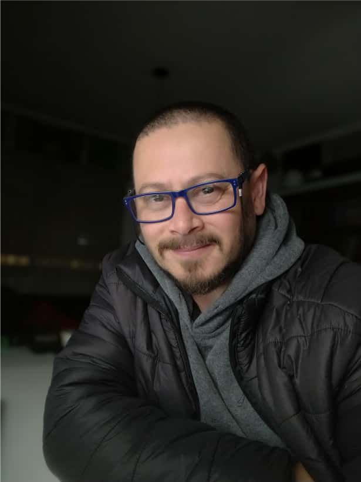

# Hola, te cuento sobre mi

Soy la primera generación de egresados universitarios en mi familia, pilar fundamental para haberlo logrado. Perseverante, autoexigente y detallista, me considero un aprendiz perpetuo. Me gusta el trabajo en equipo, siempre que la distribución de tareas sea clara y los resultados se cumplan.

Canalizo mis tensiones en mi familia, fuente de mi resiliencia, y soy practicante a tiempo completo de la reciprocidad. Trabajo como empleado público desde 2005 y sostuve una empresa privada en paralelo hasta 2019, cuando me dediqué plenamente a mi función pública. Desde entonces, con vocación de servicio, colaboro para que los servicios de salud sean más accesibles para las personas.

Desarrollando sistemas de señalización hospitalaria en todo el país, investigo honorariamente la cultura gráfica en hospitales y desarrollo proyectos de preservación patrimonial en imprentas hospitalarias.

Soy papá de Santi, de 19 años, esposo y compañero de Myriam desde hace 30 veranos. Gracias a su apoyo, soy licenciado en Diseño de Comunicación Visual por la FADU-Udelar y trabajo en la interfaz visual que existe entre las cosas y las personas. Me gusta explicar el mundo en 3 dimensiones.

