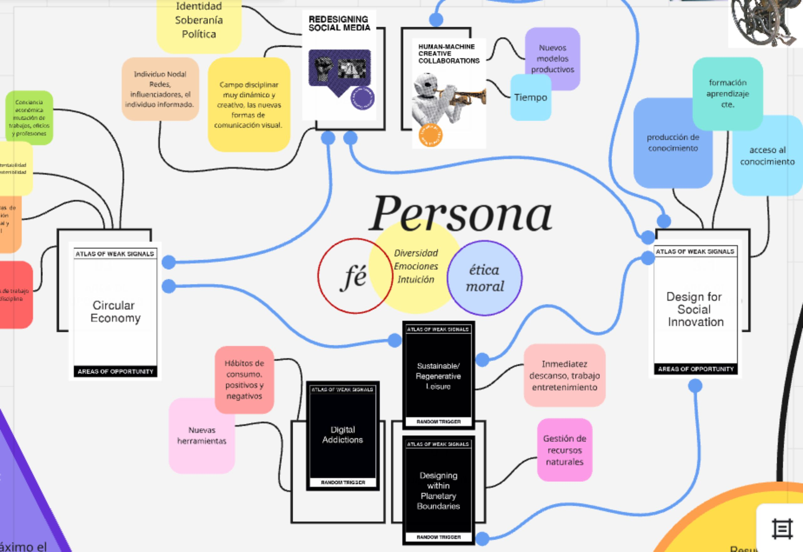
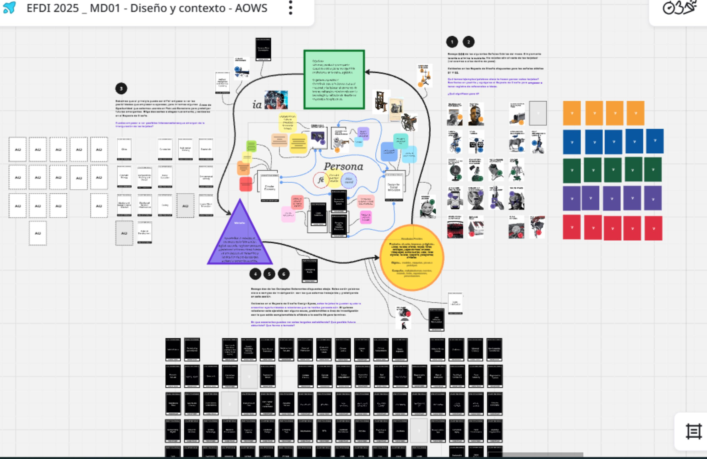
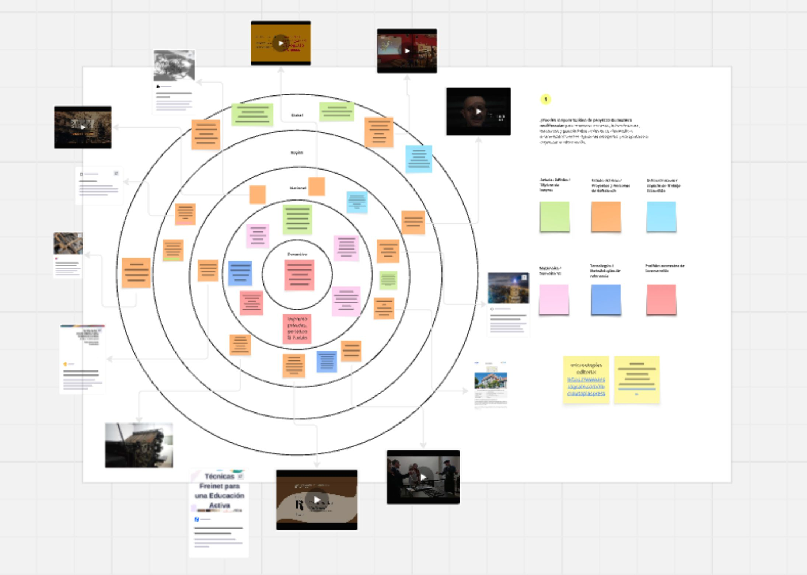
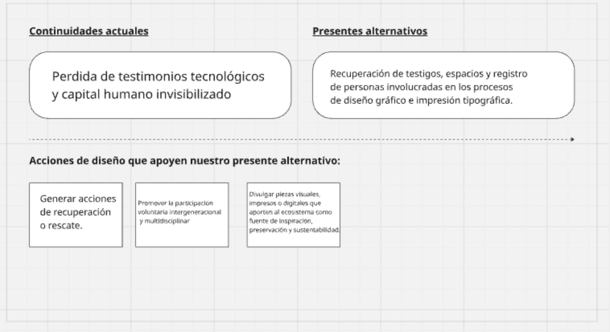
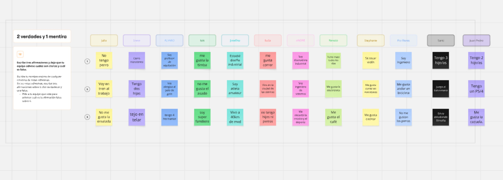

---
hide:
    - toc
---

# MD01

El módulo de diseño nos introduce en la búsqueda del proyecto final, mediante un sistema de imágenes disparadoras denominado Atlas: pequeñas señales. Este consiste en una experimentación con una herramienta didáctica desarrollada por José Luis de Vicente. 

La etapa inicial de la propuesta planteaba descubrir cartas y pensar disparadores conceptuales que permitieran ir generando escenarios posibles para problematizar futuros emergentes. Los cinco ejes temáticos que funcionan como trampolín son: capitalismo de vigilancia, antropoceno, el futuro del trabajo, después del Estado-nación y explorando la identidad. 

Con una reflexión que permite una asociación directa con los ejes de la Agenda 2030, se construye un vínculo con el cambio climático, la nueva derecha, la identidad de género, la renta básica universal y las organizaciones globales.

En este escenario de sesgo ideológico definido, debemos encontrar un hilo conductor para desarrollar un proyecto.
En la plataforma Miro, como espacio de diseño, construimos en tres etapas un mapa conceptual, escenarios posibles y un enfoque a modo de FODA. La tríada propuesta para la inspiración es: señales, oportunidades, desencadenantes y desafíos.

Las dos primeras cartas de señales débiles que me salieron fueron: Rediseño de los medios sociales y La colaboración creativa de la máquina y el humano. Como oportunidades: Economía circular y Diseño social de innovación. Los desencadenantes y desafíos fueron: Adicciones digitales, diseñar dentro de los límites planetarios y ocio sustentable regenerativo.

La conexión intuitiva con los ejes de interés personal fue bastante fuerte y motivante. Debíamos pensar si las cartas ofrecían posibilidad de conexión; de lo contrario, se podían seleccionar otras cartas. La conexión fue espontánea y natural, por lo que la intuición como variable humanizadora resultó determinante para legitimar el conjunto de cartas que salieron. 

Pude definir un modelo de proyecto que pone en el centro a las personas y su relación con la tecnología desde la mirada de mi disciplina. Se busca resignificar los nuevos medios de comunicación visual con sus lógicas de diseño, poniendo en valor los medios más antiguos que ya no forman parte del ecosistema de difusión, pero que fueron muy importantes para nuestro presente.

Los medios impresos y los digitales conforman un nuevo sistema de divulgación del conocimiento. La generación de contenidos es una industria que se ha expandido, generando nuevos modelos económicos y de ingresos. El mantenimiento cultural y documental son parte de una economía circular en desarrollo con gran potencial.

El tiempo es una variable que define el consumo de información actual. Medios fríos y medios calientes, como escribía Marshall McLuhan en 1960: cuanto mayor participación tiene el destinatario del mensaje, más frío es el medio de difusión. La estrategia para que el mensaje llegue a un rango amplio de público es usar varios medios simultáneamente.

Los productos digitales e impresos son un mecanismo innovador que implica explicar la realidad a la sociedad con métodos de diseño multiplataforma, usando la tecnología como aliado para garantizar el acceso y promover el consumo cultural. Esto tiene un impacto directo en los hábitos y nuevas gestualidades de las personas, reconfigurando los tiempos de trabajo, descanso y entretenimiento.

En el diagrama de diseño multiescalar se reduce el campo de acción, se enfoca y se achica el estado de la cuestión. Me permitió afinar el objetivo hacia un posible proyecto final. Con la recopilación de referencias se reafirman los objetivos. El esquema de alternativas presentes constituye la bajada conceptual que me pone frente al desafío de encontrar la vinculación con la fabricación en 3D.

 

Logros y dificultades con MIRO

Con respecto a la plataforma Miro, me pareció muy didáctica, con una interfaz entretenida e intuitiva. La visualidad y el modo de trabajo simultáneo son características muy dinámicas: poder ver el trabajo de los compañeros ayuda mucho a destrabar conceptos, explorar posibilidades de conexión y mejorar métodos.

La lógica del hipervínculo, que permite simplemente copiar y pegar los enlaces para que queden insertados, es excelente. Después de varios intentos fallidos, Victoria me compartió el tip de copiar y pegar directamente en el espacio de trabajo.

La introducción al espacio de diseño Miro propuesto por Julia y el equipo para interactuar y conocernos mejor permitio conocer las primeras herramientas de la página.

