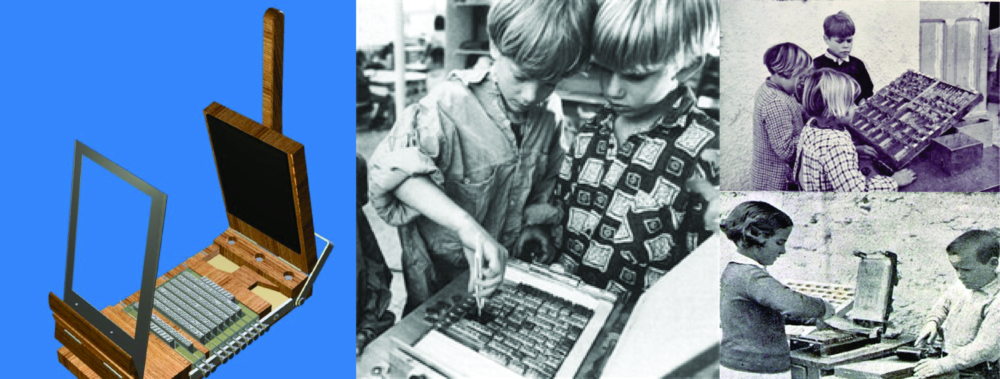
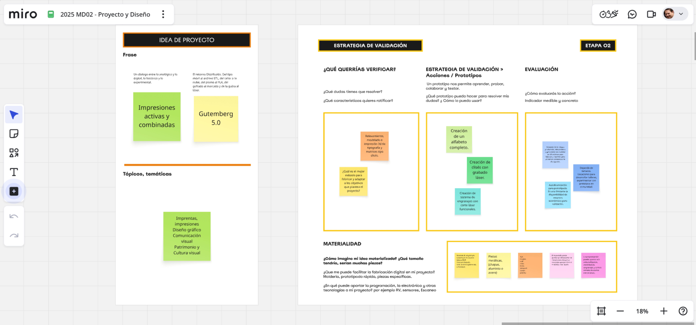

---
hide:
    - toc
---

# MD02
*Proyecto y diseño*

Arrancamos el módulo “Pensar diseño”: valorar, bajar a tierra las ideas, con quién, para quiénes, cómo, porqué. La construcción de una propuesta tangible es el desafío de este módulo. Empezamos con un ejercicio en la plataforma Miro.

https://miro.com/app/board/uXjVJ0RGljI=/

En las presentaciones de Joaquín y Santiago nos dejan trampolines instalados en palabras y frases claves: generar conciencia, validar proyectos, empoderar a la comunidad. Aspectos que ayudan a consolidar las estrategias y deben desembocar en acciones concretas.

La propuesta transitará por generar en 3D los elementos que permiten la interacción con distintos públicos objetivos. En una primera instancia, la estrategia es el trabajo con niños en edad de aprendizaje del alfabeto y secuencia numérica. En modalidad de taller, que puede ser en escuelas, en el local de imprenta o en liceos.

Así como en otros países, pareciera que solo la perspectiva de los profesionales del diseño gráfico y la comunicación visual es sensible a la preservación de un estilo tipográfico, desde la rotulación al manejo de la composición de página con tipos de plomo hasta la identidad de una “cultura gráfica”. Es allí donde se origina este proyecto y tiene la responsabilidad de inocular en la sociedad un interés cultural casi inexistente.

Recientemente, en el ciclo de charlas Herederos de la Letra organizado por Leyendatype en colaboración con el DG Faio Ares, se compartieron experiencias de recuperación e inventariado específico de tipografía; aunque es una práctica disciplinar concreta, toda la experiencia tiene como origen una preocupación individual con gran aceptación comunitaria.

Ejemplos como el del diseñador Carlos Campos Verdu y la recuperación digital del patrimonio gráfico andaluz en España, o la del diseñador Diego Crescimbeni y Gustavo Ferrari con el fileteado y nuestro arte como un gesto solidario en las paradas de los microbuses de Buenos Aires.

Estas iniciativas lograron poner a disposición de las personas una práctica específica con un sentido funcional que además valora la identidad gráfica local y permite impulsar emprendimientos de diseño de fuentes tipográficas con arraigo histórico vernáculo.

En 2020, junto al colega Daniel Silverman, docente de la Facultad de Arte y Diseño (FAD) de la Universidad Provincial de Córdoba, presentamos un trabajo en la sexta Jornada del Diseño del Libro. Un proyecto de rescate patrimonial de la primera imprenta de Córdoba; fue con Daniel que hice la primera aproximación al prototipo de imprenta a escala, que luego convertimos en un prototipo modelado e impreso en 3D.

https://youtu.be/21GW-XR0-wo?si=vz8QUwyHANechi4z

  <iframe
    src="https://www.youtube.com/embed/21GW-XR0-wo?rel=0&modestbranding=1"
    title="Video de YouTube"
    frameborder="0"
    allow="accelerometer; autoplay; clipboard-write; encrypted-media; gyroscope; picture-in-picture; web-share"
    allowfullscreen
    style="position:absolute; top:0; left:0; width:100%; height:100%;">
  </iframe>

---

  <iframe
    src="https://www.youtube.com/embed/-tpEptv8LoY?start=7"
    title="YouTube video player"
    frameborder="0"
    allow="accelerometer; autoplay; clipboard-write; encrypted-media; gyroscope; picture-in-picture; web-share"
    allowfullscreen
    style="position:absolute; top:0; left:0; width:100%; height:100%;">
  </iframe>

---

  <iframe
    src="https://www.youtube.com/embed/3HANYVQSaO8?start=11"
    title="YouTube video player"
    frameborder="0"
    allow="accelerometer; autoplay; clipboard-write; encrypted-media; gyroscope; picture-in-picture; web-share"
    allowfullscreen
    style="position:absolute; top:0; left:0; width:100%; height:100%;">
  </iframe>

---

Basados en la trayectoria de trabajos realizados desde 2018 hasta hoy, es que este nuevo enfoque propone una estrategia que fusiona tecnología de fabricación 3D con prácticas de impresión directa y diseño de mensajes visuales para empoderar a las comunidades. Similar a como lo hacía la técnica pedagógica de imprenta escolar Freinet.

https://www.youtube.com/watch?v=6rXmo9XB330&t=4s

## *Metodologia*

Relevar y redibujar tipografías usadas en los talleres de imprenta. Vectorizar alfabetos escaneados de impresos o de tipos de plomo y convertirlos en clises modelados en 3D. Diseñar mecanismos de transferencia artesanal para niños.

Relevar y reproducir sistemas mecánicos de transferencia mecánica por presión con una escala portátil que permita imprimir usando clises diseñados e impresos en 3D, láser o frezado. Gestionar encuentros en modalidad talleres para experimentar con los prototipos y ajustar el diseño. 

Registrar y publicar el proceso y actividades. Las ideas macro más ambiciosas son la recuperación del lugar, de las máquinas que existen en CeReMOS y, finalmente, la creación del museo nacional de la imprenta.

--- 

# *Segunda parte del ejercicio:*

https://miro.com/app/board/uXjVJ0RGljI=/

Proponer un nombre para el proyecto y cerrar el enfoque para trazar un camino viable sin dejar de lado el marco global o la ambición máxima que nos gustaría alcanzar. Dos características que aportan a ordenar las acciones: Idea de proyecto y estrategia de validación.

Como nombres posibles propongo: 

**Impresiones activas y combinadas** 
*Un diálogo entre lo analógico y lo digital, lo histórico y lo experimental.* 

**Gutemberg 5.0** 
*El retorno distribuido, del tipo móvil al archivo STL, del taller a la nube, del plomo al PLA, del gofrado al marcado y de la gubia al láser.*

---

Acá les dejo una charla con mi "amigable" de la IA sobre la busqueda del nombre del proyecto. 

<!-- Visor PDF (GitHub Pages + MkDocs) -->

  <object
    data="https://luchoblau-gh.github.io/Luis-Blau/files/amigo-chatgpt.pdf"
    type="application/pdf"
    width="100%"
    height="100%">
    <embed
      src="https://luchoblau-gh.github.io/Luis-Blau/files/amigo-chatgpt.pdf"
      type="application/pdf"
      width="100%"
      height="100%" />
    

      No se pudo incrustar el PDF.
      <a href="https://luchoblau-gh.github.io/Luis-Blau/files/amigo-chatgpt.pdf" target="_blank" rel="noopener">
        Abrir PDF completo
      </a>
    

  </object>

  📄 <a href="https://luchoblau-gh.github.io/Luis-Blau/files/amigo-chatgpt.pdf" target="_blank" rel="noopener">
    Abrir PDF en pestaña nueva
  </a>

--- 

Dentro de las acciones a corto plazo, seleccione el relevamiento, modelado e impresión de tipografía y matrices tipo clisé. Dejamos abierto verificar: ¿cuál es el método más adecuado para fabricar y adaptar a los objetivos que plantea el proyecto? 

Para responder a esta interrogante es necesaria la experimentación. Se busca un producto que permita absorber los requerimientos mecánicos de la transferencia de tinta a un papel mediante la aplicación de fuerza de presión. Construcción de mecanismos de engranajes que involucran movimientos de distintas piezas de un sistema. Al mismo tiempo que sean livianos de transportar, fáciles de limpiar y accesibles económicamente.

Entonces, conclusión para el inicio: Crear un alfabeto completo de 64 glifos para imprimir en 3D o grabar en láser, y diseñar un modelo funcional que replique el sistema de tórculo con engranajes cortados con láser fabricados en madera.

Para la evaluación, priorice lo que depende estrictamente de mis acciones individuales. Las tareas que dependen de la participación de terceros y están sujetas a disponibilidad externa quedarán para etapas posteriores. El otro aspecto es la autofinanciación para prototipar; se destinarán entre 150 y 200 dólares entre insumos como filamentos, placas de maderas y otros fungibles.

 

---

*Referencias*

Museo Tipografía Pao de Sto. Antonio
http://www.museutipografia.com.br
Utsch, A. (2015). Patrimônio Gráfico entre ação e preservação, Museo tipografíaPão de Sto. Antônio, Minas Gerais, Brasil

Museo Nacional de la Imprenta Irlandesa.National Print Museum
https://www.nationalprintmuseum.ie/about/history/

Caja Baja, taller dedicado a la impresión con métodos de impresión directa
https://cajabaja.com.uy/

Buena letra: Taller dedicado a la caligrafía, producción de grabados y reproducción con impresión directa.
https://buenaletra.shop/

Espacio museo del periódico semanal El Pueblo, ciudad de Santa Lucía, Canelones
https://semanarioelpueblo.com.uy/

Película: Los Últimos, de Pablo Pivetta y Nicolas Rodriguez Fuchs, 2019. La película se financió parcialmente mediante una campaña de crowdfunding, complementada con autogestión de los directores.
https://www.youtube.com/watch?v=J4b9kK9fmgw

Escuela de Industrias Gráficas de UTU
https://escuelaindustriasgraficas.utu.edu.uy/
Recuperó y preserva en uso una colección de prensas tipográficas y linotipia. Aún mantiene la enseñanza de tipografía en la plantilla curricular del bachillerato tecnológico de Técnico Impresor.

Taller de imprenta del Hospital de Clínicas,presentacion internacional 2021, y exposición en el marco del Día del Patrimonio 2021 y en FADU la Noche de los Museos del mismo año, organizado por el Museo de Ciencias de la Salud.
https://www.youtube.com/watch?v=3HANYVQSaO8&t=11s

Movimiento de Educación Popular Freinet Uruguay
https://freineturuguay.wordpress.com/?utm_source=chatgpt.com

REMFA Uruguay 2023 (Red de Movimientos Freinet de América)
https://remfauruguay2023.wordpress.com/remfa/?utm_source=chatgpt.com

*Referencias de proyectos que involucran fabricaciòn 3D* 

Escaparate, imprenta Freinet (octubre 2010)
https://oscartesano.blogspot.com/2013/01/imprenta-de-freinet-octubre-2010.html

Open project - How to 3D Print Your Own Printing Press
https://openpressproject.com/blogs/news/how-to-3d-print-your-own-printing-press#:~:text=I,printing%20cloth%2Ffelts

Prensa de impresión casera a partir de una caja de leche modificada
https://makezine.com/article/craft/diy-printing-press-from-a-modified-milk-crate/

Nueva prensa tipográfica RÁPIDA PLUS® 50x100 cm.
https://prensasvillazanblog.blogspot.com/

Prensas litográficas serie JL, instrucciones de montaje.
https://www.polymetaal.nl/siteUK/Linkdocs/JL-series/jlassembly.htm?utm_source=chatgpt.com

Prensa Litográfica Alejandro E.
https://3dwarehouse.sketchup.com/user/7a0dea78-bba8-4514-acb8-5a17e5c79ff0/alejandro-E

Fabricación y planos de tórculos, prensas litográficas y de grabado.
https://www.instructables.com/Build-a-Printmaking-Press/

Prensa litográfica manual Modelo Brisset, ca. 1865
https://www.ign.es/resources/docs/IGNCnig/noticias/prensa_litografica.pdf#:~:text=algunas%20obras%20de%20litograf%C3%ADa%20art%C3%ADstica,transmitida%2C%20se%20soltaba%20el%20pedal

Printing presses in the graphic arts collection. The National Museum of American History 1996 - Elizabeth M. Harris.
https://amhistory.si.edu/docs/harris_printing_presses_graphic_arts_1996.pdf?utm_source=chatgpt.com

Grabado con Fotopolimeros
https://www.domestika.org/es/blog/11142-fotograbado-con-fotopolimeros-una-revolucion-en-el-grabado