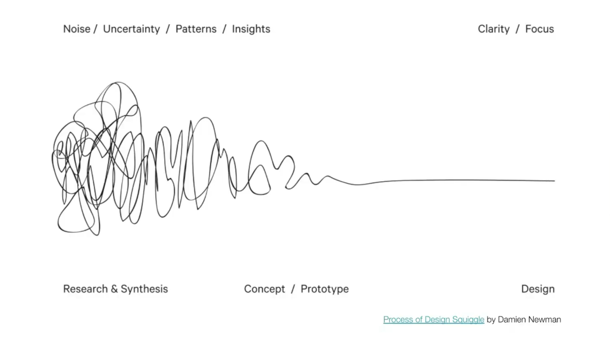
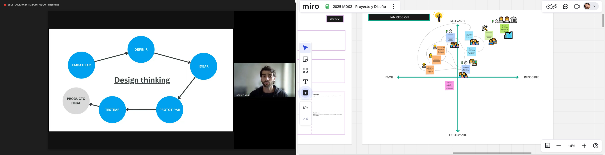
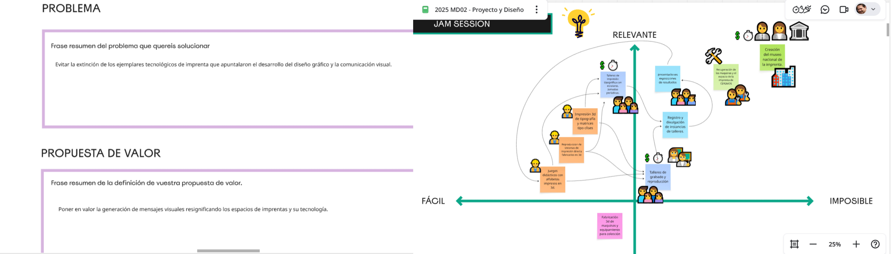

---
hide:
    - toc
---

# MD02
*Proyecto y diseño*

Arrancamos el modulo, "Pensar diseño" poner en valor, bajar a tierra las ideas, con queien, para quienes, como, porqué. La aconstrución de una propuesta tangible es el diesfío de este modulo. Empezamos con un ejercicio en la plataforma miro.

https://miro.com/app/board/uXjVJ0RGljI=/

En las presentaciones de Joaquin y Santiago nos dejan trampolines instalados en palabras y frases claves, generar conciencia, validar proyectos, empoderar a la comunidad. Aspectos que ayudan a consolidar las estrategias y deben desembocar en acciones concretas.

La propuesta transitara por generar en 3d los elementos que permiten la interacción con distintos publicos objetivos. en una primera instancia la estrategia es el trabajo con niños en edad de aprendizaje del alfabeto y secuencia numerica. en modalidad de taller que puede ser en escuelas, en el local en un local de imprenta o en liceos.

Asi como en otros paises, solo la prespectiva de los profesionales del diseño gráfico y la comunicación visual son sensibles a la preservación de un estilo tipografico, desde la rotulación al manejo de la composición de pagina con tipos de plomo, esta la identidad de una cultra grafica. Es alli donde se origina este proyecto y tiene la responsabilidad de inocular en la sociedad un interes cultural casi inexistente.

Recientemente en el ciclo de charlas Herederos de la Letra organizado por Leyendatype en colaboracion con el DG Faio Ares, se compartieron experiencia de recuperacion inventariado espesifica de tipografia, aunque es una practica disciplinar concreta, todo las experiencia tiene como origen una preocupacion individual con gran aceptación comunitaria.

Ejemplos como el del diseñador Carlos Campos Verdu y la recuperacion digital del patrimonio gráfico Andaluz en España, o la del diseñador Diego Crescimbeni y gustavo ferrari con el fileteado y nuestro arte como un gesto solidario en las paradas de los micro buses de Buenos Aires.

Estas iniciativas lograron poner a dispoción de las personas una práctica espesifica con un sentido funcional que ademas ponen en valor la identidad gràfica local y permite impulsar emprendimientos de diseño de fuentes tipograficas con valor histórico vernaculo.

En el 2020 Junto al Colega Daniel Silverman de la facultad de arte y diseño (FAD) de la Universidad Provincial de Cordoba, presentamos en la sexta Jornada del Diseño del Libro, un proyecto de rescate patrimonial de la primera imprenta de Cordoba, fue con Daniel que hice la priemera aporximaciòn al prototipo de imprenta a escala, que luego convertimos en un prototipo modelado e impreso en 3d.

  <iframe
    src="https://www.youtube.com/embed/TXLxYeLlvU4"
    title="Video de YouTube"
    frameborder="0"
    allow="accelerometer; autoplay; clipboard-write; encrypted-media; gyroscope; picture-in-picture; web-share"
    allowfullscreen
    style="position:absolute; top:0; left:0; width:100%; height:100%;">
  </iframe>

---

  <iframe
    src="https://www.youtube.com/embed/-tpEptv8LoY?start=7"
    title="YouTube video player"
    frameborder="0"
    allow="accelerometer; autoplay; clipboard-write; encrypted-media; gyroscope; picture-in-picture; web-share"
    allowfullscreen
    style="position:absolute; top:0; left:0; width:100%; height:100%;">
  </iframe>

---

  <iframe
    src="https://www.youtube.com/embed/3HANYVQSaO8?start=11"
    title="YouTube video player"
    frameborder="0"
    allow="accelerometer; autoplay; clipboard-write; encrypted-media; gyroscope; picture-in-picture; web-share"
    allowfullscreen
    style="position:absolute; top:0; left:0; width:100%; height:100%;">
  </iframe>

---

Referncias:

Museo Tipografía Pao de Sto. Antonio
http://www.museutipografia.com.br
Utsch, A. (2015). Patrimônio Gráfico entre ação e preservação, Museo tipografíaPão de Sto. Antônio, Minas Gerais, Brasil

Museo Nacional de la Imprenta Irlandesa.National Print Museum
https://www.nationalprintmuseum.ie/about/history/

Caja Baja, taller dedicado a la impresión con métodos de impresión directa
https://cajabaja.com.uy/

Buena letra: Taller dedicado a la caligrafía, producción de grabados y reproducción con impresión directa.
https://buenaletra.shop/

Espacio museo del periódico semanal El Pueblo, ciudad de Santa Lucía, Canelones
https://semanarioelpueblo.com.uy/

Película: Los Últimos, de Pablo Pivetta y Nicolas Rodriguez Fuchs, 2019. La película se financió parcialmente mediante una campaña de crowdfunding, complementada con autogestión de los directores.
https://www.youtube.com/watch?v=J4b9kK9fmgw

Escuela de Industrias Gráficas de UTU
https://escuelaindustriasgraficas.utu.edu.uy/
Recuperó y preserva en uso una colección de prensas tipográficas y linotipia. Aún mantiene la enseñanza de tipografía en la plantilla curricular del bachillerato tecnológico de Técnico Impresor.

Taller de imprenta del Hospital de Clínicas,presentacion internacional 2021, y exposición en el marco del Día del Patrimonio 2021 y en FADU la Noche de los Museos del mismo año, organizado por el Museo de Ciencias de la Salud.
https://www.youtube.com/watch?v=3HANYVQSaO8&t=11s

Referencias de proyectos que involucran fabricaciòn 3D 

Open project - How to 3D Print Your Own Printing Press
https://openpressproject.com/blogs/news/how-to-3d-print-your-own-printing-press#:~:text=I,printing%20cloth%2Ffelts

Prensa de impresión casera a partir de una caja de leche modificada
https://makezine.com/article/craft/diy-printing-press-from-a-modified-milk-crate/

Nueva prensa tipográfica RÁPIDA PLUS® 50x100 cm.
https://prensasvillazanblog.blogspot.com/

Prensas litográficas serie JL, instrucciones de montaje.
https://www.polymetaal.nl/siteUK/Linkdocs/JL-series/jlassembly.htm?utm_source=chatgpt.com

Prensa Litográfica Alejandro E.
https://3dwarehouse.sketchup.com/user/7a0dea78-bba8-4514-acb8-5a17e5c79ff0/alejandro-E

Fabricación y planos de tórculos, prensas litográficas y de grabado.
https://www.instructables.com/Build-a-Printmaking-Press/

Prensa litográfica manual Modelo Brisset, ca. 1865
https://www.ign.es/resources/docs/IGNCnig/noticias/prensa_litografica.pdf#:~:text=algunas%20obras%20de%20litograf%C3%ADa%20art%C3%ADstica,transmitida%2C%20se%20soltaba%20el%20pedal

Printing presses in the graphic arts collection. The National Museum of American History 1996 - Elizabeth M. Harris.
https://amhistory.si.edu/docs/harris_printing_presses_graphic_arts_1996.pdf?utm_source=chatgpt.com

Grabado con Fotopolimeros
https://www.domestika.org/es/blog/11142-fotograbado-con-fotopolimeros-una-revolucion-en-el-grabado