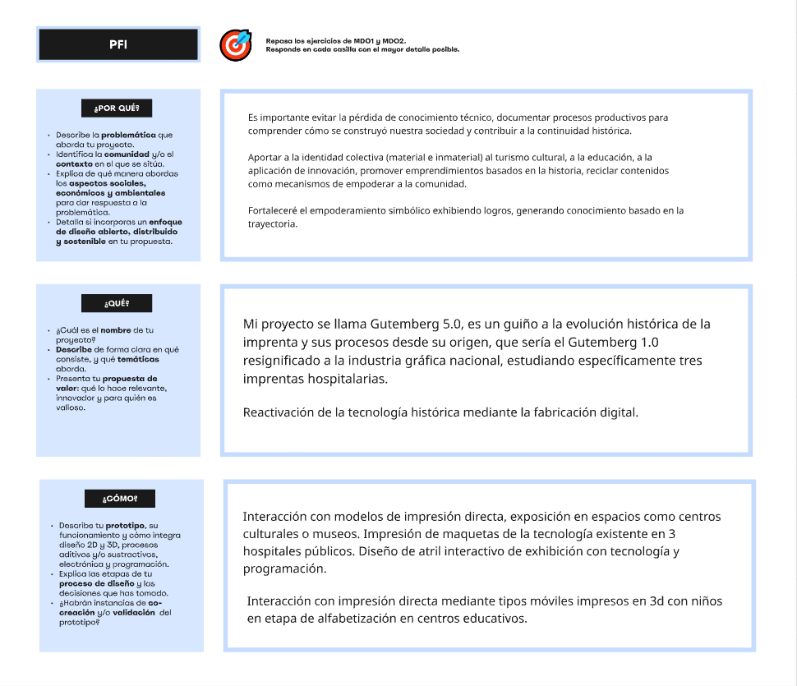
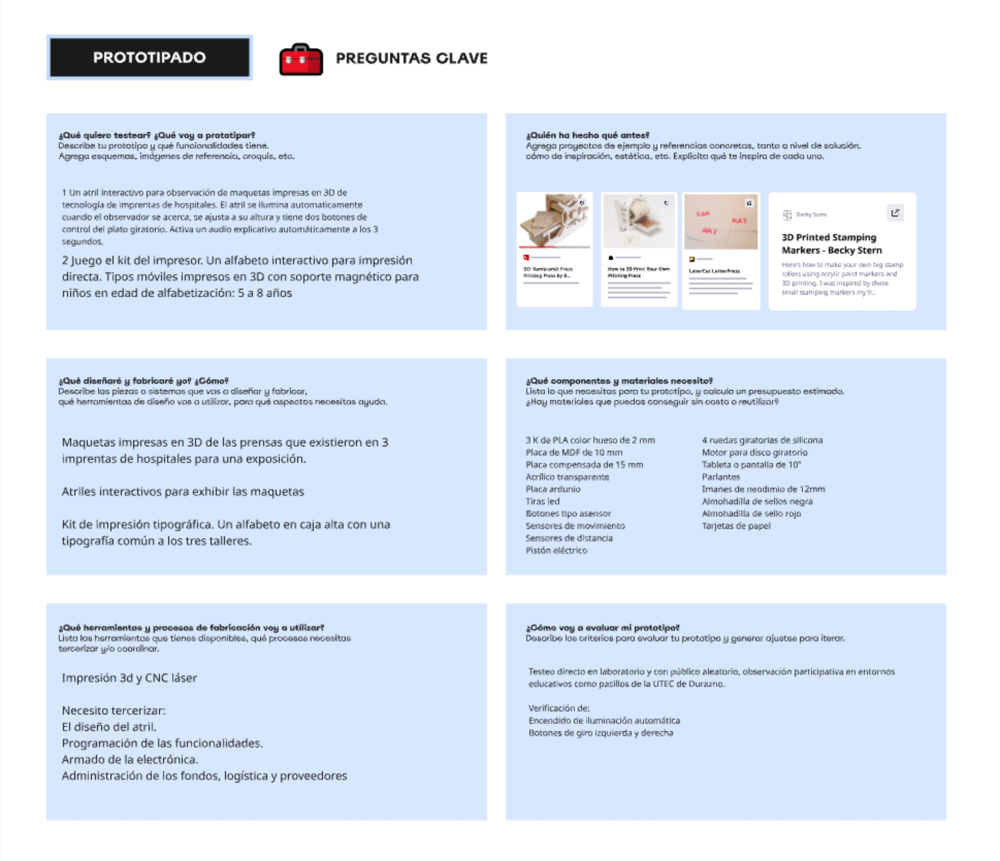
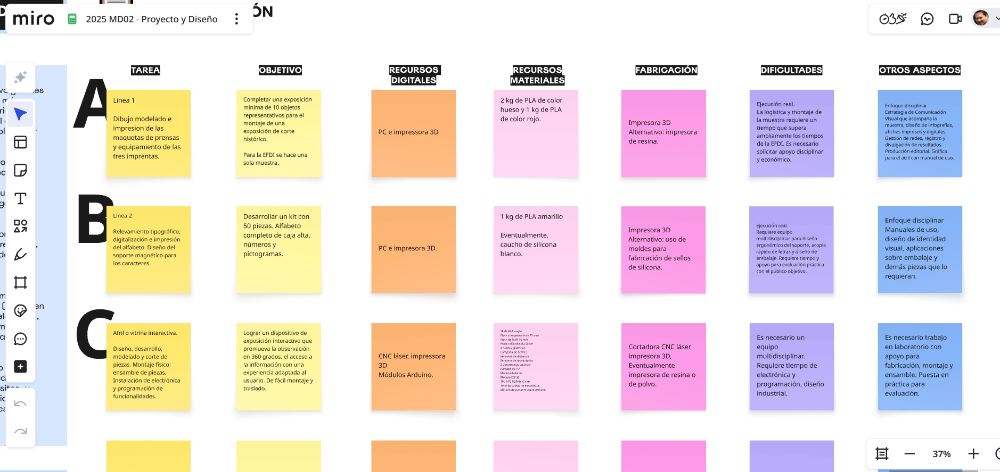
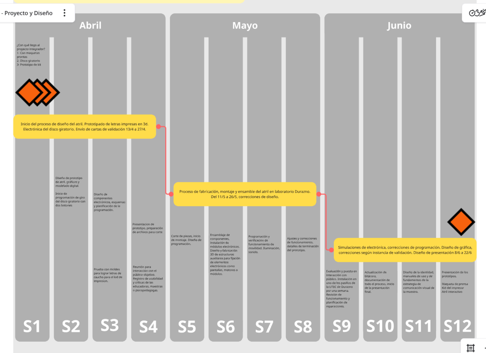

# MD03

## *Prototipado y fabricación*

https://miro.com/app/board/uXjVJ0RGljI=/

Este modulo es la ultima bajada antes del proyecto final. Aca se define el *Que*, *Porque*, con *Quien* y *Como*. La estructura de la consigna es una guia para bajar ideas a tierra de forma ordenada. 

Repaso de las tres areas aprendidas, tecnología y fabricación, diseño, inovación y sostenibilidad.

En esta etapa la planificación, los materiales y la tecnología que se pienso usar queda explicitada de manera concreta.

Tres acciones con un rango de público amplio, pensado con profundo anclaje patrimonialista de la cultura gráfica, productos concretos de activación de la memoria, comercialización con cruce de tecnologias antiguas y contemporaneas.

## Referencias

### [*Clase del 23 de feb. de 2026*](https://drive.google.com/file/d/18LrKUhcOpuVUGvRYy-qh6J1--KZiP8fp/view?usp=sharing)

 