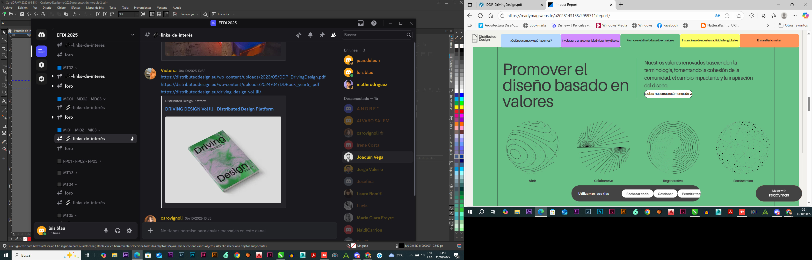
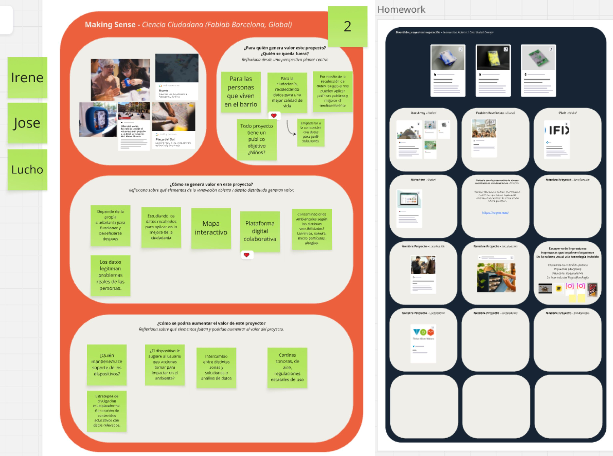
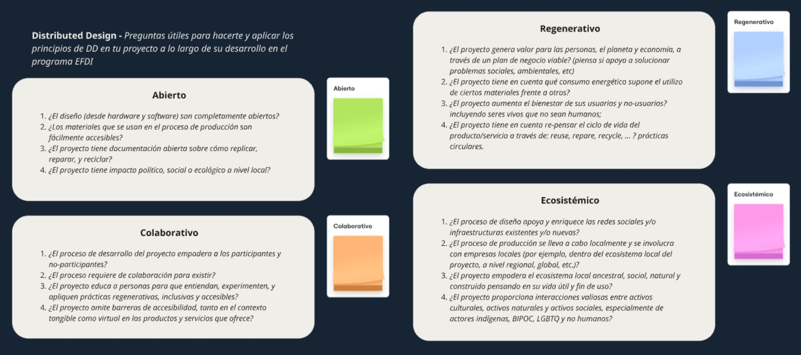
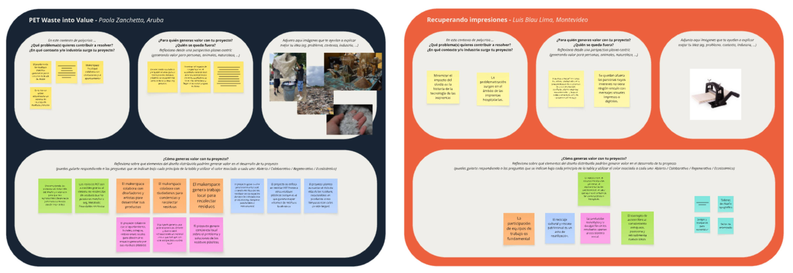
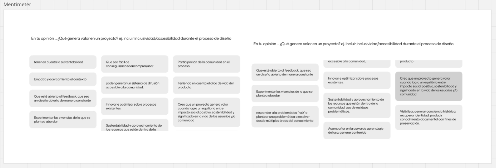
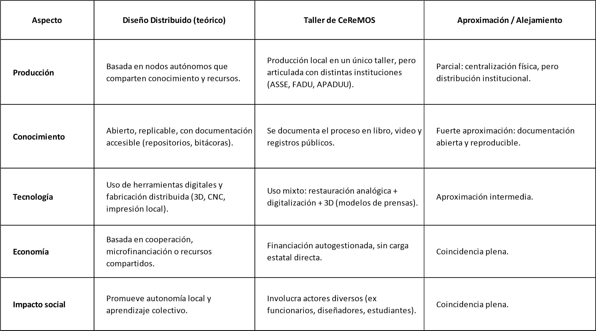

### **MI01**

# *Inovación abierta y distribuida*

- ¿Que es el diseño distribuido? 

Este modulo es muy interesante me hizo acordar algun trabajo sobre Economia Social Solidaria. Estos modelos basado en valores son parte del ecosistema económico. Nos introducimos a este modelo a traves de dos ejercicios interpelantes.

Entender esta logica para ver si aplicar al proyecto que desarrollaremos para la EFDI es el desafio. Ahora bien ¿Cuales son los valores que promueve? Acceso abierto, amigable con el medio ambiento, participacion colectiva y sustentable. En sus publicaciones encontramos enunciados como:

*Museo del Diseño Desobediente Impugnar las pedagogías disciplinarias del diseño dominadas por hegemonías, jerarquías y binarios sería proporcionar espacio para perspectivas e interpretaciones plurales de la decolonialidad que surgen de diversos contextos y experiencias históricas, sociales, culturales y comunitarias.*

El cuestionamiento como herramienta de analisis, aterrizaje o fortalecimiento bajo un concepto ideologico, que presenta mecanismos de libertad semi restringida a traves del sometimiento al conceso. Este metodo convive y parece ser compatible para proyectos con fuerte participación estatal. En tal sentido, es positivo poner sobre la tencion de las preguntas a lo que tenemos en mente y ver los puntos de cercania y de alejamiento.

## *Abierto*

Res-P1:
Mi proyecto incluye etapas abiertas, como la producción de piezas de divulgación digital que son gratuitas y de libre acceso.

Res-P2:
El concepto de “accesibilidad” puede tener distintas interpretaciones. Desde el punto de vista económico, significa bajos costos. En mi caso, y en este momento, el acceso a una impresora 3D de calidad media —como medio de producción— es accesible, al igual que la compra de insumos.

Res-P3:
El proyecto cuenta con un buen caudal de documentación, tanto propia como referencial. Algunas partes pueden replicarse; por ejemplo, las piezas de divulgación contienen información que expone metodologías y estrategias con fines educativos. Por otro lado, el proyecto produce conocimiento histórico inédito. Estos conceptos de investigación son replicables en cualquier institución y en distintos ejes. Es necesario contar con conocimientos de comunicación visual que posibiliten la construcción adecuada de los mensajes. En síntesis, el conjunto de factores necesarios para responder a la pregunta sería disponer de formación, voluntad y participación.

Res-P4:
El proyecto tiene impacto institucional en la unidad ejecutora donde se desarrolló, entre el personal de forma directa, sus familias y las localidades donde viven. Desde el punto de vista ecológico, el cuidado de los bienes y de la infraestructura prolonga la vida útil de las instalaciones, lo que constituye un aporte al medio ambiente. Por otro lado, la producción de conocimiento digital implica el uso de servidores que consumen energía y recursos naturales.

Si consideramos la huella de carbono, podría decirse que la producción de elementos impresos aún no tiene un peso relevante como para cuestionar su utilización. Además, el insumo empleado es de origen vegetal renovable, lo cual representa otro parámetro favorable para el medio ambiente.
Una variable significativa es el reciclaje informativo que implica la recopilación histórica: una actividad que no genera nuevos residuos. Es decir, su residuo es cero.

## *Colaborativo*

Res-P1:
No sé si “empodera”, pero la producción histórica, el reconocimiento de una labor y la visibilización de una actividad dentro de una institución generan sentimientos positivos tanto en funcionarios como en no funcionarios. Resignificar un servicio y promover actividades —que a su vez constituyen los insumos para la producción de nuevos contenidos de divulgación— genera un reconocimiento constante y construye valor simbólico. Ese proceso impacta directamente en la identidad y el sentido de pertenencia de las personas.

Res-P2:
El proyecto requiere equipos multidisciplinarios y multigeneracionales para su desarrollo. Sin embargo, el orden es esencial para mantener el control temporal: cumplir metas y objetivos depende de una buena planificación proyectual. En este sentido, son necesarios líderes participativos con roles claramente definidos.
La figura del responsable resulta imprescindible para garantizar la coordinación y la coherencia del proceso.

Res-P3:
El proyecto apunta a una educación entretenida, mediante el acceso a activadores de la memoria que deben diseñarse y producirse. Los mensajes visuales y los objetos son los productos que se pretenden explorar como resultado de la experiencia, tanto en forma colectiva como individual. La formación y el aprendizaje constituyen el capital simbólico del proyecto. El acceso a la información es uno de los fines principales. El acceso a los espacios físicos, en cambio, no es una variable constante y se atiende según la demanda.

Res-P4:
No fue algo previsto originalmente.
Sin embargo, el acceso a plataformas digitales actuales permite la disponibilidad de contenidos visuales y auditivos. Aunque no estuviera contemplado desde el inicio, no es una variable que se descarte. Por ejemplo, los servicios de traducción en lengua de señas tienen costos elevados, hay pocos disponibles y son muy demandados, por lo cual se debe estudiar su viabilidad. Por otro lado, la inteligencia artificial y las aplicaciones actuales son capaces de adaptar los contenidos para personas no videntes.
Asimismo, los procesos de impresión 3D podrían incorporar códigos como el sistema Braille, ampliando las posibilidades de inclusión.

## *Regenerativo*

Res-P1:
El proyecto incorpora una actividad museística, con la aspiración de generar un museo inédito sobre la tecnología de la impresión. Esto aporta valor desde la cultura gráfica y la comunicación visual, generando un espacio que puede vincularse a la actividad turística. A su vez, derrama sobre la localidad nuevas oportunidades derivadas de los flujos generados por actividades educativas o visitas turísticas. Contribuye, además, al posicionamiento local, nacional e internacional de la institución y del territorio donde se inserta.

Res-P2:
El proyecto consume energía eléctrica y, eventualmente, combustible fósil durante determinadas etapas de su desarrollo.

Res-P3:
El proyecto eleva el conocimiento de los usuarios, destinatarios y de todas las personas vinculadas a alguna de las etapas de los procesos productivos.
No genera residuos ni contaminantes gaseosos, lo cual resulta significativo para preservar el equilibrio ambiental y reducir su impacto ecológico.

Res-P4:
La producción de piezas impresas en 3D contempla la posibilidad de solicitudes de reparación o reposición de componentes dañados, escenarios que están previstos dentro de la planificación.
Asimismo, se proyecta la recopilación de todo el material de soporte y de las fallas de impresión con el fin de fabricar filamentos propios, cerrando así un ciclo de reutilización de recursos y fomentando la sostenibilidad del proceso.

## *Ecosistema*

Res-P1:
El proyecto tiene a las redes como un pilar fundamental: un medio de divulgación independiente que promueve una nueva forma de participación y de conexión político-social. Las plataformas digitales funcionan como espacios de encuentro donde confluyen distintas miradas, potenciando la visibilidad de las acciones y de los productos generados.

Res-P2:
El proyecto se apoyará en una producción local, aunque prevé alianzas estratégicas con instituciones educativas como la UTEC, la FADU, el Polo Tecnológico del Cerro y otros espacios de experimentación similares a FabLab.
También mantiene vínculos con empresas locales mediante alianzas informales y colaboraciones voluntarias, basadas principalmente en el intercambio de servicios por presencia publicitaria en los productos. Esta red de cooperación conforma un ecosistema dinámico que integra el conocimiento académico, la innovación tecnológica y la participación comunitaria.

Res-P3:
El proyecto incorpora un valor inexistente y busca recomponer un bien en riesgo de desaparición.
Desde el punto de vista gráfico, empodera al reconfigurar un espacio para que el servicio continúe en funcionamiento, lo cual resulta útil, necesario y simbólicamente reparador. Además, habilita nuevas formas de vínculo entre las personas, fortaleciendo las relaciones institucionales y comunitarias.

Res-P4:
El proyecto se desarrolla dentro de un entorno hospitalario. No existe un plan de acciones con grupos definidos, sino una plataforma abierta en la que cualquier persona que desee participar puede hacerlo sin discriminación y con pleno ejercicio de libertad. Esta apertura refuerza la idea de comunidad inclusiva y colaborativa, donde la participación es voluntaria y el intercambio se da de forma orgánica y horizontal.

Sin duda que este ejercicio fortalece lo que tenemos como certesas y descarta debilidades o aspectos no definidos. Sumando el aporte de los comentarios de los compañeros completamos un nivle de analisis que pone valor argumentativo al poryecto.

# *Acercamientos y alejamientos del proyecto con los conceptos de diseño distribuidos.*

Este cuadro comparativo surge de haberle dado la información publicada sobre el rescate de la imprenta de CEREMOS al chatGPT. La respuesta de la IA es de una coherencia sustancial.

Uno de los problemas mas sigificativos es el tiempo que insume lograr alianzas institucionales debido a los tramites burocraticos del ambito público. Necesariamente el motor individual tiene que existir por dos motivos principales 1 hay poco interes en el eje tematico 2 todos los actos administrativos que insume un expediente no se hacen solos, nadie a no ser el interesado lo tiene que realizar. 

El otro problema es que en el ambito de la cultura grafica a nivel comunidad es imperceptible, en este sentido la preservación y el rescate viene de la comunidad profesional, independiente si ejerce docencia o no. El interes de la comunidad se introduce a partir de la mirada individual del actor disciplinar. 

Com conclusión el proyecto tiene un potencial solido para desarrollarse con una modalidad híbirda, con un distintivo singular. Diseño distribuido, economia social solidaria y participación privada.

Esto se extendio mas de lo que me hubiera gustado, pero creo que vale la pena.