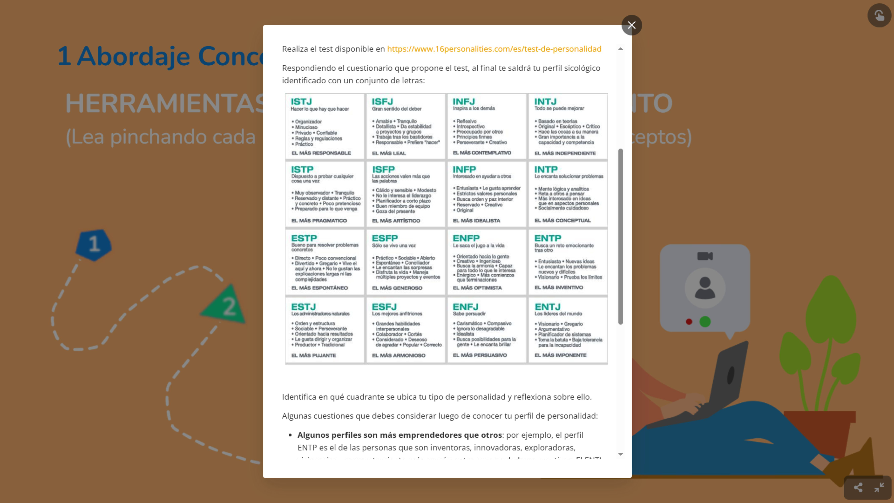

---
hide:
    - toc
---

# MI03
# **Emperendimiento**

# Modulo 1

Imagen tomada de:
https://betrep.org/ventajas-de-emprender

---

¿Qué diferencia hay entre emprendimiento y empresa?
Se podría decir que un emprendimiento es una etapa previa a la consolidación de una empresa. Es de carácter informal y sus objetivos son experimentales, que luego pueden transformarse en un sistema formal con estructura jurídica y métodos productivos y logística comerciales. Según Schumpeter (innovación), McClelland (motivación de logro), Drucker (aprovechamiento sistemático de oportunidades).

En el módulo de emprendimiento tuvimos la oportunidad de reflexionar sobre nuestras propias capacidades emprendedoras. Un análisis de autoconocimiento sobre actitud, habilidades y destrezas para resolver distintas situaciones. Preguntas como “¿cuál es tu tipo de personalidad?”. Podría aportar a posicionar el esfuerzo necesario para iniciar una empresa. 

## *Personalidad*
Es interesante que reconocidos científicos den sustento académico a estos métodos adoptados por Meyer-Briggs Type (MBTI, Isabel Myers y Katherine Briggs) para evaluar personalidades que clasifican 16 categorías con distintas características. Carl Jung elaboró en 1921 la teoría sobre los tipos psicológicos. A partir de ahí se llega a un test cuyo enfoque permite detectar fortalezas y debilidades para interacturar con otras personas.

El test se hace con un cuestionario de 60 preguntas asociadas a una variable numérica que vincula a sigla. Esa sigla es la representación de un tipo de personalidad conocido como perfil psicológico. En mi caso me salió ENTJ alentador, pero mi pregunta es: ¿en qué edad de la vida esto tiene más peso en la motivación?

## *Comportamiento*
Otro aspecto interesante es que, al parecer, ser emprendedor tiene un comportamiento característico (CCE). Un enfoque desarrollado por el psicólogo estadounidense David McClelland en 1960, sobre emprendimiento económica y organizacionalmente exitoso. Búsqueda de oportunidades e iniciativa. Correr riesgos calculados. Exigencia con la calidad y la eficiencia. Persistencia. Compromiso. Búsqueda de información. Establecimiento de metas. Planificación sistemática. Persuasión y red de contactos. Independencia y autoconfianza. 

## *Inteligencia*
A estos conceptos se les suman las inteligencias múltiples, abordadas por Howard Gardner en 1980. Las personas tienen habilidades para resolver problemas y él las explica en nueve categorías. Lingüística. Lógico-matemática. Visual-espacial. Musical. Kinestésica. Naturalista. Intrapersonal. Interpersonal.

## *FODA*
Fortalezas, Oportunidades, Debilidades y Amenazas 
Conocer estos aspectos hacia el interior de la persona emprendedora posibilita la mejora continua. Esto también es aplicable al negocio, al equipo de personas como herramienta para medir la superación.  Características y habilidades favorables propias;   factores externos favorables; carencias y limitaciones desfavorables y factores externos desfavorables.

## *Cambio de mentalidad*
Estas herramientas que vi hasta acá deben ser acompañadas de un cambio de mentalidad para desarrollar una mente empresarial. Cambiar la comodidad del salario por ser creador de tu sustento económico es el desafío con más vértigo que se puede enfrentar, y más en una sociedad estatista como la uruguaya.

---

El canal de YouTube Negocios y Emprendimientos, creado en 2010, tiene contenidos enfocados a las principales claves del pensamiento emprendedor y modelos de negocio. Como, por ejemplo, “12 claves para desarrollar una mentalidad emprendedora”.

Referencias citadas en el audiovisual: 
Carlos Nava Condarco (2018); Emprender es una forma de vida.
Timothy Ferriss (2007); La semana laboral de 4 horas.
Robert Kiyosaki y Sharon Lechter (1997); Padre rico, padre pobre.
Napoleon Hill (1937); Piense y hágase rico.
Andy Freire (2005); Pasión por emprender.

---
# Modulo 2

## *Lectura complementaria 1*
Una lectura sugerida como complementaria que me pareció interesante para la reflexión sobre cómo detectar oportunidades es Spotlight: Habilidades del siglo XXI en América Latina y el Caribe (HundrED + BID, 2021). En un contexto de resiliencia al impacto de la pandemia en la educación. Las asimetrías al acceso a la información y la automatización de la industria. Plantea cuatro grandes grupos: digitales, cognitivas avanzadas, función ejecutiva y socioemocionales. Habilidades necesarias para la inserción laboral, disminuir el desempleo académico, aumentar los salarios que combinen habilidades matemáticas y sociales.

Se analizaron 384 innovaciones de 16 países en cuatro etapas: 
1 - Descubrimiento
2 - Impacto y escalabilidad
3 - Evaluación con 67 expertos 
4 - Selección final estructurados en talleres.

Se seleccionaron 15 innovaciones educativas de 7 países: Adaptabilidad, comunicación, colaboración, pensamiento crítico, ciudadanía global, motivación, perseverancia. En programas que incluyen currículos innovadores, programas extracurriculares, intervenciones, modelos escolares, desarrollo docente.

## *Conclusion del informe*
Como conclusión, el informe plantea que las habilidades del siglo XXI son esenciales para afrontar los retos actuales y futuros, integradas a políticas públicas, formación docente y modelos pedagógicos.

---

## *Como conclusión personal*
A modo de reflexión crítica, agrego que también el rol de los profesionales universitarios como motores que sostienen el vínculo entre la formación y el consumo de bienes y servicios. Son generadores de empleo y aportan experiencia y trayectoria empírica a los procesos creativos e industrializados. Fortalecen la actualización permanente de la actividad independiente con la enseñanza. Creo que también aporta a dilucidar potenciales vocacionales para minimizar el tiempo de deserción del sistema educativo.

---
## *Capacidad, habilidad y competencia*

Un documento que hace reflexionar sobre los tres conceptos fundamentales en el ámbito del aprendizaje y el desempeño humano: capacidad, habilidad y competencia. La capacidad es el potencial natural que poseen todas las personas para aprender y enfrentar desafíos. La habilidad es la manifestación práctica de ese potencial, desarrollada mediante experiencia, técnica y entrenamiento. Y la competencia es el nivel superior de desempeño que integra capacidad, habilidad, actitud y conocimiento aplicado eficazmente en un contexto real. 

Repasar estos conceptos y diferenciarlos explica, entre otras cosas, el que estemos cursando una especialización con nivel de posgrado. Analizar en términos de esfuerzo mental la capacidad implica el uso de la corteza prefrontal, la memoria consciente e inconsciente, algo que biológicamente es parte de todas las personas y tiene que ver con guardar información.
La habilidad de recuperar la información guardada en el cerebro, es decir, el conocimiento adquirido, para resolver un problema en el menor tiempo posible, con el menor consumo de energía y con resultados destacados. Eso es ser competente, saber articular capacidades, habilidades, destrezas y actitud para obtener un resultado superior.

---

# Modulo 3

## *El que no arriesga no gana.*

El estrés que causa el tomar riesgos está relacionado con la cantidad de escenarios posibles que puedas imaginarte para anticipar y minimizar el impacto negativo que pudiera causarme. La metáfora de la locomotora frente al obstáculo, la resistencia del vagón, el juicio de la estación más la carga inerte, expresan con claridad la presión psicológica y emocional que implica tomar riesgos.

El éxito es subjetivo y relativo; depende de las metas de cada individuo y es aceptable pensar que es todo aquello que genera una sensación de realización, de bienestar o de felicidad. El valor del éxito dependerá de cada persona y está asociado al esfuerzo por superar adversidades y a la voluntad de ser siempre mejores. Sin embargo, ser exitoso tiene responsabilidades que pueden operar como barreras si aparece el temor de no poder mantener el éxito.

## *El propósito*
El agregar valor y estar alineado con las preferencias de los consumidores es la diferencia entre elegir una marca que identifica o representa un propósito cuyo impacto es positivo. Un cliente que se siente identificado por una marca siente armonía entre los atributos del producto y sus valores personales. Por ejemplo, productos cuyo proceso es amigable con el medioambiente. Con respecto a eso, me llamó la atención la mención a los estudios que pronostican que los millennials trabajan mejor cuando lo hacen por un propósito en el que creen. Esto es crucial para atraer talentos adecuados para promover buenos resultados productivos con lealtad de sus colaboradores.

Crear valor puede tener variables económicas y sociales; se logra mediante tres mecanismos: reconcibiendo productos y mercados, redefiniendo la productividad en la cadena de valor y construyendo asociaciones de apoyo donde la unión de varias empresas sobresale frente a la competencia.

## *Aprender haciendo*
Una de las características del emprendedor es la experimentación, arriesgar sin temor al error, prototipar hasta que se llegue a la solución innovadora. Es una metodología de aprendizaje donde, en vez de la secuencia tradicional teoría-práctica, se invierte el proceso a práctica-teoría. Una realidad que no se puede perder del radar es que una persona aprende: 20 % de lo que ve, un 20 % de lo que oye, un 40 % de lo que ve y oye y un 80 % de lo que vivencia o descubre por sí mismo.

En el Barómetro del Emprendimiento de Éxito en España, elaborado por el MIT, en 2015, 14 expertos analizan una muestra de más de 100 emprendedores, tomando sus valores como variables de la ecuación del éxito. Motivación, resultados reales, logros personales, sociales y empresariales. 
Las nuevas variables que definen la ecuación actual son la autorrealización, propósito, innovación, excelencia y beneficios. Según este estudio realizado en España, los jóvenes entre 20 y 30 años priorizan la autorrealización y elpropósito. Los mayores de 40, la excelencia y estabilidad. Tanto hombres como mujeres consideran de menor importancia el beneficio económico.

Es claro que en países con gobiernos socialistas que invierten fuerte en el posicionamiento del impacto social muestren ese parámetro como el prioritario.