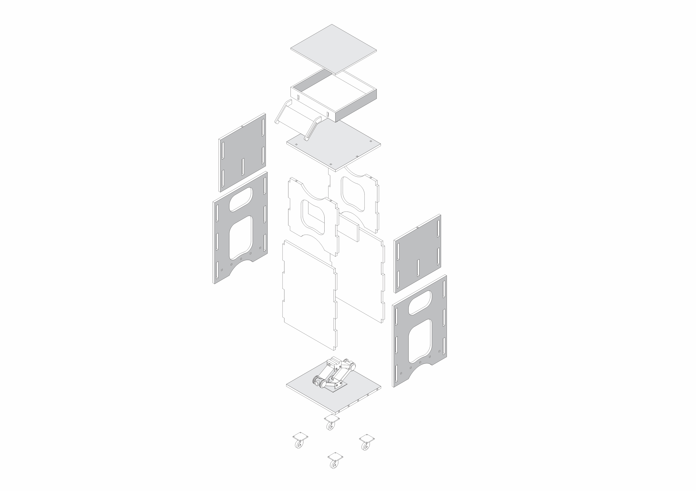
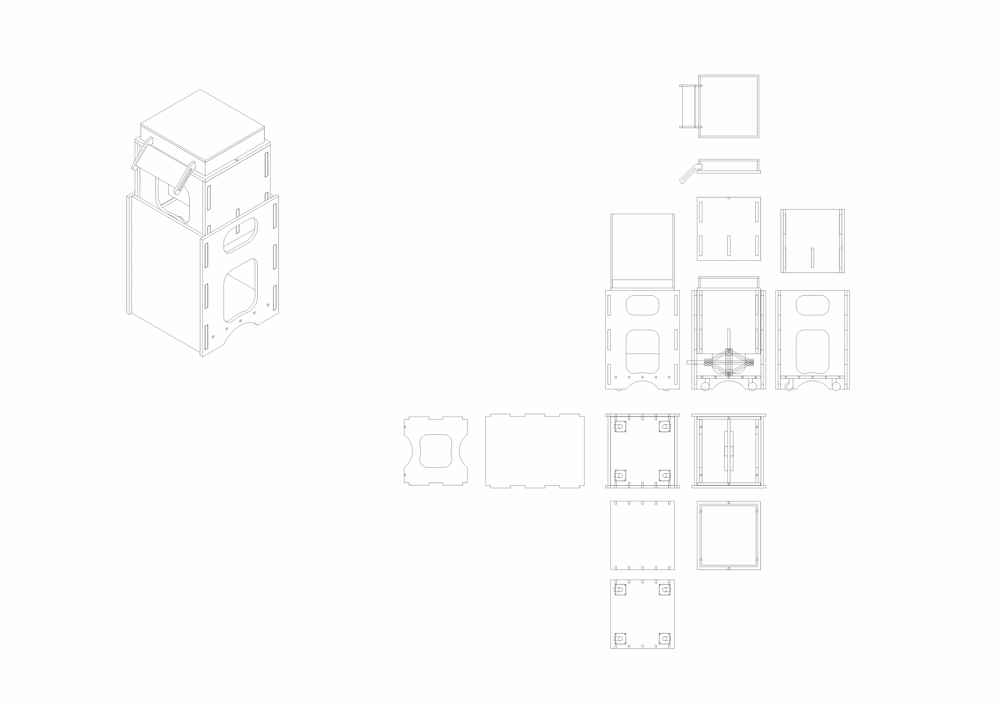
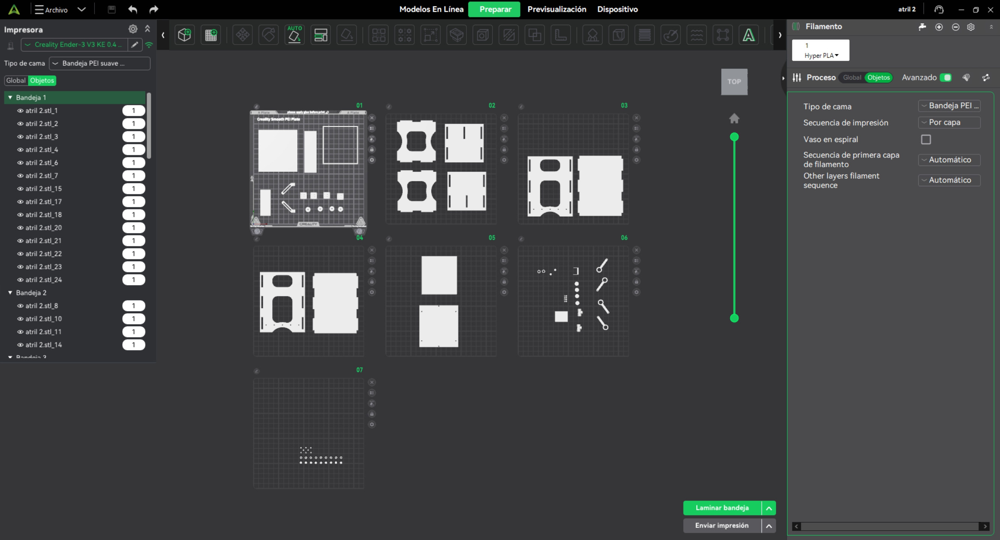
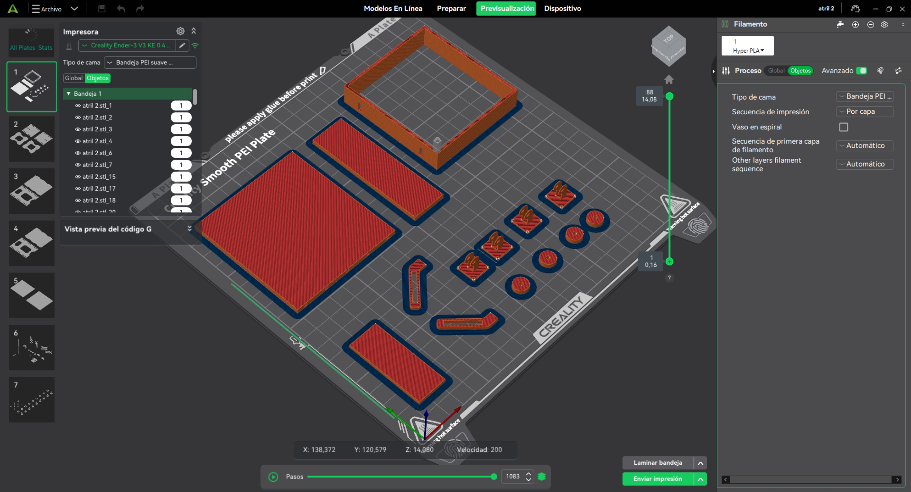
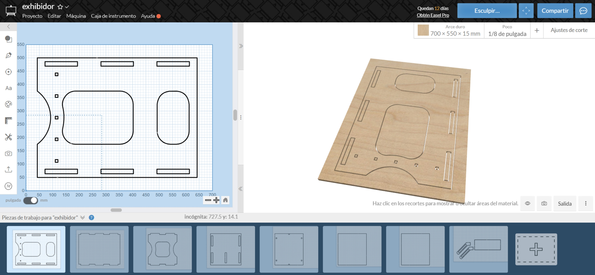
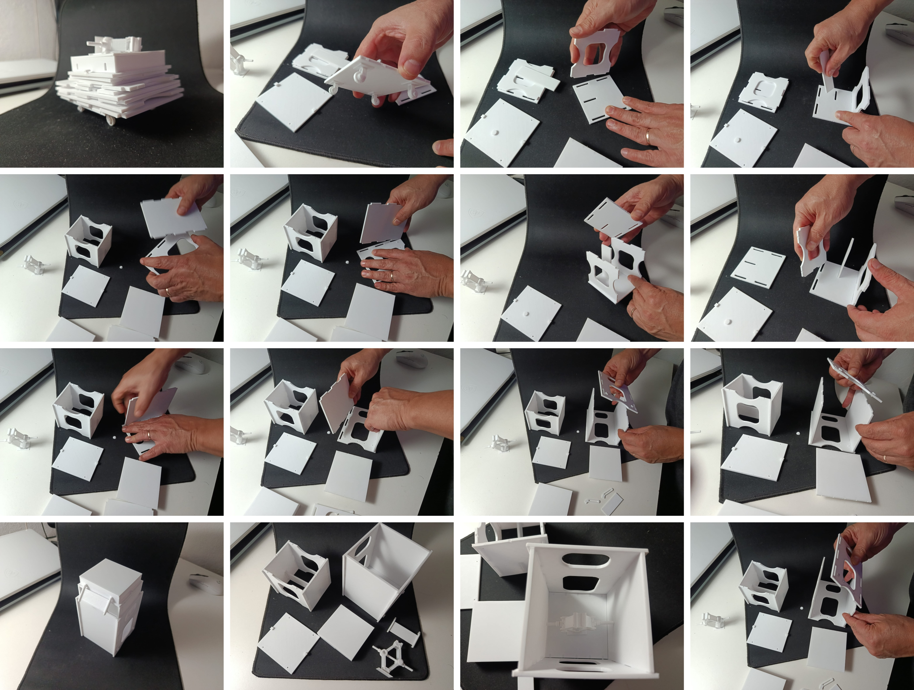

# **EXPOSICION**

Atril exibidor interactivo.

Atril o vitrina para exhibición de maquetas impresas en 3D. Es un equipamiento interactivo de forma cúbica, ensamblada en dos partes, una encastrada en la otra y en la parte superior una campana rectangular de acrílico transparente con un baño de luz desde abajo hacia arriba. Tendrá electrónica y programación para control de iluminación, audio, giro y ajuste de altura. Las funcionalidades estrategicas son fácil montaje y desmontaje, una vez montadas es de fácil traslado, y acopio en espacios reducidos.

Dimensiones: 40x40x80 cm, extendible hasta 110 cm en altura.
Peso que soportará: entre 50 y 2500 g
Materialidad: Placa compensada, terminación melamínico de madera de 15 mm de espesor, en dos partes; una encaja en la otra; la interior es móvil, se levanta con un pistón eléctrico accionado con un botón y tiene tres posiciones.

1- La interacción con el observador es la siguiente: cuando se acerque la persona, que se intensifique la iluminación automáticamente; mientras no hay observador delante, la luz late suavemente. 

2- Ajuste de altura: El atril o vitrina tiene que ajustarse a la altura del observador mediante un sensor o un botón con tres posiciones: bajo, medio, alto.

3- El disco rotatorio debe girar a la izquierda o a la derecha con dos botones; presionando el botón, gira; al soltar, se detiene.

4- Tiene una pantalla táctil de 10" que inicia automáticamente el audio descriptivo y las imágenes si se detecta que el observador permanece 10 segundos frente a la vitrina. La pantalla debe permitir pausar el audio, reiniciarlo o ir hacia atrás como los videos de YouTube. 

5- Luego de detectar por 20 segundos que no hay personas frente al atril, vuelve todo al modo inicial. la luz late suavemente y el audiovisual vuelve al inicio y espera.

6-La alimentación es con batería recargable y tiene que tener encender las luces en color rojo como indicador de bateria baja cuando quede solo un 10% de la energia total.

Protitipado, maquetación impresa en 3D

La maquetación del prototipo se imprimió aproximadamente a escala 1/5. Se busca un tamaño que permita reproducir el proceso de montaje. Evaluar las olguras y analizar la resistencia estructural. Es necesario verificar las partes móviles que van encastradas una dentro de otra. Por otro lado, se proyecta los espacios donde se alojarán los componentes electrónicos, baterías y elementos que deben quedar incluidos en el equipamiento.   

La fabricación está proyectada en madera contrachapada, terminación natural de 15 mm cortada con láser o con rúter CNC. El mobiliario está compuesto por 20 piezas más las 4 ruedas. Es totalmente desmontable.

Estimé el tiempo de fabricación usando Easel, en 7 horas estarian todas las piezas cortadas con el rúter CNC.

Ensamblar la maqueta del prototipo con todas las piezas impresas en 3D insume 10 minutos; con las piezas reales, el encastre y el montaje se estima en un máximo de 2 horas, incluida la instalación de las ruedas. Como herrajes de seguridad para un cierre que le dé firmeza y solidez al sistema, se pretende usar tornillos con tuercas incrustadas ocultas.

Electrónica

IA-Necesito que me armes la programación de la parte automática y la analógica con botones. El esquema para visualizarlo en Tinkercad y probarlo, para que pueda ir armándolo físicamente. Necesito la lista de los materiales para comprar lo que me falta. Y un estimativo de costos del equipamiento.

