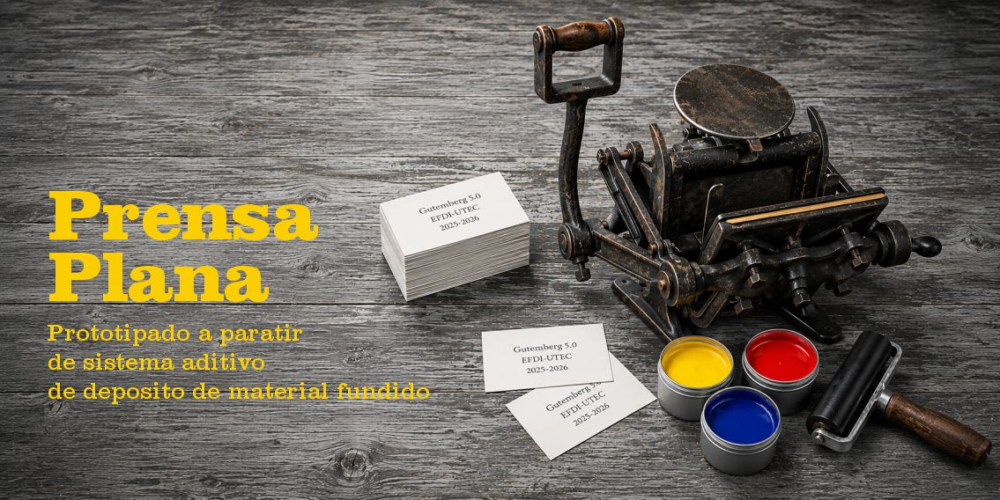

# Prensa Plana

La prensa plana, como las Minervas, se caracteriza por usar dos superficies planas para presionar el papel sobre los tipos móviles entintados y lograr la transferencia de tinta al papel. Así se logra el impreso. 

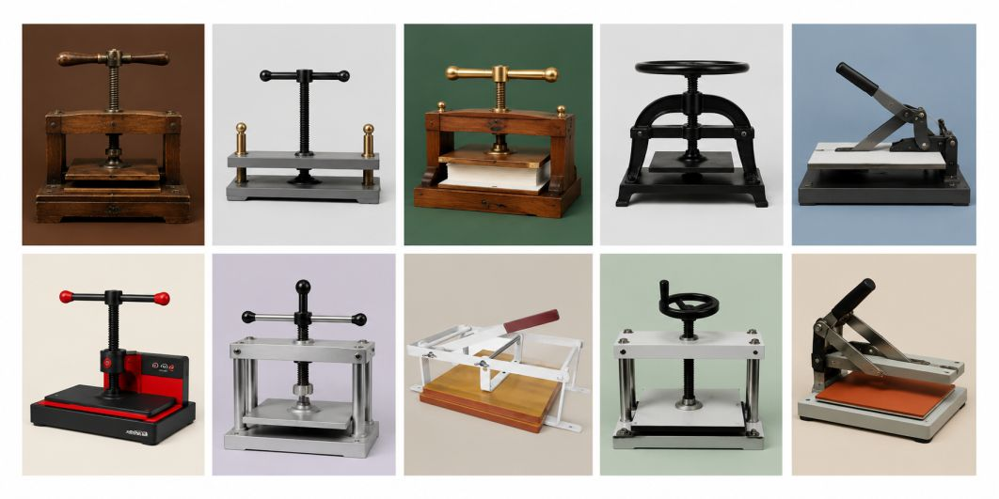

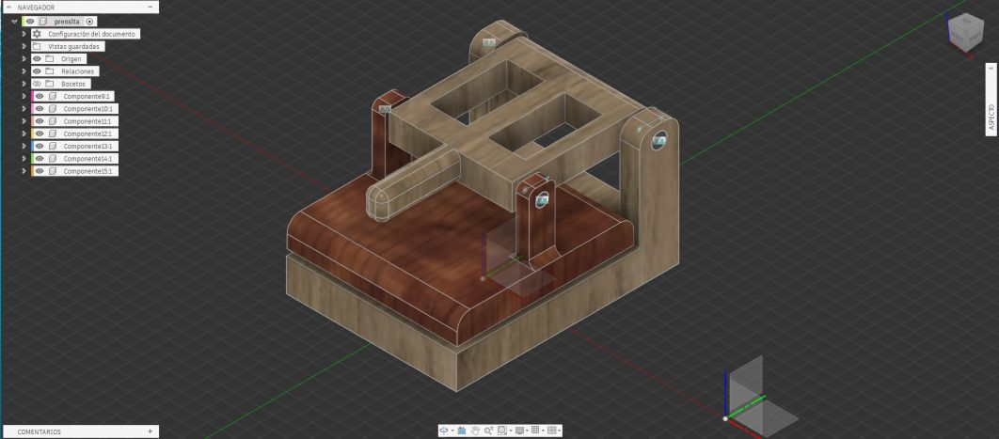

Para reproducir el sistema, diseñamos un modelo esquemático manual inspirado en una infinidad de ejemplos disponibles en la web. Con matrices realizadas con sistema de fusión aditiva destinada a niños. 

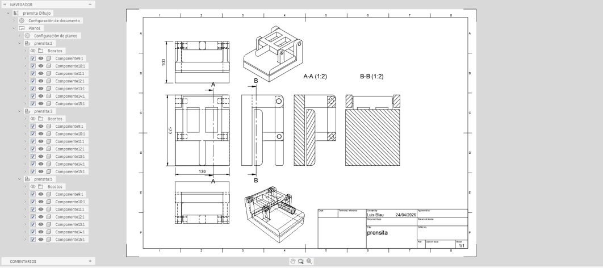

Este sistema tiene una base donde se coloca la matriz tipográfica o el diseño entintado y sobre ella el papel. La parte móvil es la platina que aprieta el papel sobre la matriz y transfiere la tinta logrando el estampado.

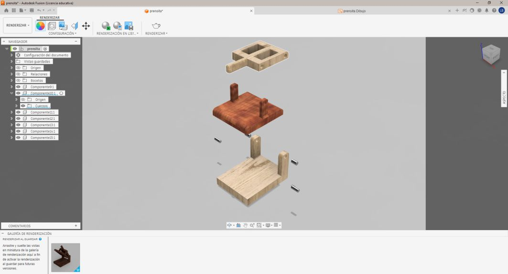

Con este modelo de mesa se explica el método con el que se reprodujeron impresos por más de 500 años y aún sobreviven algunos talleres y empresas que producen usando este sistema, aportando al mismo tiempo a la preservación patrimonial de la tecnología de la cultura gráfica.

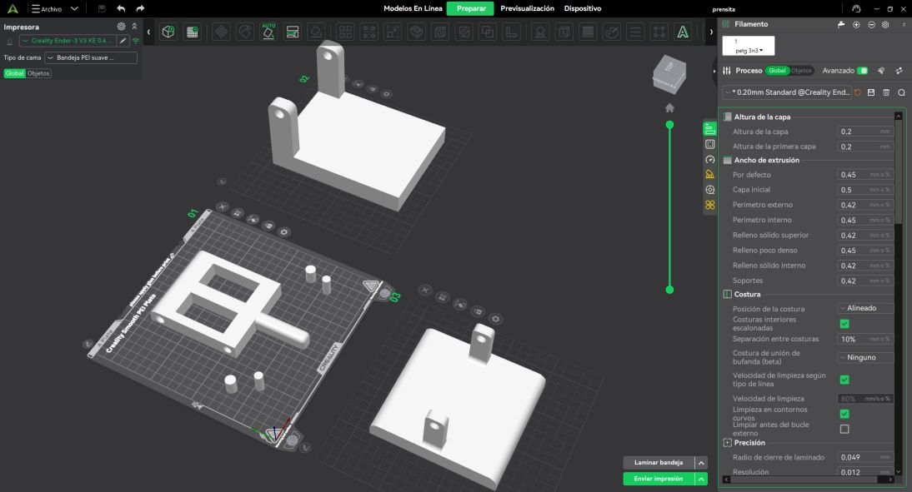

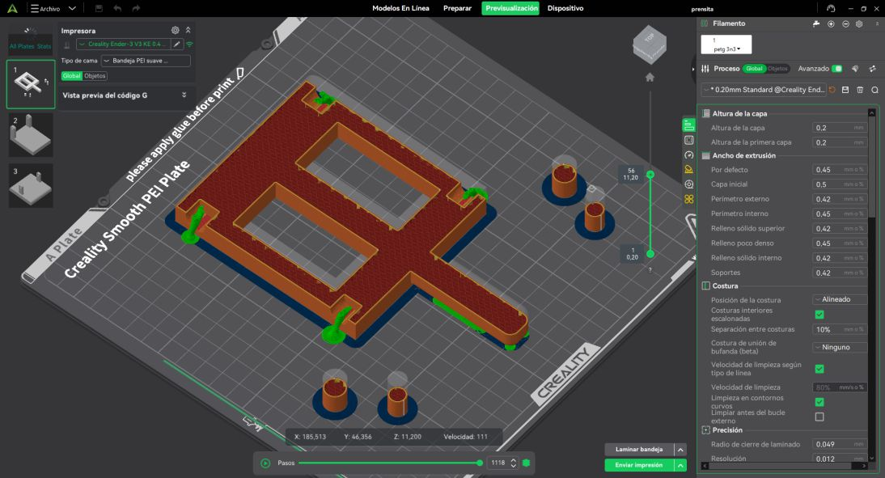

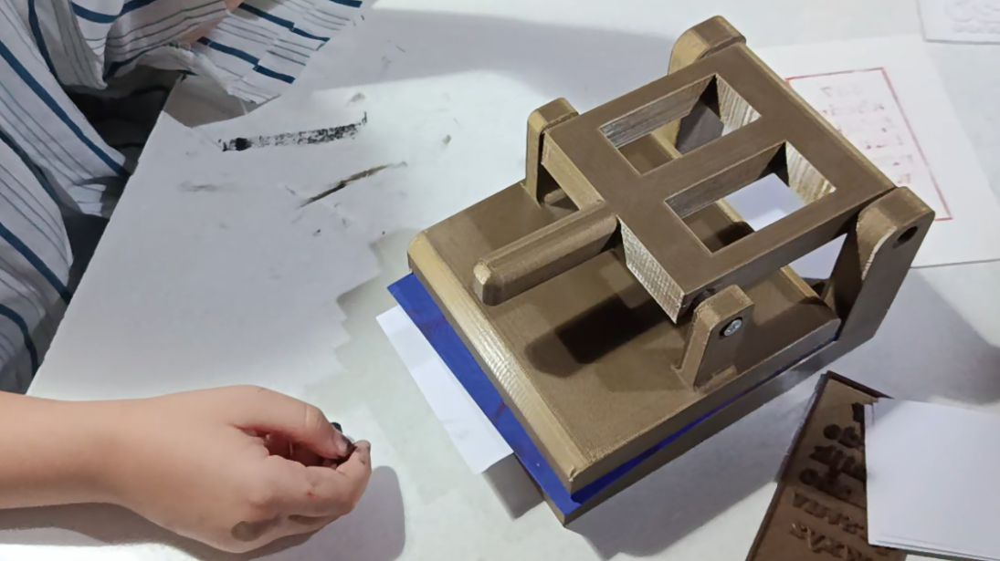

La principal innovación es la creación de matrices a través de la fabricación digital. El dibujo artesanal, la digitalización, la vectorización y el modelado 3D. Con estas posiblidades la reproducción didáctica de una prensa manual de uso escolar puede escalar a otros ámbitos y otros públicos de mayor edad. 

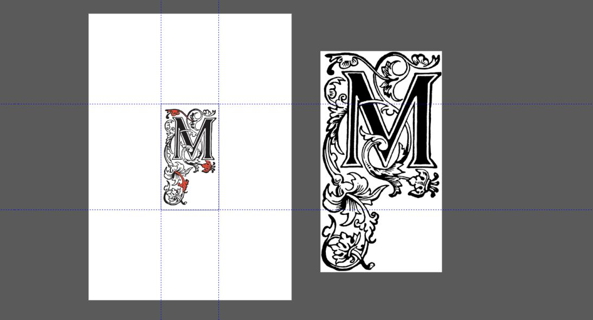

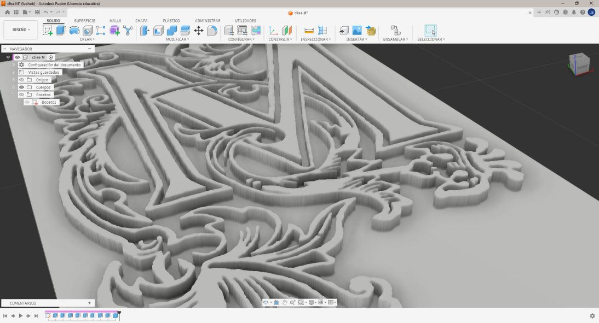

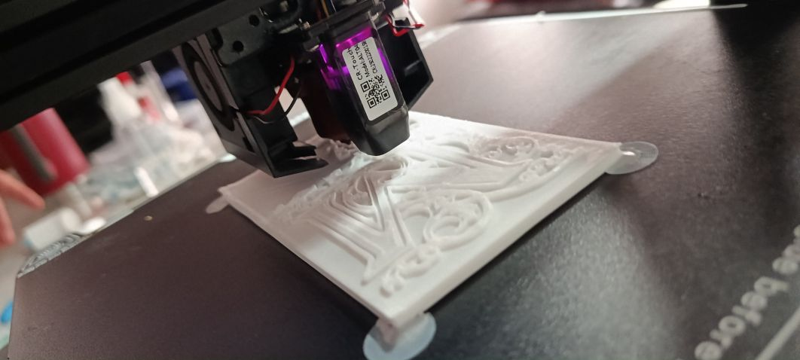

La incorporación de matrices fabricadas con moldes y biomateriales que disminuyen la cantidad de presión para lograr la impresión.

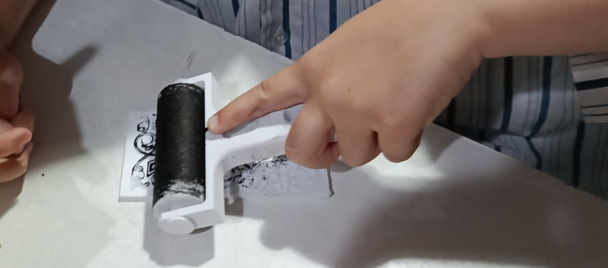

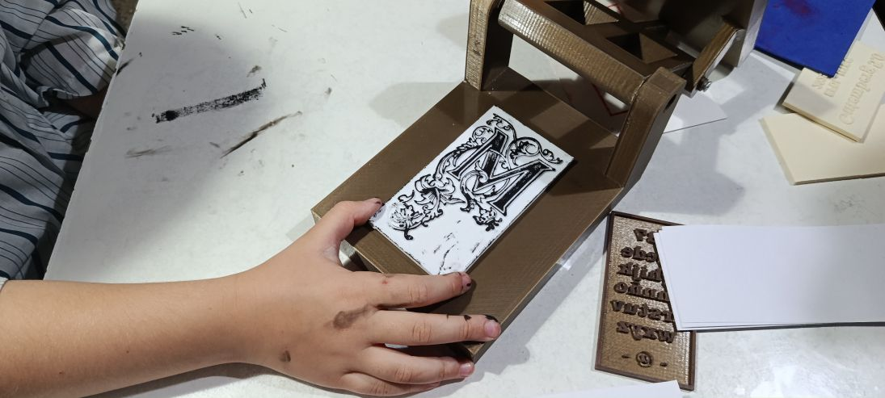

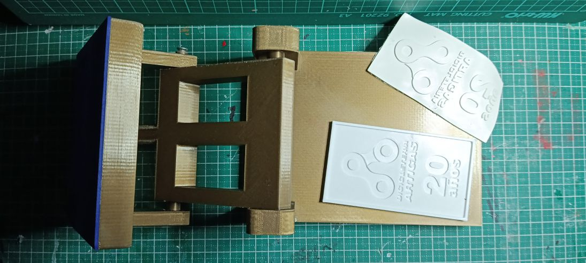

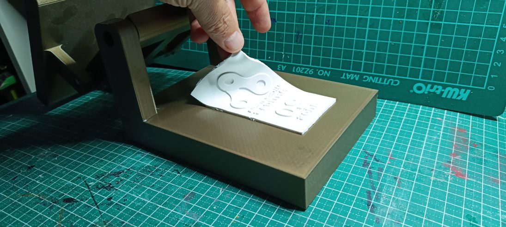

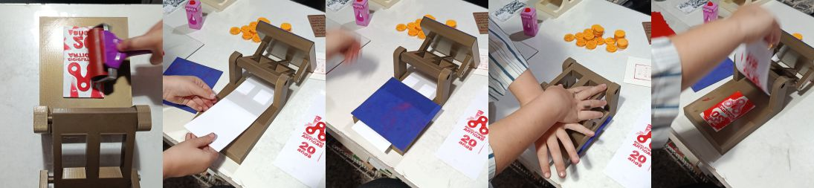

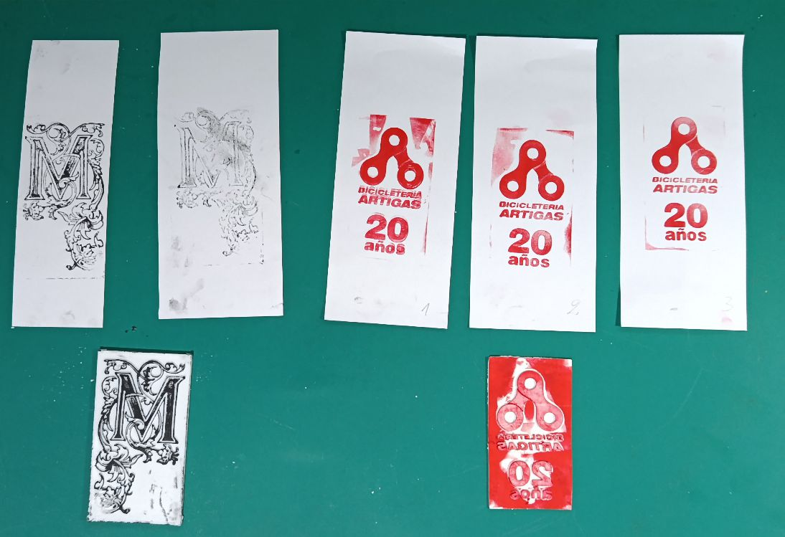

Este sistema es parte del taller que se realiza en conjunto con la exposición.