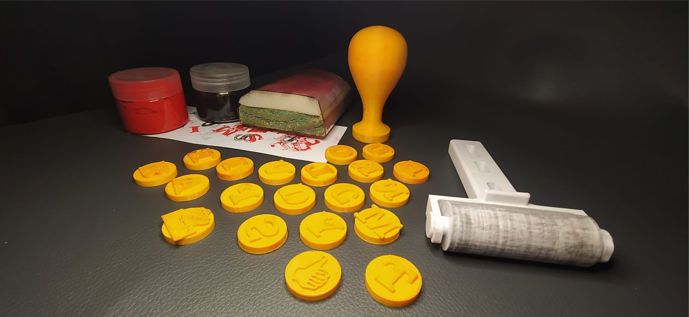
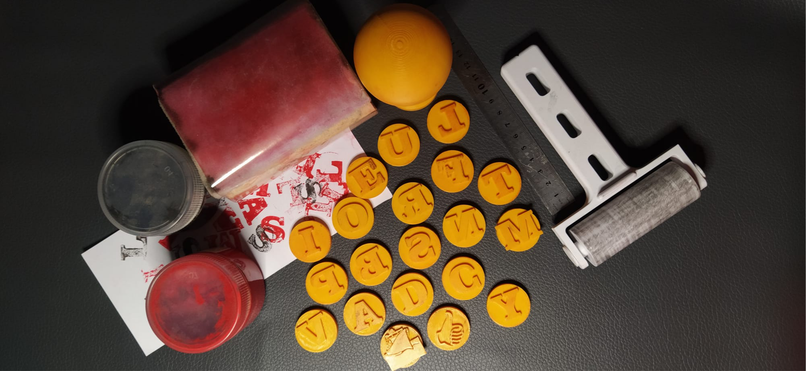
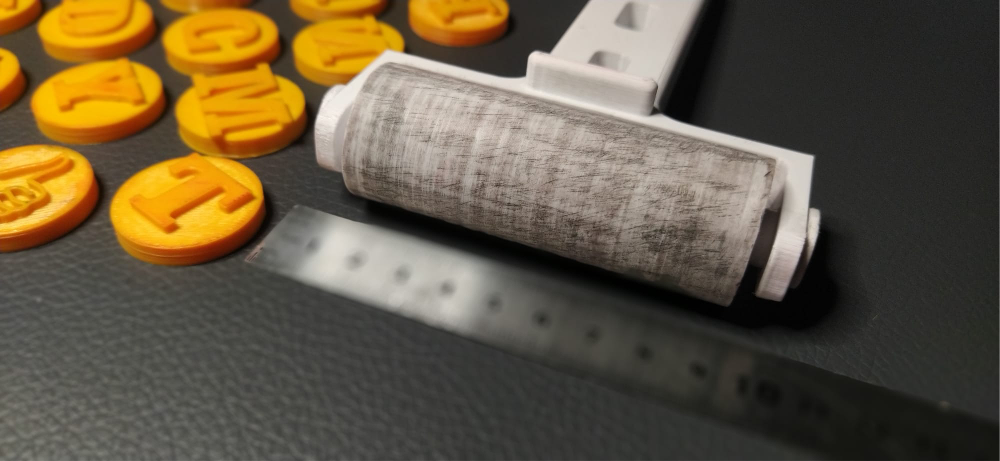

# **Proyecto Final** | EFDI

---

## *Gutemberg 5.0*

Reactivación del patrimonio tipográfico hospitalario mediante fabricación digital: exposición abierta y kit de alfabetización con doble impresión directa

### 1. Introducción

El proyecto se estructura en dos líneas complementarias:

Modelo colaborativo y distributivo:
Montaje de una exposición pública de modelos 3D de prensas históricas vinculadas a imprentas hospitalarias.

---

Modelo individual, participación multidisciplinar:
Desarrollo de un Kit del Impresor Escolar, orientado a niños de 6 a 7 años, como herramienta de alfabetización a través de la impresión directa.

Ambas líneas comparten una misma base tecnológica (modelado paramétrico e impresión 3D) pero responden a objetivos distintos: uno patrimonial y divulgativo; otro pedagógico y productivo.

### 2. Objetivo General

Reactivar la cultura gráfica hospitalaria mediante la reproducción digital de tecnologías históricas y su transferencia pedagógica a través de dispositivos de alfabetización material.

### 3. Línea 1 — Modelo colaborativo y distribuido
Exposición de Prensas Hospitalarias Impresas en 3D. Sistema abierto de investigacion, producción y mediación cultural.
Modelo de colaboración posible:

- Colaboración Historica Documental
- Colaboración Técnica / Maker
- Colaboración Educativa
- Colaboración Artística
- Colaboración Académica

Mapa de aportes especificos esperables:

- Contexto documental
- Mejora mecánica
- Optimización electrónica
- Reinterpretación visual
- Aplicacion pedagógica
- Prototipado Experimental
- Memoria Oral

**Objetivo específico**
Desarrollar una muestra expositiva compuesta por modelos tridimensionales impresos en 3D de prensas tipográficas que formaron parte de imprentas hospitalarias en Uruguay.

Componentes

- Modelos a escala de prensas históricas.
- Fichas técnicas normalizadas.
- Contexto histórico y documental.
- Registro audiovisual del proceso de modelado y fabricación.
- Publicación de archivos 3D bajo licencia abierta.

Alcance conceptual (Publico general)
La exposición propone una experiencia tangible del patrimonio técnico. El visitante no solo observa: comprende el mecanismo, la lógica estructural y el funcionamiento.

El modelo físico funciona como mediador entre:

- Memoria institucional
- Cultura material
- Fabricación digital contemporánea

### 4. Línea 2 — Modelo individual multidisciplinar
Kit del Impresor Escolar (6–7 años)

**Objetivo específico**
Diseñar y fabricar un kit de impresión directa orientado a procesos iniciales de alfabetización mediante la manipulación tipográfica.

Componentes del kit:

- Alfabeto en caja alta (A–Z)
- Números (0–9)
- Pictogramas básicos
- Base de impresión manual
- Sistema de entintado simple
- Manual didáctico

Todos los elementos serán impresos en 3D.

**Fundamentación pedagógica**
La propuesta se apoya en:

- Aprendizaje kinestésico.
- Alfabetización multisensorial.
- Comprensión material del signo gráfico.
- Relación entre letra, forma y huella.
- El niño no solo reconoce la letra: la compone, la entinta, la presiona y la imprime.
- Se restituye así la dimensión corporal de la escritura.

### 5. Metodología Integrada

**Fase 1** — Investigación histórica (ya desarrollada)

- Relevamiento de imprentas hospitalarias.
- Identificación de modelos de prensa.
- Análisis tipográfico de documentos originales.

**Fase 2** — Modelado y Prototipado

- Modelado paramétrico 3D.
- Ensayos de resistencia mecánica.
- Ajuste de tolerancias.
- Pruebas de ensamblaje.

**Fase 3** — Desarrollo del Kit Escolar

- Diseño ergonómico adaptado a infancia.
- Evaluación de seguridad (bordes, piezas pequeñas).
- Pruebas de impresión directa.
- Ajustes de presión y registro.

**Fase 4** — Implementación y Validación

- Montaje de exposición.
- Taller piloto con grupo escolar.
- Registro de experiencia.
- Evaluación cualitativa.

### 6. Resultados Esperados

Producto Patrimonial

- Exposición montada.
- Modelos abiertos disponibles en repositorio digital.
- Documentación técnica completa.
- Producto Aplicado
- Kit funcional de alfabetización.
- Manual didáctico.
- Protocolo de taller replicable.

### 7. Valor Innovador

El proyecto integra:

- Patrimonio hospitalario.
- Fabricación digital.
- Diseño distribuido.
- Alfabetización temprana.
- Impresión directa contemporánea.

No se trata solo de reproducir máquinas:
se reactiva un sistema cultural completo.

---

## **Prototipado** 

### *Kit del Impresor Escolar*

Sistema modular magnético de impresión directa para alfabetización inicial (6–7 años)

### 1. Concepto del dispositivo

El Kit del Impresor Escolar es un sistema de impresión directa basado en tipos móviles intercambiables con fijación magnética, diseñados para funcionar como sello manual. Cada carácter (letra, número o pictograma) adopta la forma de medalla circular impresa en 3D, con:

- Relieve tipográfico invertido para transferencia de tinta.
- Imán encapsulado en su interior.
- Geometría segura y ergonómica para manipulación infantil.
- El soporte de impresión incorpora un sistema magnético oculto que mantiene la medalla firmemente posicionada durante la presión.

El proceso de uso es simple:

- Selección del carácter.
- Fijación magnética en el soporte.
- Entintado mediante rodillo.
- Presión manual sobre tarjeta.
- Transferencia directa.

### 2. Componentes del Kit
Elementos impresos en 3D

- Rodillo entintador
- Soporte magnético para medallas
- 27 letras mayúsculas
- 9 números
- 5 pictogramas básicos
- Estructura contenedora o caja organizadora
- Elementos complementarios
- Almohadilla de entintar
- Tarjetas en blanco para impresión
- Dos colores de tinta acrílica base agua

### 3. Especificaciones técnicas preliminares

- Tipos móviles (medallas)
- Forma: circular
- Diámetro estimado: 35–45 mm
- Altura total: 8–12 mm
- Relieve de impresión: 1–2 mm
- Material sugerido: PLA o PETG
- Imán encapsulado de neodimio de baja potencia (seguridad infantil)
- Soporte de letras
- Base plana con encastre magnético central
- Sistema de contención lateral para evitar desplazamientos
- Mango ergonómico adaptado a motricidad infantil
- Rodillo entintador
- Estructura impresa en 3D
- Rodillo intercambiable (goma EVA o silicona blanda)
- Fácil desmontaje para limpieza

### 4. Fundamento pedagógico
El kit integra:

- Alfabetización multisensorial.
- Aprendizaje kinestésico.
- Asociación signo–forma–huella.
- Construcción activa de la letra.

**El niño/a**:

- Elige el signo.
- Lo posiciona.
- Lo entinta.
- Lo imprime.
- Observa el resultado.

Este proceso refuerza:

- Reconocimiento visual.
- Coordinación motriz fina.
- Comprensión del carácter como unidad gráfica autónoma.
- Relación entre gesto y marca.
- La experiencia conecta con la tradición tipográfica, pero en lenguaje contemporáneo.

### 5. Innovación del sistema
El diferencial del kit radica en:

- Intercambio magnético seguro.
- Modularidad.
- Fabricación completamente digital.
- Integración entre patrimonio tipográfico y alfabetización temprana.
- Posibilidad de personalización tipográfica futura.

### 6. Metodología de desarrollo

**Etapa 1** — Diseño paramétrico

- Modelado 3D de medallas.
- Test de tolerancias magnéticas.
- Simulación de presión.

**Etapa 2** — Prototipado

- Impresión en PLA.
- Ensayos de entintado.
- Evaluación de transferencia.

**Etapa 3** — Validación pedagógica

- Taller piloto con grupo escolar.
- Observación de uso.
- Ajuste ergonómico.

**Etapa 4** — Documentación

- Manual de uso.
- Guía didáctica.
- Protocolo de seguridad.

### 7. Relación con la línea patrimonial
Mientras la exposición de prensas trabaja la memoria técnica histórica, el Kit del Impresor Escolar activa esa memoria en el presente. Uno exhibe la máquina. El otro reactiva su lógica. El niño no aprende solo letras. Aprende que las letras se imprimen, que tienen cuerpo y relieve.

---

### *Exposiciicon imprenta hospitalarias*

### 1. Concepto de Montaje

La exposición estará compuesta por 8 modelos de prensas hospitalarias impresas en 3D, montadas sobre atriles diseñados y fabricados digitalmente.

Cada atril no será solo soporte:
será un dispositivo interactivo autónomo.
La muestra representa tecnologías vinculadas a las tres imprentas estudiadas:

- Imprenta de la Caridad (1822-1855)
- Imprenta del Hospital de Clínicas (1951)
- Imprenta CeReMOS (1959)

### 2. Sistema de Atriles CNC Interactivos
Diseño General
Estructura cortada en CNC (MDF fenólico o multilaminado).
Ensamblaje por encastre estructural.
Disco superior giratorio para exhibición del modelo.
Compartimento interno para electrónica.
Altura aproximada: 100–110 cm.
Diámetro disco: 35–45 cm.

### 3. Funcionalidades Interactivas
Cada atril incorporará:

- 3.1 Iluminación automática
Activación por sensor de proximidad.
Luz LED cálida dirigida al modelo.
Encendido suave (fade in opcional).

- 3.2 Activación sonora
Sensor de proximidad independiente.
Reproducción de audio breve:
Contexto histórico.
Funcionamiento mecánico.
Datos técnicos.
Duración sugerida: 30–45 segundos.

- 3.3 Disco giratorio motorizado
Motor de baja velocidad.
Botón giro derecha.
Botón giro izquierda.
Movimiento suave para no desestabilizar modelo.
El visitante puede explorar el objeto en 360°.

### 4. Prototipo Tecnológico
Se desarrollará un atril prototipo como modelo técnico replicable.
Este prototipo permitirá:

- Ajustar tolerancias estructurales.
- Evaluar estabilidad.
- Testear cableado y seguridad.
- Calibrar sensores.
- Evaluar consumo energético.
- El resto de los atriles podrán replicar el sistema optimizado.

### 5. Arquitectura Técnica (Base Propuesta)
Electrónica sugerida:

- Microcontrolador tipo Arduino.
- Sensor de proximidad IR o ultrasónico.
- Driver para motor DC o motor paso a paso.
- Tira LED 12V.
- Módulo reproductor MP3 con parlante compacto.
- Fuente estabilizada interna.
- Todo el sistema quedará oculto en cavidad inferior.

### 6. Experiencia del Visitante
Secuencia de interacción:

- Se aproxima.
- Se enciende iluminación.
- Se activa audio contextual.
- Puede girar el modelo.
- Observa detalles mecánicos.

Esto convierte la exposición en:

- Sensorial
- Mecánica
- Narrativa
- Participativa

### 7. Valor Académico
El desarrollo del atril integra:

- Diseño paramétrico.
- Corte CNC.
- Ensamble estructural.
- Programación básica.
- Integración hardware.
- Experiencia de usuario (UX físico).

No es solo museografía:
es prototipo de sistema expositivo replicable.

### 8. Evaluación Técnica
Durante la implementación se evaluará:

- Tiempo de interacción promedio.
- Cantidad de activaciones.
- Resistencia mecánica.
- Estabilidad estructural.
- Robustez del sistema electrónico.
- Facilidad de mantenimiento.

### 9. Relación Conceptual con Gutemberg 5.0
La imprenta fue tecnología interactiva en su tiempo.
El atril devuelve esa condición. Del movimiento manual del tórculo al botón digital contemporáneo. Del plomo al sensor.

---

## **Referencias**

### *Open proyet - How to 3D Print Your Own Printing Press*
https://openpressproject.com/blogs/news/how-to-3d-print-your-own-printing-press#:~:text=I,printing%20cloth%2Ffelts

### *Prensa de impresión casera a partir de una caja de leche modificada*
https://makezine.com/article/craft/diy-printing-press-from-a-modified-milk-crate/

### *Nueva prensa tipográfica RÁPIDA PLUS® 50x100 cm.*
https://prensasvillazanblog.blogspot.com/

### *Prensas litográficas serie JL, instrucciones de montaje.*
https://www.polymetaal.nl/siteUK/Linkdocs/JL-series/jlassembly.htm?utm_source=chatgpt.com

### *Prensa Litografica Alejandro E.*
https://3dwarehouse.sketchup.com/user/7a0dea78-bba8-4514-acb8-5a17e5c79ff0/alejandro-E

### *Fabricación y planos de tórculos, prensas litográficas y de grabado.*
https://www.instructables.com/Build-a-Printmaking-Press/

### *Prensa litografica manual Modelo brisset ca.1865*
https://www.ign.es/resources/docs/IGNCnig/noticias/prensa_litografica.pdf#:~:text=algunas%20obras%20de%20litograf%C3%ADa%20art%C3%ADstica,transmitida%2C%20se%20soltaba%20el%20pedal

### *Printing presses in the graphic arts Collection. The nacional Museum of Americna History 1996 - Elizabeth M. Harris.*
https://amhistory.si.edu/docs/harris_printing_presses_graphic_arts_1996.pdf?utm_source=chatgpt.com

### *Grabado con Fotopolimeros*
https://www.domestika.org/es/blog/11142-fotograbado-con-fotopolimeros-una-revolucion-en-el-grabado

### *Torculo Rembrandt DIY de Bill Ritchie 2014*
https://competition.adesignaward.com/design.php?ID=32121

## **Videos de la WEB**

### *Prensa de grabado con tubos de pvc*
https://www.youtube.com/watch?v=PROfesEBLcE&t=208s

### *Mini Etching Preso Isnpiration*
https://www.youtube.com/watch?v=E3bvc0d0GJs&t=10s

### *DIY Mini Etching Press Assembly*
https://www.youtube.com/watch?v=BGpp6sn9apQ