# **Tipos Móviles** | EFDI

Una experiencia con Tipos Móviles de biomateriales, PLA, madera y caucho.

## Prototipo 1

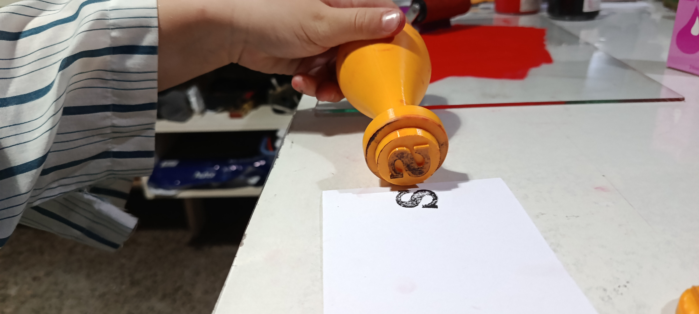

El kit del impresor permite un acercamiento del antiguo método de impresión de Gutenberg con un público infantil sin tener que ir a una imprenta ni usar tipos originales de plomo. Es equivalente a un sello, con matriz, soporte, empuñadura y entintado.

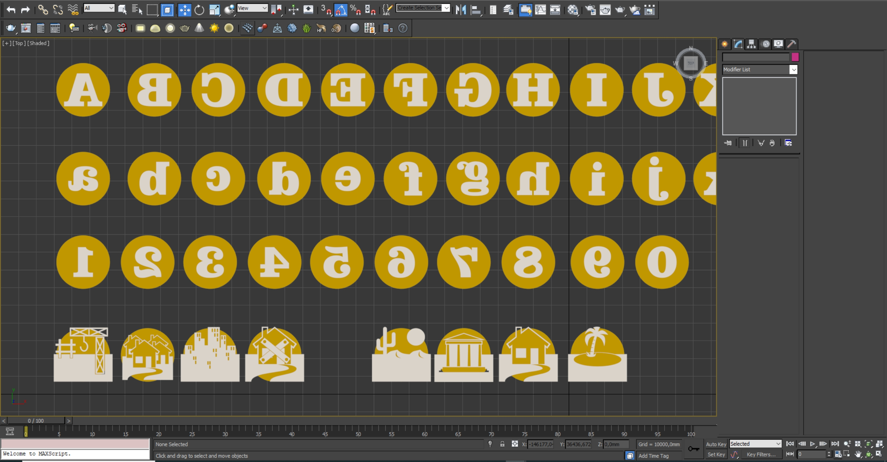
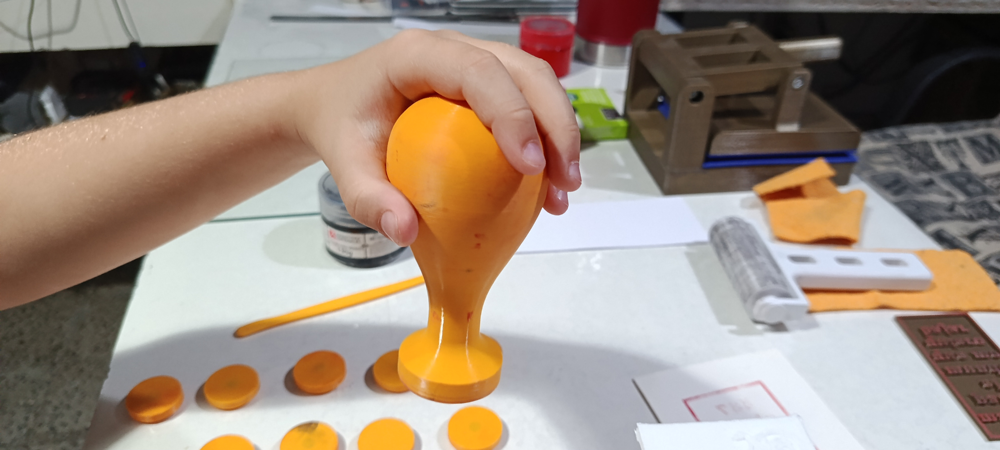

El desafío es fabricar un sistema de estampado de letras al papel usando presión con las manos, como sellos. Un alfabeto con mayúsculas y minúsculas que puedan ser montadas en una empuñadura y que la presión de niños sea suficiente para transferir la tinta al papel.

¿Cuál es la fuerza de un niño?
¿Cuál es el tamaño adecuado de letras?
¿Con qué tipo de tintas es el más adecuado?
¿Cómo controlar las manchas?
¿Cómo entintar las letras?
¿Cómo limpiar los útiles?

Una agarradera grande para amplificar una fuerza pequeña. Tipos móviles de tamaño grande, compactos y rígidos requerirán fuerza de presión. Un sistema fácil y rápido para intercambiar piezas en la agarradera. Piezas con el menor número de aristas y ángulos posibles para que sea más amigable y con menos riesgos de lesiones.

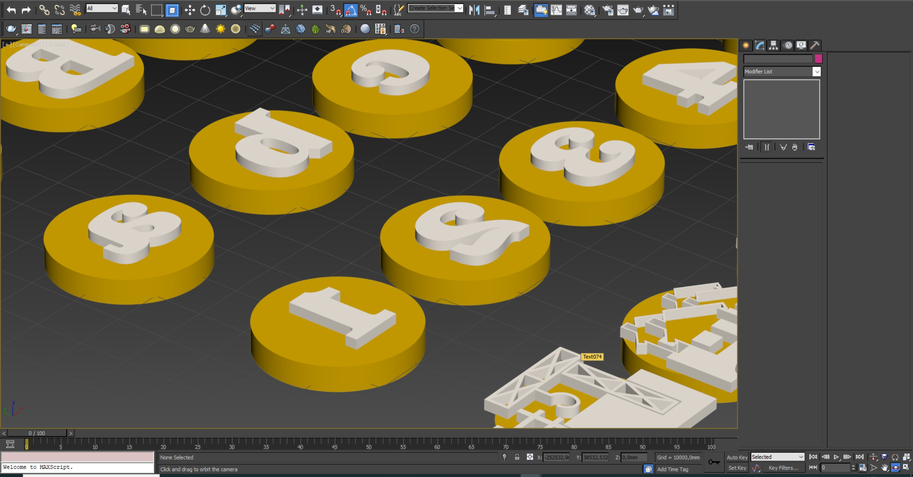
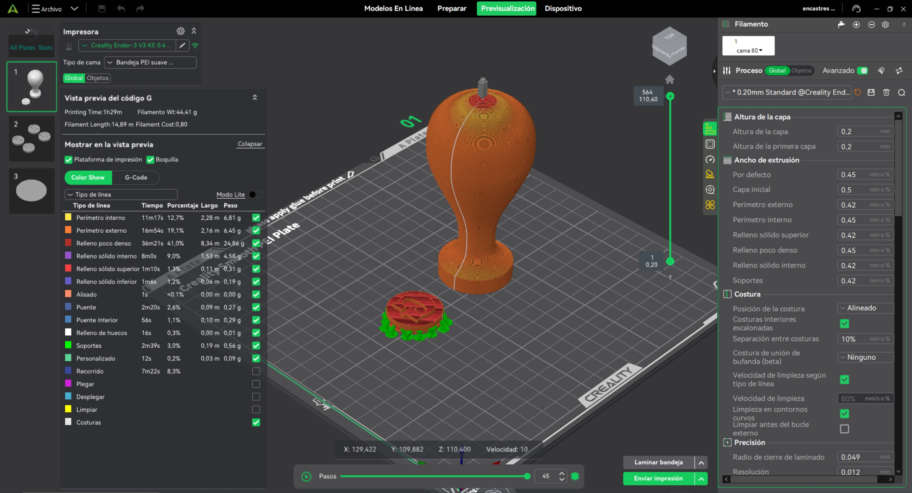

Con el primer prototipo se evaluó una agarradera con forma de pera invertida y discos circulares con los caracteres invertidos impresos con PLA amarillo para lograr mayor estímulo visual con las piezas.

Primero se evaluó un modelo con discos roscados, pero lo descarté rápidamente por el tiempo que lleva quitar y recolocar la pieza; además, el modelado digital es complejo y lleva bastante tiempo de desarrollo y diseño.

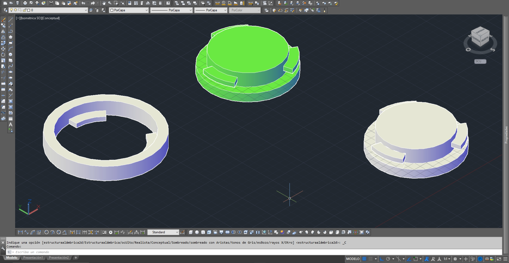

Los sustituí por discos con un imán de neodimio oculto en el interior del disco y otro en la base de la empuñadura. Fácil, rápido y atractivo para un niño. Definí un tamaño de disco de 30 mm como adecuado para manipular: letras muy visibles, piezas que no se pierden con facilidad y buen agarre para lavado después del uso. Para niños de 5 a 7 años, la normativa internacional sobre rango de riesgo de obstrucción de la vía aérea contempla ese tamaño.

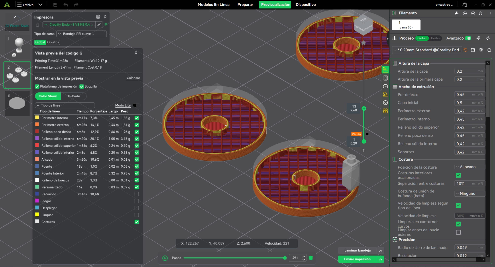

Pude someterlo al uso infantil con la ayuda de mi sobrina Sofía, de 7 años. Observé varias dificultades en el uso:
1. Con tintas densas a base de agua tipo pasta, el disco se sale de la agarradera.
2. Para lograr una impresora uniforme, es necesario hacer fuerza con ambas manos.
3. Para mejorar la transferencia, hay que usar una hoja de goma eva debajo del papel.
4. Hay bastante enchastre de tinta; se tiene que tener delantales y servilletas húmedas.
5 con tintas más líquidas (como las de sello convencionales); funciona mejor el conector magnético.
6. El rodillo Entintador es un estímulo fuerte y el niño se ve tentado a pintar con él.
7. La limpieza de los utensilios ensucia bastante con salpicaduras la zona donde se lavan las piezas.

Como conclusión en esta etapa, hay que mejorar el estampado, logrando que se haga con menos fuerza. La agarradera debe tener mayor fuerza en los imanes para aumentar la adherencia con el disco de la letra.

## Prototipo 2

En la segunda etapa, combiné impresión 3D con técnicas de moldes para lograr un sello suave, que reduzca considerablemente la fuerza que hay que hacer para estampar. Eso permite mejorar el proceso, reducir el tamaño de la agarradera, no necesita una base de goma eva y se obtienen mejores resultados en menor tiempo.

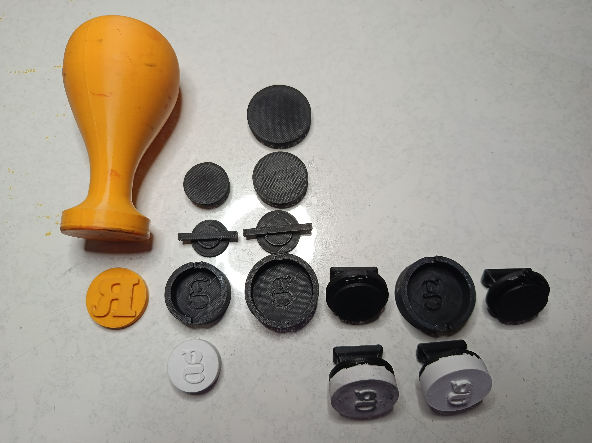

Con el mismo diámetro, cambio drásticamente el diseño; los discos pasan a ser cilindros blandos, lo rigido son los moldes negativos para ser llenados con biomateriales; en este caso usé caucho de silicona. La letra pasa a ser bajorelieve dentro del molde.

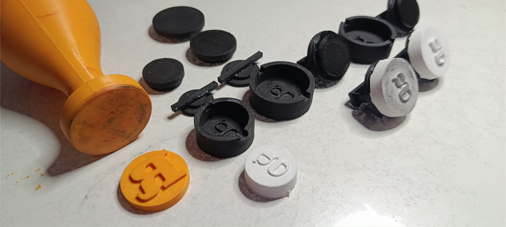

El llenado insume 8 ml de caucho y el desmolde se puede hacer a las 10 horas de haber llenado. El resultado es muy bueno, con buena definición de la forma; mantiene los remates, los ojos y los cambios de modulación en la letra. 

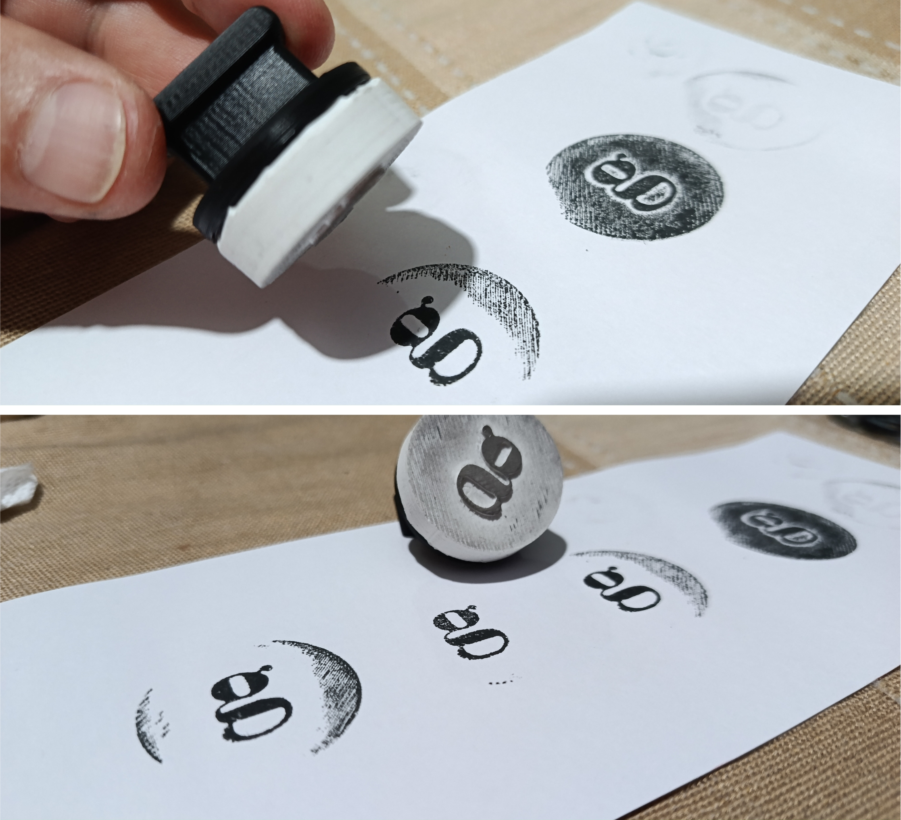

Mantenemos las dos partes del prototipo 1, una agarradera y un disco de impresión. Los nuevos problemas que tuve que resolver son: 
1. La altura de la letra es muy baja y la base del sello llega al papel.
2. La unión del disco de caucho y la agarradera no es propia.

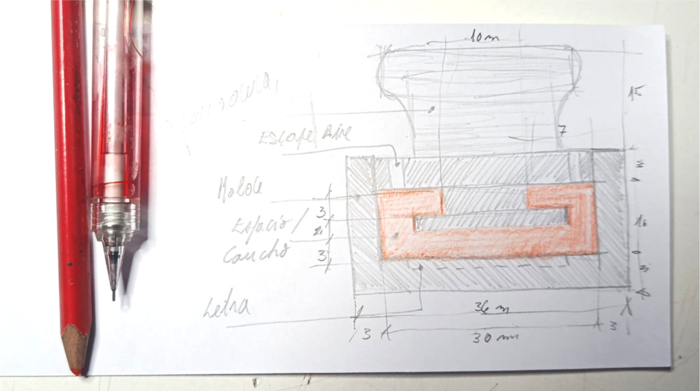

Se aumentó el bajorelieve en el molde a 2 mm y en la agarradera el nicho donde el caucho inunda para quedar adherido; se aumentó a 3 mm.

El proceso de impresión de una unidad tarda 33 minutos. Para un alfabeto completo con mayúsculas, minúsculas y números, serían 64 unidades, es decir, 128 piezas en total. El tiempo que insume es de 35 horas para un juego completo. Cada par de piezas lleva 12 g de filamento, en total se necesitan 800 g. El caucho de silicona por unidad es de 8 ml; en total insume 520 ml. Para poder desmoldar, hay que esperar 12 h.

En esta instancia no solo se está promoviendo imprimir con tipos móviles, sino que también se está reproduciendo el proceso de fabricación de un tipo móvil, el verdadero aporte de Johannes; él inventó el molde para fabricar tipos móviles de plomo, lo que posibilitó la reproducción de textos de forma masiva en 1450.

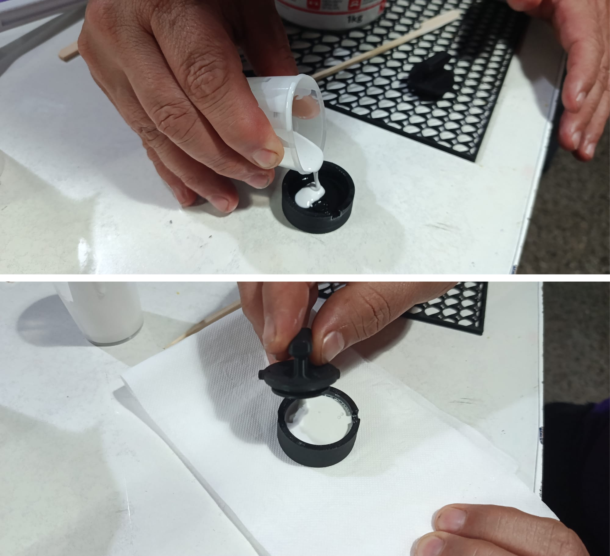
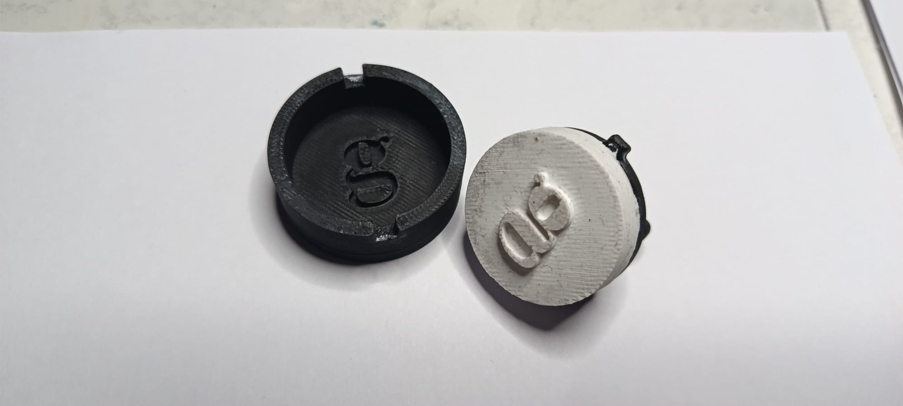

## Otros prototipos para estampado

Inspirado por el historiador Robert Darnton en sus reflexiones sobre la industria del libro y la edición. Su crítica planteaba que la imprenta nacía en el siglo XV como una tecnología nueva, pero con mentalidad vieja; imitaba a los libros caligráficos. Recién 50 años más tarde aparecerían tipografías nuevas, que no imitaban a la caligrafía gótica. Ese recuerdo me motivó a explorar las posibilidades de la impresión 3D aplicadas a la producción de impresos; es como el proceso inverso a lo que manifestaba Darnton. Una fabricación moderna para una aplicación antigua.

En ese sentido, imprimí una letra con cada estilo de relleno interior que viene en el laminador de mi impresora 3D, y exploré qué resultados impresos generaba cada uno. El objetivo es artístico, con valor estético y aplicado como recurso decorativo en distintos soportes. Me permitió observar la resistencia estructural de las piezas, los tiempos de impresión y el consumo de material de cada estilo.

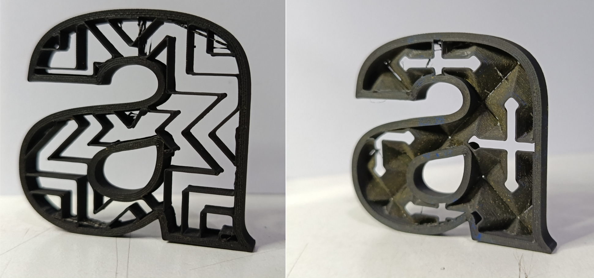

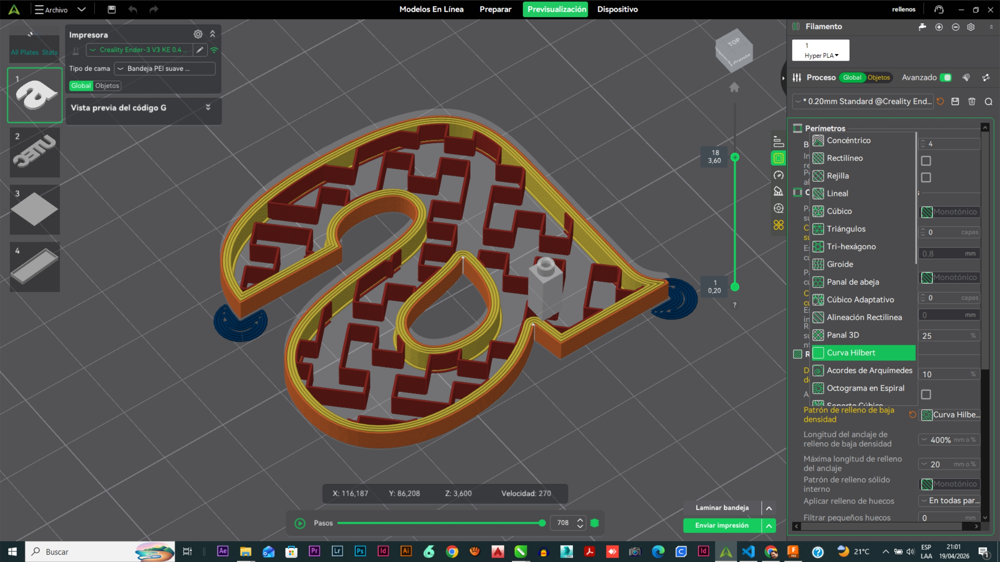

## Tipos móviles de MDF

Los tipos móviles de madera surgieron entre 1820 y 1830 por necesidades técnicas; para hacer grandes titulares en afiches, fundir en plomo era costoso y muy pesado. Por ese motivo surgen los tipos de madera como solución industrial. Para fabricarlos, el tipógrafo Darius Wells inventó alrededor de 1820 la fresadora lateral para tallar tipos de madera. Luego, a partir de eso, se desarrolló el pantógrafo mecanizado que copiaba en un extremo la letra y la ampliaba en el otro tallando con una fresa. Se podría decir que es un antecedente directo del ruter CNC.

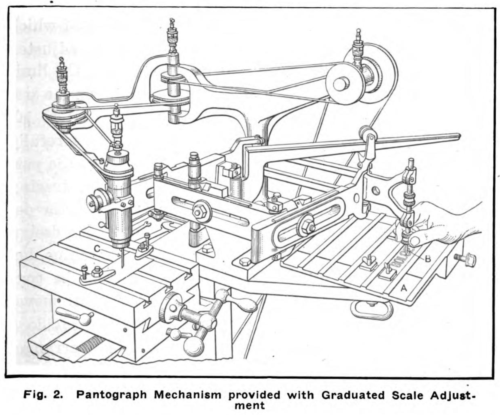

En el rúter CNC del lab de Durazno tallamos dos tipos de madera en MDF de 8 mm como ejercicio de uso de la tecnología, y la apliqué directamente a mi proyecto final.

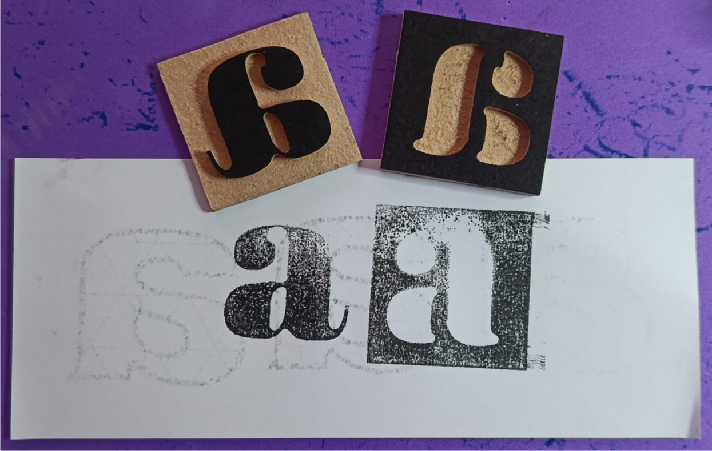

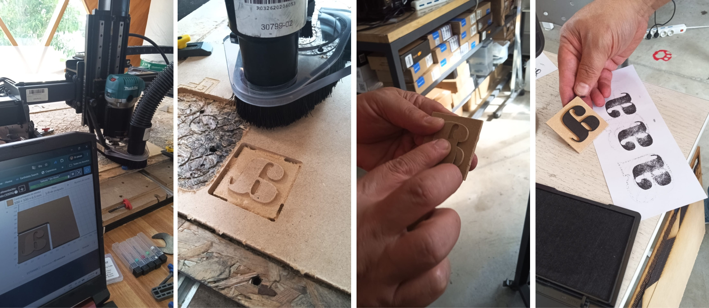

Para cerrar lo que considero un reciclaje patrimonial integral, seleccioné una familia tipográfica fundida en Montevideo y adquirida por una de las imprentas hospitalarias estudiadas. Bodoni es la tipografía que se usará en el proceso de prototipado de los moldes de los sellos.

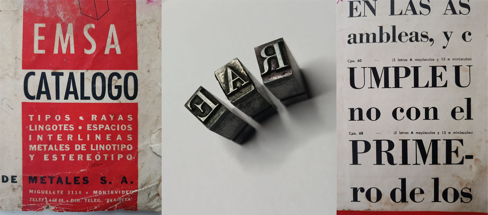

---
