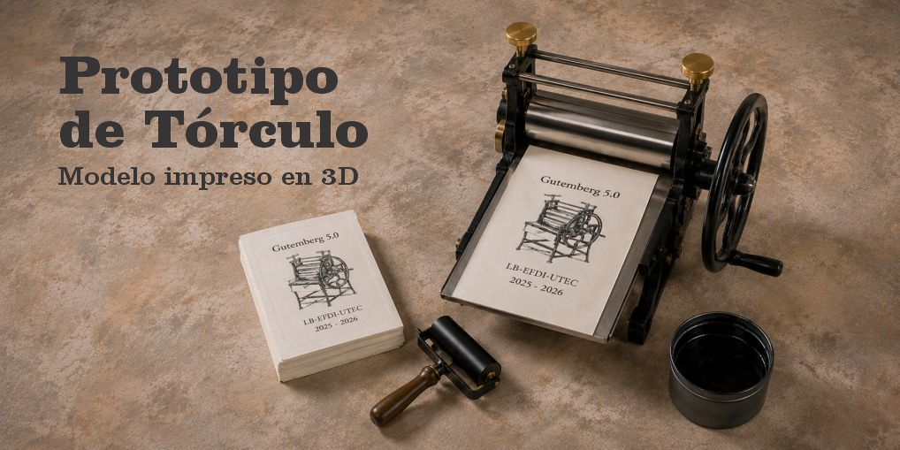
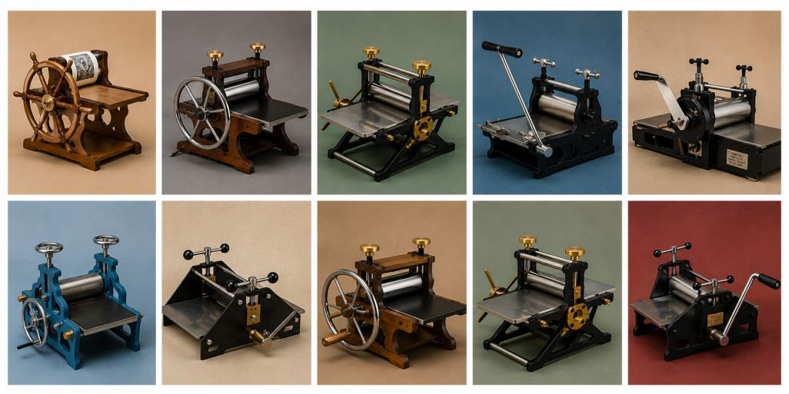
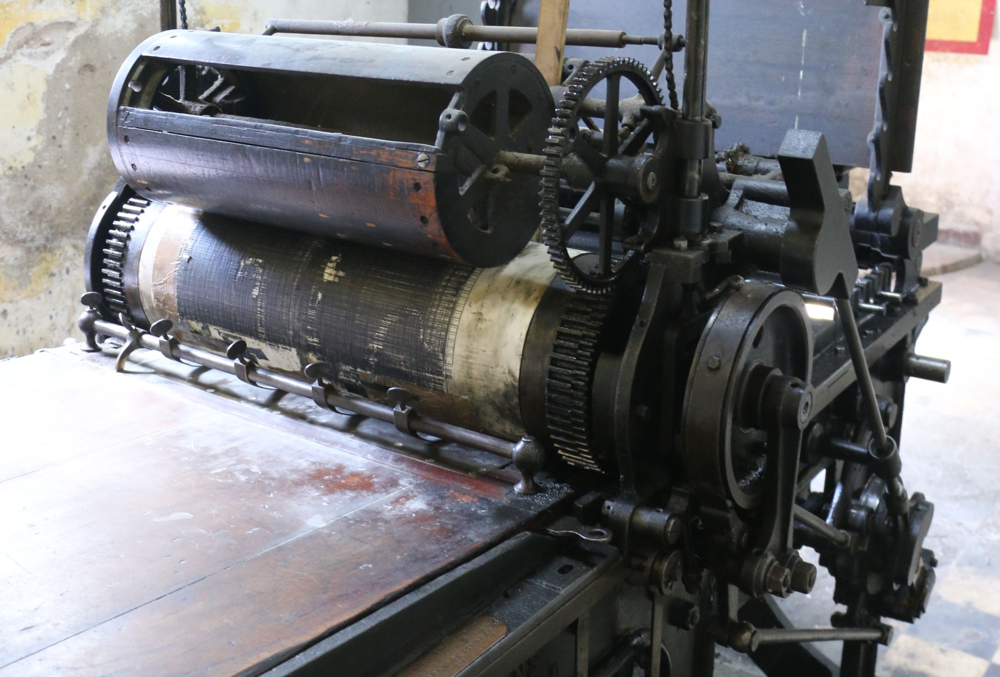
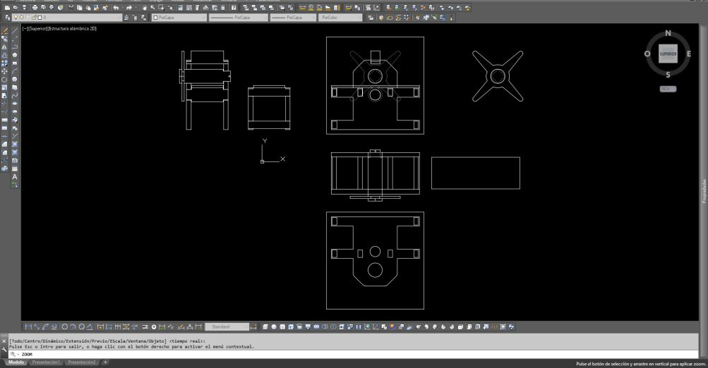
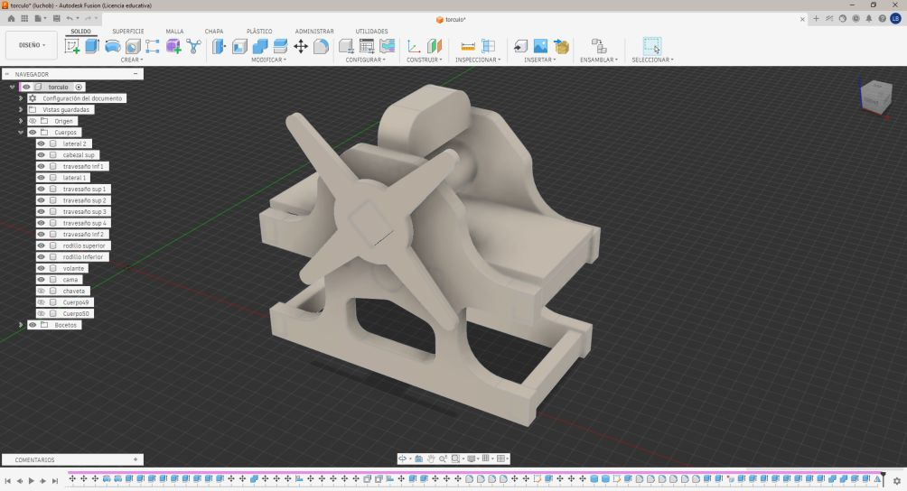
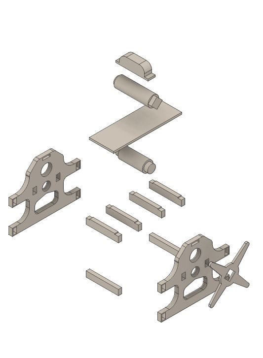
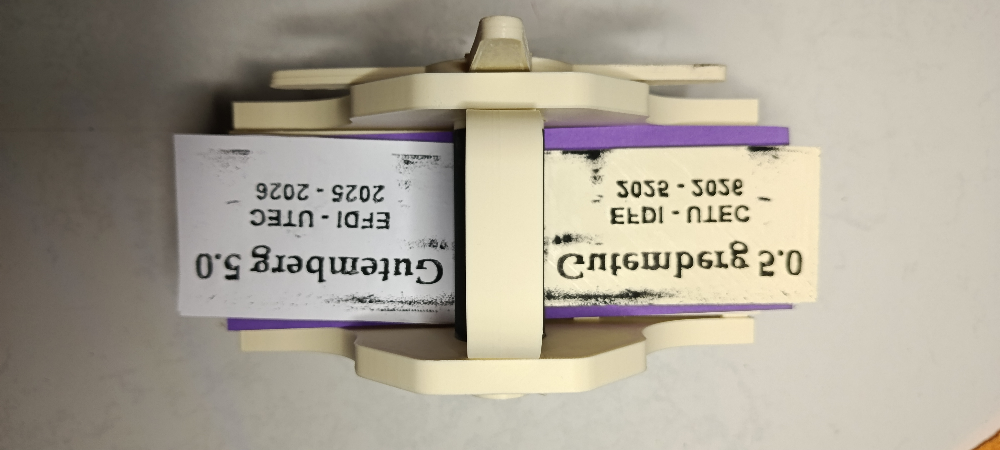
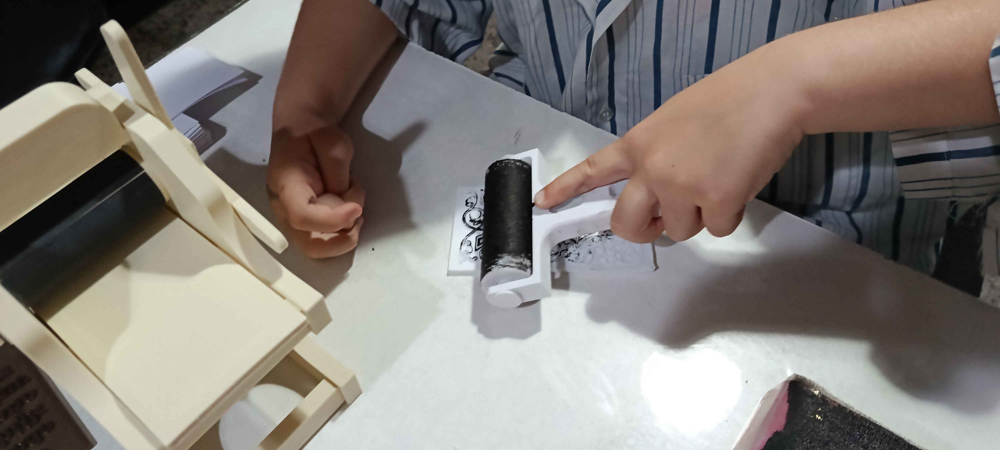
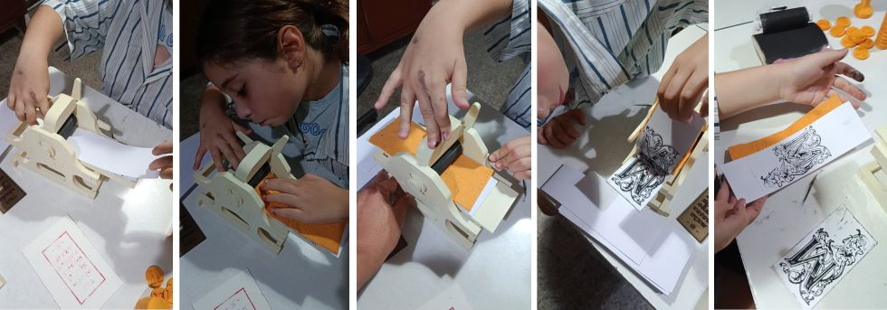
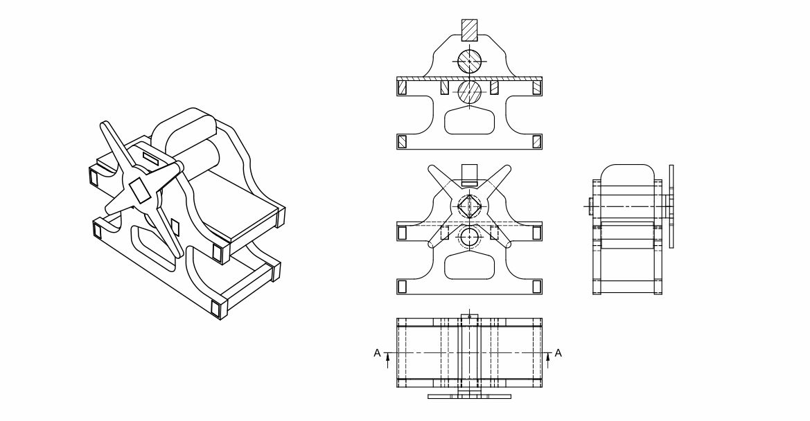

# Prensa plano-cilíndrica

El tórculo es una prensa plano-cilíndrica utilizada históricamente para la impresión tipográfica, el grabado y otras técnicas de estampación. Su funcionamiento se basa en el desplazamiento de una cama móvil que transporta la matriz bajo un cilindro de presión.

# Evolución tecnológica

La prensa plano-cilíndrica representa una evolución significativa respecto a las prensas planas tradicionales. Mientras que en la prensa plana la presión se ejerce simultáneamente sobre toda la superficie de impresión, en la plano-cilíndrica la presión se concentra en una línea de contacto que avanza progresivamente a medida que gira el cilindro.

Esta diferencia permite distribuir mejor los esfuerzos mecánicos, obtener impresiones de mayor calidad y reducir el desgaste de los tipos móviles y de las matrices. Asimismo, el sistema requiere menor esfuerzo para alcanzar una presión uniforme sobre superficies de impresión más grandes.

Otra ventaja importante es el aumento de la productividad. La incorporación del cilindro posibilitó incrementar la velocidad de trabajo y la cantidad de impresos producidos, convirtiendo a las prensas plano-cilíndricas en una tecnología fundamental para periódicos, publicaciones seriadas y talleres gráficos de gran volumen durante los siglos XIX y XX.

La reproducción de este sistema dentro de Gutenberg 5.0 permite comprender cómo la innovación tecnológica transformó los procesos de impresión, mejorando simultáneamente la calidad, la durabilidad de los componentes y la capacidad productiva de los talleres gráficos.

Como referencia para este proyecto se tomó el tórculo conservado en el Museo Silveira Silva de Durazno, una pieza representativa de las tecnologías gráficas utilizadas en Uruguay a finales del siglo XIX y comienzos del siglo XX.

A partir de la observación y el relevamiento visual se desarrolló un modelo físico mediante fabricación digital, buscando representar los principales componentes mecánicos y el principio de funcionamiento del sistema original.

El modelo permite explicar de forma didáctica conceptos vinculados a la impresión histórica, la transmisión de movimiento y la evolución tecnológica de los sistemas gráficos.

El proceso de impresión comienza con el entintado de la matriz, que se coloca sobre la cama móvil del tórculo. Sobre ella se dispone el papel y, posteriormente, el fieltro. Mediante el giro del volante, el conjunto avanza bajo el cilindro de presión, que transfiere la tinta al papel. Una vez completado el recorrido, se retira el impreso y el proceso puede repetirse para realizar nuevas reproducciones.

Referencias

[Tórculo del Museo Silveira Silva de Durazno](https://durazno.uy/index.php/noticias-departamentales/torculo-en-el-museo-silveira-silva-reliquia-de-finales-del-1800.html)

