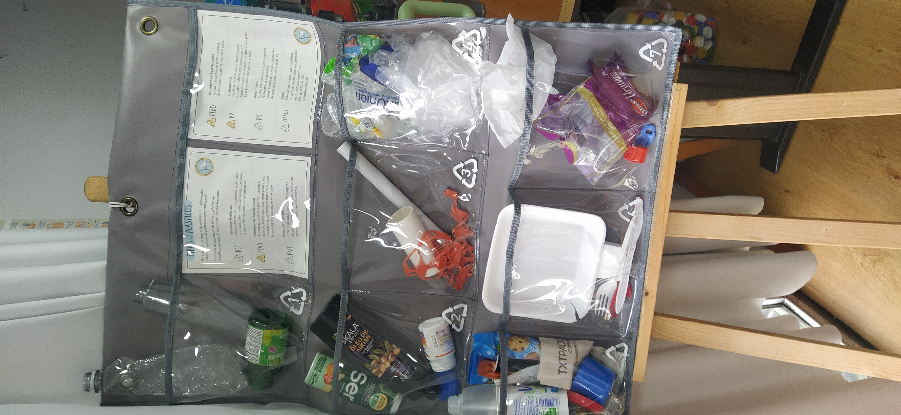
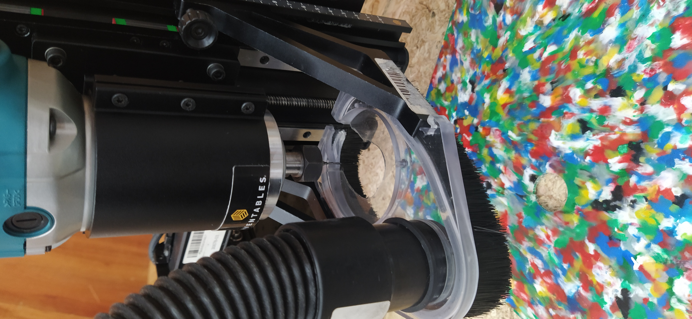
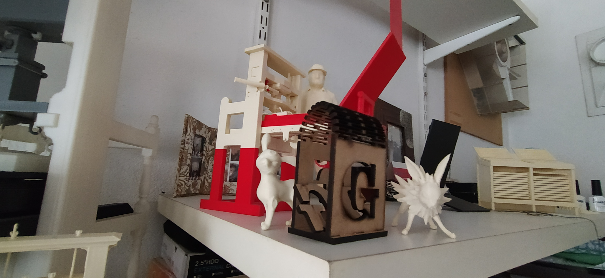

---
hide:
    - toc
---

# FP01

*Fabricación en laboaratorio 1*

El primer intercambio en laboratorio de fabricación digital fue en el Domo de la Utec de Durazno. Una experiencia sensorial única donde la charla es en estéreo y la espacialidad configura una jornada particularmente especial.

  <iframe
    src="https://www.youtube.com/embed/eCaZfuYanok"
    title="Laboratorio de Fabricación Digital - UTEC Durazno"
    frameborder="0"
    allow="accelerometer; autoplay; clipboard-write; encrypted-media; gyroscope; picture-in-picture; web-share"
    allowfullscreen
    referrerpolicy="strict-origin-when-cross-origin"
    style="position:absolute; top:0; left:0; width:100%; height:100%;">
  </iframe>

Luego de la presentación de las distintas tecnologías que tiene el laboratorio por parte de Facundo, fuimos paso a paso siguiendo la configuración para lograr los objetivos del ejercicio de corte, grabado y rasterizado con láser.

Instalamos el programa RdWork e importamos el archivo que desde corel exporté en DXF. Una vez en el programa, se verifica que las líneas no estén dobles y superpuestas (eso hace que el láser pase dos veces por el mismo lugar) y lo ponemos en capas con su color correspondiente. Negro: corta, Rojo: graba, Verde: Resteriza.

Se hizo una importación con archivo de imagen en extensión SVG, en una capa propia para realizar un grabado a partir de una imagen. En las propiedades de la capa se configura la velocidad y la potencia del láser; en modalidad raster, el láser se prende o apaga según el contraste monocromático de la imagen.

Una vez configurado el archivo, se guarda el archivo en el formato nativo del programa y se exporta en formato RD, que es el del modelo de la máquina del laboratorio. Este archivo se carga a la memoria de la máquina con un pendrive. Desde el panel frontal se navega y se transfiere a la memoria interna.

Se carga la placa de MDF a la cama de la máquina y se establece el eje de coordenadas. Luego se simula el área que insume el diseño y se ejecuta el comando de inicio del proceso. 

La máquina láser con la que trabajamos es de CO2, tiene un sistema de extracción de gases con turbina conectada hacia el exterior. Produce un sonido intenso producto de la sumatoria de todos sus sistemas de movilidad, extracción de humos y vibraciones de su estructura; se recomienda el uso de tapaorejas.

Visitamos el contenedor de reciclado de plásticos donde César nos explicó el ciclo desde que reciben los materiales, clasificación, limpiezas y producción de diversos productos. Plásticos tipo 2: Son los de las tapitas de envases de refrescos. Este código se encuentra encerrado en un triángulo en casi todos los envases, cuyo material es el más adecuado para las máquinas que tienen en el laboratorio. Placas de hasta 18 mm de espesor de 40x50 cm y un peso de aproximadamente 2 kg, involucran triturado de las tapitas, horneado hasta que se vuelve una pasta, vertido de la materia prima fundida en moldes de MDF en una prensa neumática. 

Se logran formas diversas, planas, y algunos modelados con inyección combinada con maniobras artesanales logran recipientes que se usan como macetas. La materia prima se recibe de la comunidad de forma gratuita; se fabrican diversos objetos que solicitan escuelas en modalidad de intercambio. UTEC aporta la infraestructura, el desarrollo de la tecnología y los recursos humanos de los laboratorios.

Me traje mis dos primeros objetos logrados a partir de cortadora Láser

Hasta el proximo FABLAB amigos!!!