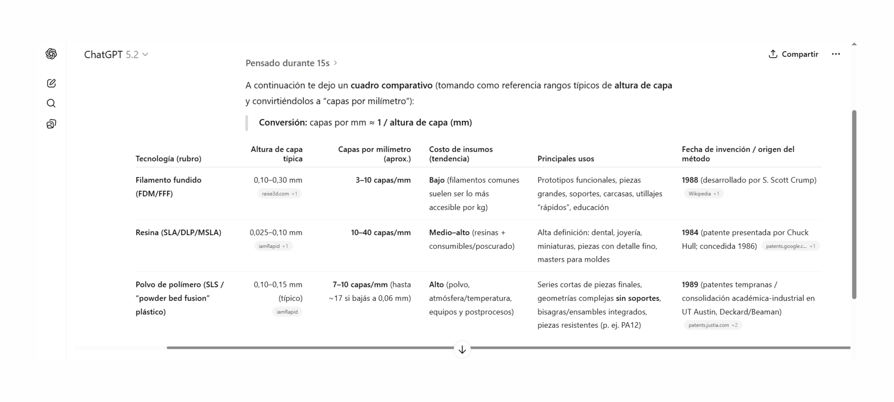

# FP02

### *Fabricación en laboratorio 2*

Segunda jornada de experimentación con impresión 3d volvimos al DOMO de Durazno.

  <iframe 
  src="https://www.youtube.com/embed/_ORDg7-aLGs?si=AHwccLFemi-Aut6E" 
  title="YouTube video player" 
  frameborder="0" 
  allow="accelerometer; autoplay; clipboard-write; encrypted-media; gyroscope; picture-in-picture; web-share"
  allowfullscreen
  referrerpolicy="strict-origin-when-cross-origin"
  style="position:absolute; top:0; left:0; width:100%; height:100%;">
  </iframe>

Enfocados en los distintos tipos de impresión 3D, repasamos algunas impresoras, sus partes, procesos de mantenimiento y características de la calidad de los objetos impresos.

Manufactura por deposición de fundición, sistema MDF, solidificación de resina con láser y solidificación de polímero con láser. Son las tres tecnologías que dispone el laboratorio y la elección se hace según los requerimientos del proyecto en relación al producto a imprimir.

Conocer en profundidad los distintos resultados de las tecnologías permite ordenar y catalogar tipos de asesoramiento. Partir de la necesidad de un cliente y adecuar los recursos tecnológicos para brindar una solución eficiente, de calidad, con plazos y costos perfectamente determinados.

La calidad de la terminación de las piezas, la resistencia mecánica, la impermeabilidad y la resistencia a la luz ultravioleta. Incluso si debe ser biocompostable, la combinación de las tecnologías aumenta el rango a un nivel en que solamente la creatividad del diseñador es el límite.

La adición de filamento fundido, versatilidad, economía y rapidez. Hasta 10 capas por milímetro.

Solidificación de resina, alta fidelidad, calidad y resistencia; proceso con muchos cuidados e insumos de costos elevados. Calidad de hasta 40 capas por milímetro.

Solidificación con polvo de polímeros, resistencia, fidelidad y sin desperdicio de soporte; proceso sucio y con costos altos de insumos. Hasta 10 capas por milímetro de definición.

Parte de las aplicaciones de la impresión 3D se vienen trabajando en el módulo MT09.

https://luchoblau-gh.github.io/Luis-Blau/tecnicos/mt09/

