# FP03

*Fabricación en laboratorio 3*

Laboratorio de Bio Materiales, UTEC Minas.

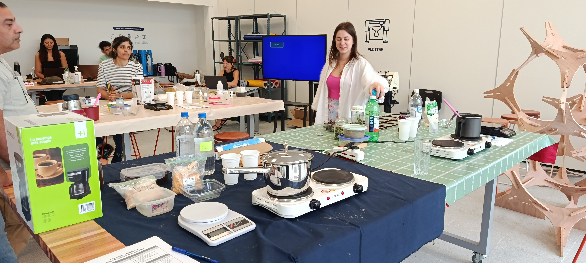

Un laboratorio diferente, complementario con un dejo culinario: la química, las recetas, las balanzas y las hornallas que nos prepararon los docentes fueron el escenario. Los biomateriales, bioplásticos o biopolímeros fueron desglosados y explicados por la Lic. Maria Clara Freyre, docente de la EFDI. Este eje temático viene emergiendo desde 2018 en el ámbito de FADU principalmente a través del EUCD. Un desafío es articular y reflexionar cómo atraviesa nuestra mirada disciplinar.

La primera conceptualización es el origen del término biomateriales. ¿Por qué el nombre y qué nos viene a la mente cuando mencionamos la palabra? El término viene del ámbito de la medicina y significa todo material que es compatible con el cuerpo humano; por extensión, todo material capaz de convivir con otro ser vivo sin dañarlo. Por ejemplo, en el siglo XIX se usaba marfil u oro para reemplazar partes del cuerpo.

El término en la actualidad está emparentado con la sostenibilidad y aparecen conceptos como biomateriales regenerativos, biomateriales biodegradables, biofabricación y biomateriales impresos en 3D. 
Sus componentes son: Polímero
polimero
plastificante
aglutinante
aditivos
___
## Estacion 1
En la estación uno se usó un biocompuesto a base de Alginato de sodio aglutinante con aditivos como cáscara de huevo y cáscara de mejillones.

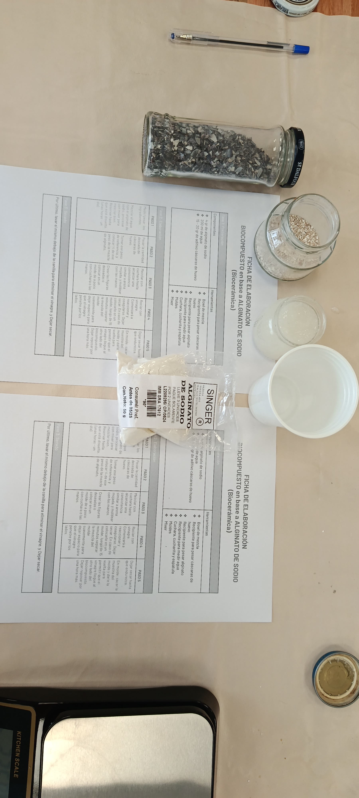

Se usaron distintos tamices y se notaron distintos resultados de aglomeración: cuanto menor la granulometría, mejor comportamiento de elasticidad y control de la forma. El resultado de esta receta es un objeto sólido como una piedra, resistente y compacto; el tiempo del curado recomendado es de dos días mínimo.

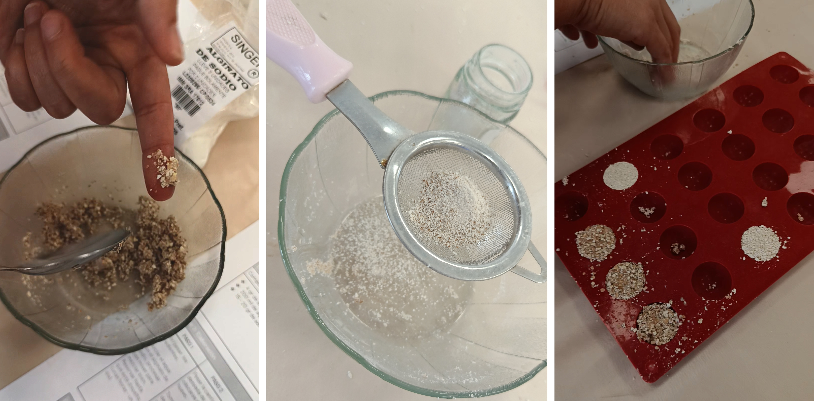
___
## Estación 2
En la estación 2 usamos resina de pino para lograr un bioplástico. La colofonia es literal resina de pino la que se usa para depilación. El resultado de esta receta es un plástico muy rígido y resistente; por ese motivo, el molde debe ser de madera y con alta resistencia al calor.

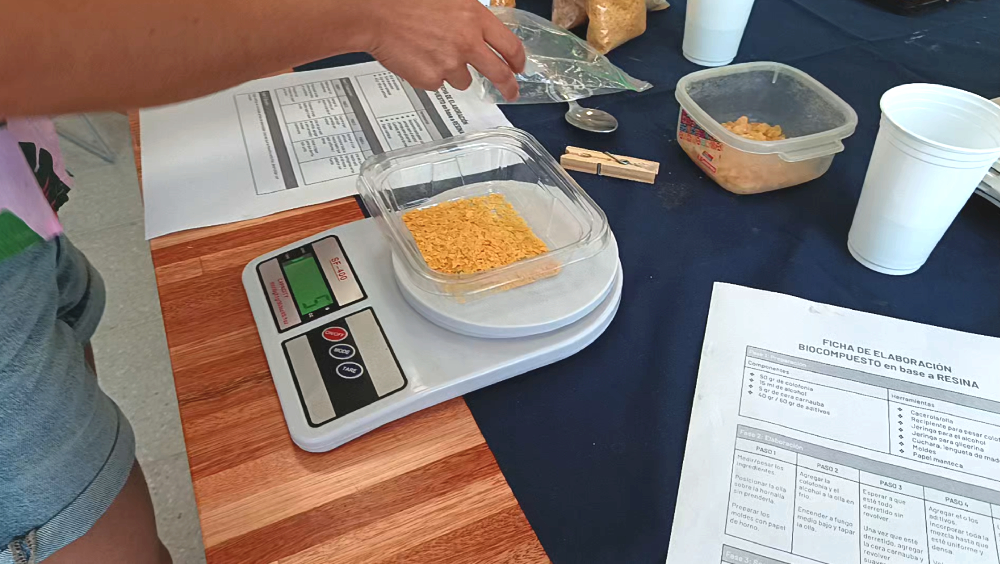
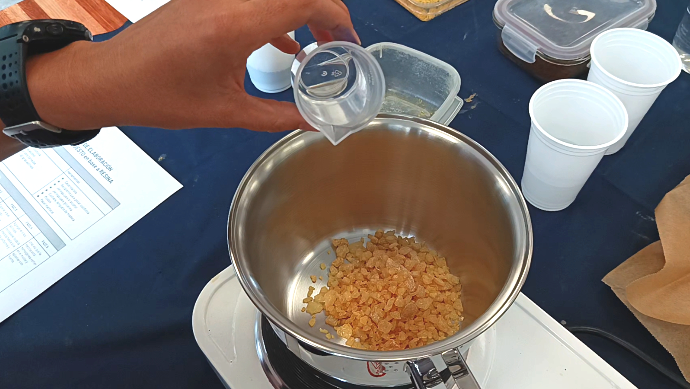

Mezclado el alcohol y la resina en frío, se cocina y se vierten los otros componentes una vez fundida completamente la resina. Se revuelve hasta lograr una pasta uniforme, siempre con temperatura media y ojo con el vapor, que tiene un olor muy fuerte.

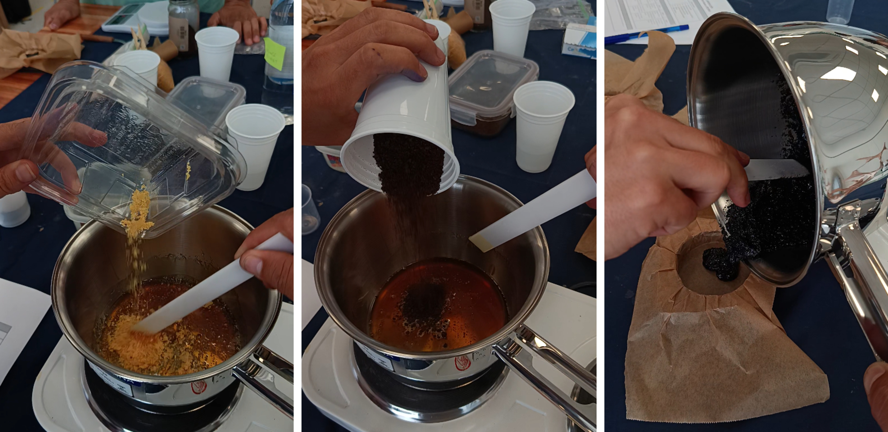

El equipo docente preparó moldes de OSB de 10 mm de espesor para el vertido y el prensado de la pasta caliente. Para completar el molde, como desmoldante se usa papel cera en ambas partes del molde. Como detalle, el molde hembra tiene el doble de espesor que la parte macho. Fue fabricado con corte láser.

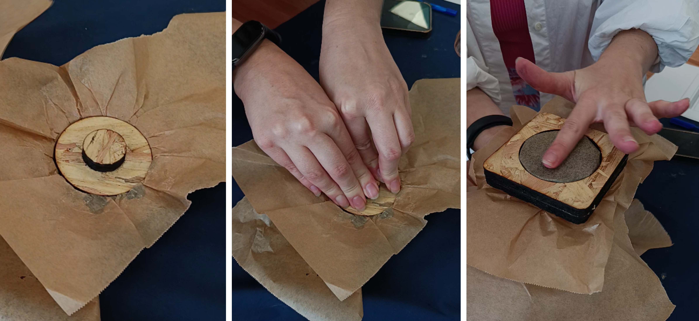

Después del vertido hay que limpiar los utilitarios; para despegar los restos se usa alcohol caliente; eso disuelve la mezcla y permite retirar bien todo el material. Una característica importante de este bioplástico es que se puede desmoldar muy rápido. En una hora el material ya estaba frío y se pudo retirar la pieza del molde. 

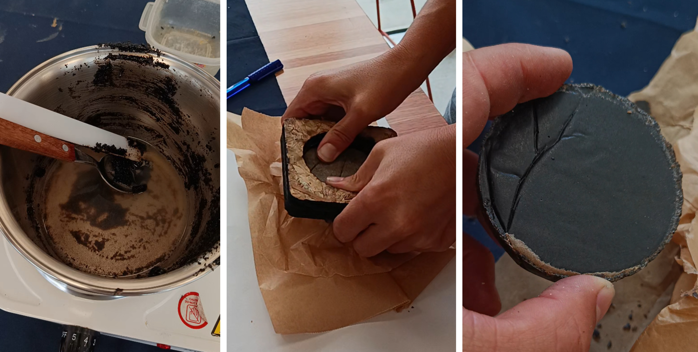

Se hizo la prueba de resistencia para comprobar la fragilidad una hora después; la pieza resistió una caída de 1 m. Se rompió al caer de 1.9 m.

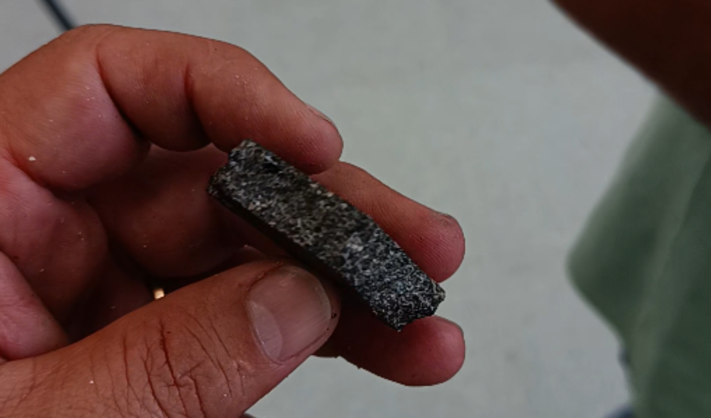
___

## Estación 3
En la tercera estación hicimos un bioplástico en base a gelatina. Se usó agua coloreada con flores de santarita fucsia, gelatina sin sabor y vinagre. 
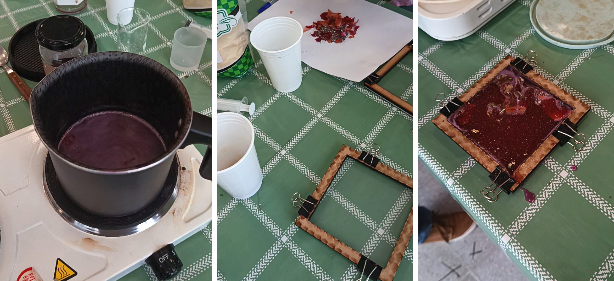

Los productos que se mezclan en frío y luego de disueltos uniformemente se calientan hasta que casi lleguen a hervir. Se agrega la glicerina y se revuelve suavemente hasta unificar la mezcla y se deja reposar. 

Como el molde es un marco de MDF de 5 mm y una base cuadrada de acrílico de 3 mm, hay que esperar a que enfríe para poder verter. El vertido se puede hacer de varias maneras porque la materia tiene un buen tiempo de trabajo antes de la gelatización. 

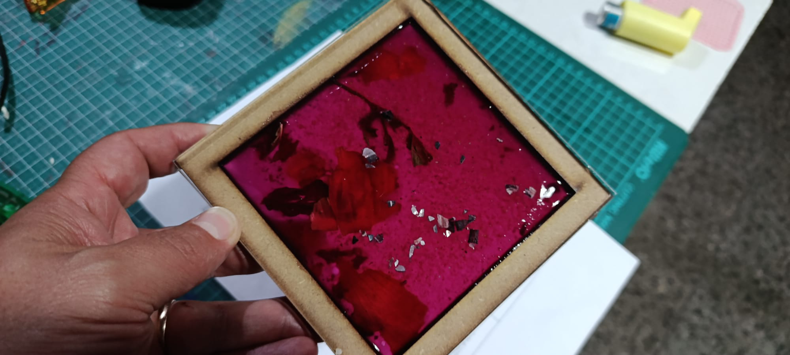

Se experimentó con un vertido en capas, añadiendo diferentes aditivos como decoración: ramas secas, cáscaras de cebolla, cáscara de naranja, conchas de mejillones trituradas y yerba. Una vez que se completa el proceso de vertido que dio 4 capas, se deja secar por uno o dos días. 

Luego de 17 horas retiramos el bioplástico, que tiene una flexibilidad muy parecida a la silicona. Muy elástica y flexible. Es destacable que la biosilicona adquiere un valor estético artístico atractivo que bien puede ser el producto final y no solamente un molde blando. 

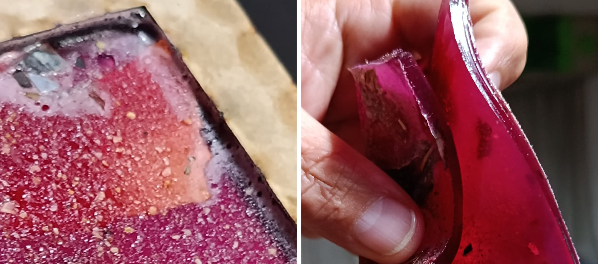
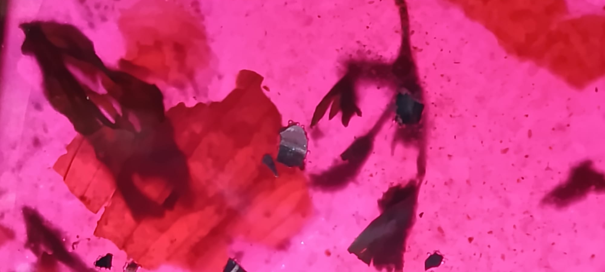
___

## Estación 4
Si bien el tiempo no nos alcanzó para realizar el ejercicio de la estación 4, se pudo registrar la técnica de extrusión con jeringa. Una biosilicona que gelatiniza al contacto con agua y genera hilos que se pueden dejar secar y quedan elásticos y resistentes.

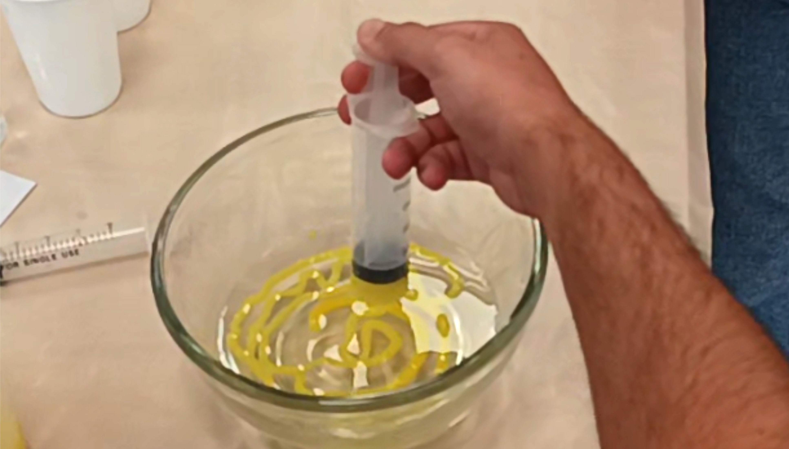
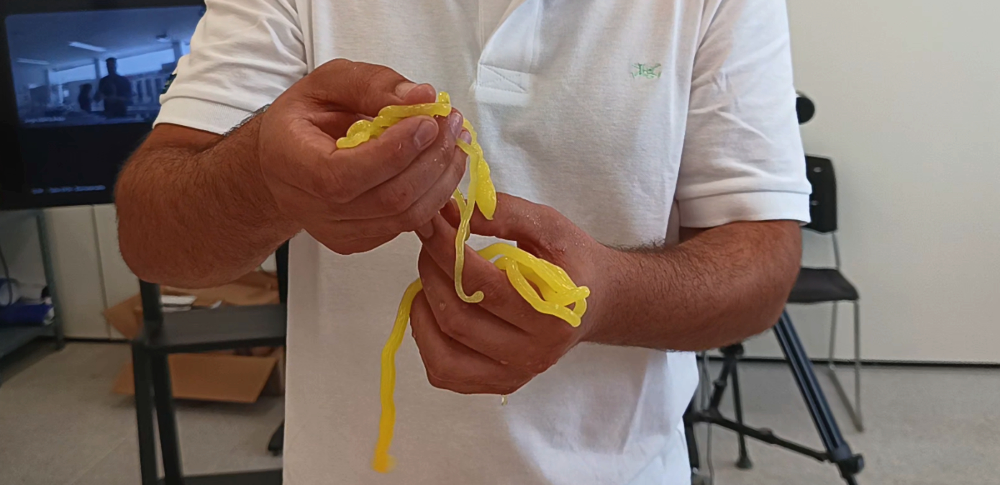

El último ejercicio que realizó el equipo docente es un bioplástico aireado que, al secar, da como resultado una lámina con burbujas, texturado también con valor decorativo muy atractivo.

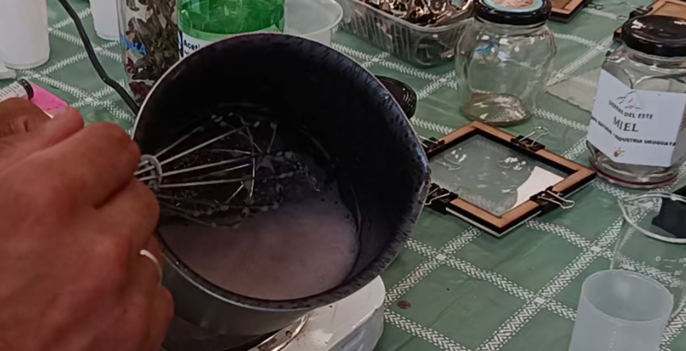

---
No se puede dejar de mensionar lo buneno del edificio y del equipamiento de la dependencia UTEC en Minas. 

---

Dejo el registro audiovisual de la excelente jornada.

 <iframe  
 src="https://www.youtube.com/embed/qabAf3sVoJs?si=pj5EGmGqdPjZ_Hjw&amp" 
 title="YouTube video player" 
 frameborder="0" 
 allow="accelerometer; autoplay; clipboard-write; encrypted-media; gyroscope; picture-in-picture; web-share" 
 allowfullscreen
 referrerpolicy="strict-origin-when-cross-origin"
 style="position:absolute; top:0; left:0; width:100%; height:100%;">
 </iframe>

---

## Referencias

Bermúdez, E y Taullard, H. Biomateriales: explorando oportunidades. Montevideo:Udelar. FADU. EUCD, 2019.

https://www.colibri.udelar.edu.uy/jspui/handle/20.500.12008/43857?mode=full&utm_source=chatgpt.com

Tatiana Acosta – María Clara Freyre; Integración de biopolímeros en Mipymes. Montevideo:Udelar. FADU. EUCD, 2021.

https://www.colibri.udelar.edu.uy/jspui/bitstream/20.500.12008/40514/1/00111%20%E2%80%93%20TESIS%20EUCD%20%E2%80%93%20Acosta%20%E2%80%93%20Freyre%20%E2%80%93%20Integracion%20de%20biopolimeros%20en%20mipymes%20%E2%80%93%202021%20-%20Plan%20nuevo%20%281%29.pdf?utm_source=chatgpt.com

Macarena Pacheco Brugger. Ko-Plastik Montevideo:Udelar. FADU. EUCD, 2022.

Lucía Berasaín – Paula Díaz, Biomateriales a partir de residuos de cafetería. Montevideo:Udelar. FADU. EUCD, 2024.
https://www.colibri.udelar.edu.uy/jspui/handle/20.500.12008/43851?utm_source=chatgpt.com

Alejandra González Molina – Marcela De Andrea, Hacia la coexistencia: diseño centrado en la vida. Montevideo:Udelar. FADU. EUCD, 2025.
https://www.colibri.udelar.edu.uy/jspui/handle/20.500.12008/50589?utm_source=chatgpt.com