# MT01

*Introducción a herramientas digitales*

El proceso de preparación del aparato de programas es complejo y requiere práctica para poder dominar con fluidez el método. Se necesitan instalar cinco aplicaciones para gestionar la bitácora en formato web: Git, GitHub, Visual Studio Code, Python y Markdoc.

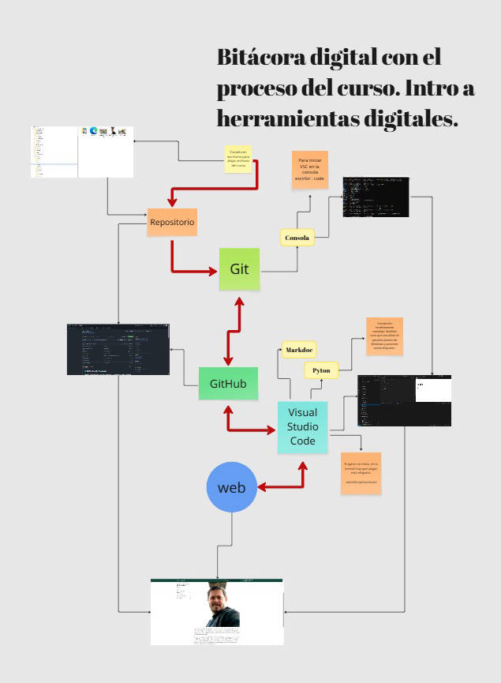

El primer paso es instalar una herramienta de control de versiones, útil en caso de necesitar recuperar archivos modificados. Una vez instalada, lo que me llamó la atención fue su interfaz visual: se parece al cuadro de DOS previo a Windows. A ese cuadro se le llama Consola, y se trabaja con comandos de programación. Para iniciarla, se presiona la tecla Windows + R y, en el cuadro que aparece, se escribe cmd. Una vez abierta la consola, como se ve en la imagen, se usa el comando code para ir al programa Visual Studio Code previamente instalado.

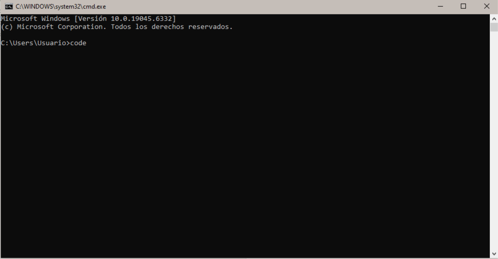

El sistema Git trabaja con una plataforma llamada GitHub, donde se alojan todos los archivos ordenados en distintas carpetas correspondientes a un proyecto determinado. A ese conjunto se le llama **Repositorio**. La instalación de [GitHub](https://github.com/) se realiza desde la página web oficial de forma gratuita: solo hay que crear una cuenta. Una vez creada, hay que cargar el repositorio —en este caso, el creado por el equipo de la EFDI— y clonarlo en nuestro equipo.

Pero antes es necesario proteger la información de acceso con una llave digital llamada SSH. En la consola se escribe el comando: **ssh-keygen - "tu mail"** para crear la clave. Se presiona Enter tres veces y queda a la espera para conectar con GitHub.

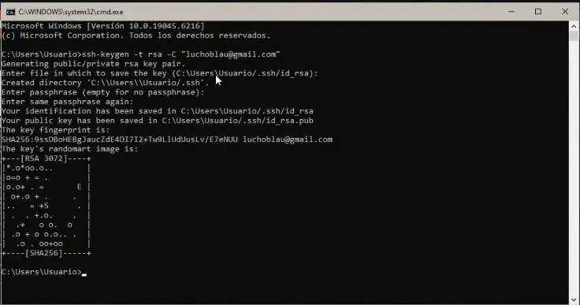

La clave generada queda guardada automáticamente en la carpeta: **c:/user/usuario/.ssh**
Y se guarda en el archivo **id_rsa.pub**, que debe abrirse con Bloc de notas para copiar su contenido.

En GitHub, desde el menú de perfil, se va a **Settings > SSH and GPG Keys** y se presiona el botón **New SSH Key**. Ahí se pega el contenido copiado del archivo id_rsa.pub en el campo Key y se confirma con el botón **Add SSH key**. Luego, GitHub pide validación: se ingresa el número de verificación enviado automáticamente al correo y ¡voilà!

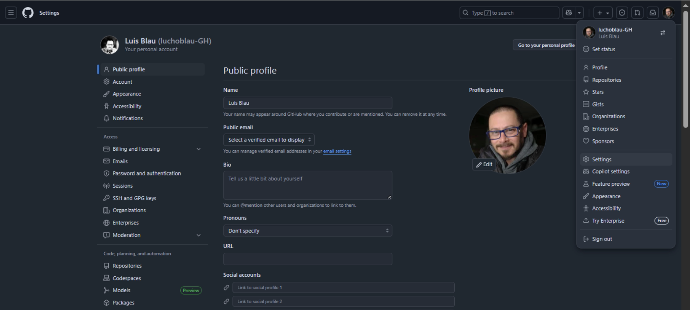

Ahora se vuelve a la consola y se escribe el comando: **ssh-T git @github.com** para acceder al repositorio y conectar Git con GitHub a través de la llave. Nadie más que el propietario del computador puede acceder al repositorio clonado. Una vez ingresado el comando, aparece en la consola el saludo de autorización y el acceso con el nombre de usuario de la cuenta GitHub.

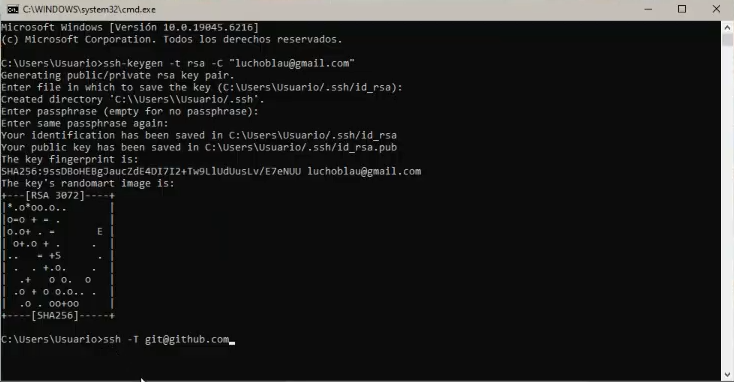

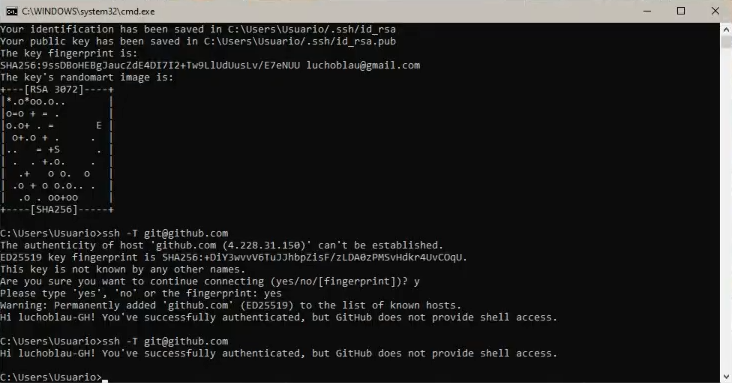

Bien, ahora sí hay que cargar el repositorio facilitado por el equipo EFDI, donde está la plantilla de la web. En GitHub se presiona el botón **Fork** (ubicado a la derecha, debajo de la barra de menús). Esto abre la página **Create a new fork** y, en el campo Repository name, se escribe el formato nombre_apellido. Luego se presiona **Create fork**.

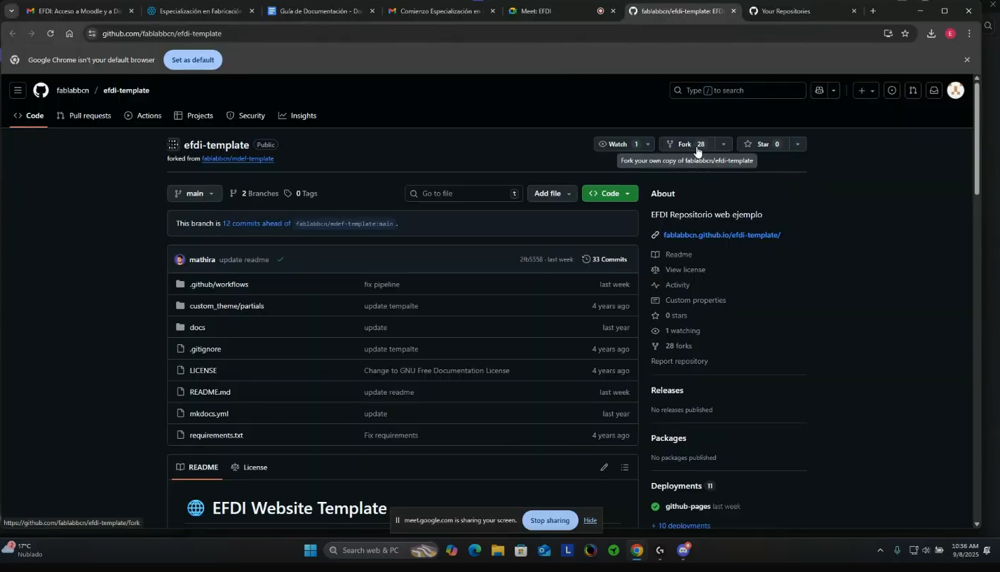

*Paréntesis: varios habíamos dado clic en el botón Create fork sin los pasos previos de crear la clave y demás. Para borrar un repositorio, se va al menú Settings y en el último campo está la opción de eliminarlo.*

Continuando con Create fork, se abre el cuadro para configurar nombre y apellido, se completa la descripción y se vuelve a presionar el botón de crear fork. Luego se va al menú **Action** para activarlo. Después, en Code, se edita el archivo README (ícono del lápiz), se personalizan los datos con el mismo nombre de la cuenta GitHub y se confirma con el botón **Commit changes** (dos veces).

En el archivo **mkdocs.yml** también se actualizan los datos y se confirman nuevamente los cambios. Volviendo al menú Action, se visualiza el proceso que ejecuta el servidor. En la interfaz aparecen tres rectángulos conectados; en el que se llama Deploy se encuentra la ruta de la página web de cada usuario.

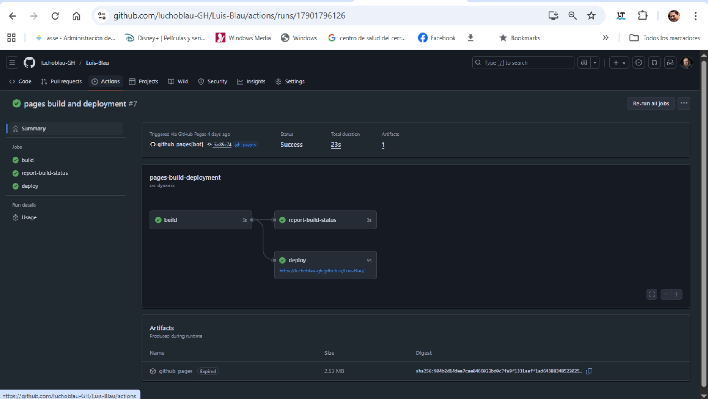

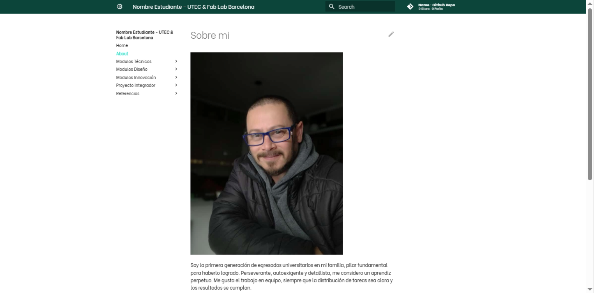

El mantenimiento y la gestión de nuevos contenidos se realizan en Visual Studio Code. Una vez instalado desde la página oficial, se abre desde la consola con el comando:
code + Enter

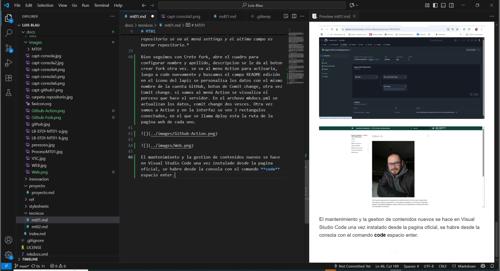

En la barra lateral izquierda aparecen los iconos de navegación. El primero es el **Explorador**, donde se encuentran todos los archivos de la plantilla y los alojados en las carpetas del proyecto. El tercer icono es el de confirmar cambios: cada vez que se modifica algo, queda registrado en la base de datos. En la parte inferior se visualiza la lista de cambios realizados y en la parte superior aparece el botón **Commit**.

*Es importante poner un nombre al cambio antes de confirmar, ya que, sin eso, el botón de commit no funcionará.*

# Esto es todo amigo!!!

8-11-2025
Vuelvo por algo que es importante dejar registrado. En cierto momento tuve que generar páginas nuevas de módulos que no estaban en el archivo original de Markdoc. El método que apliqué fue copiar una página existente **mt01.md** y pegar haciendo clic sobre el archivo con el botón derecho.
 Una vez que el archivo aparece en el explorador, se cambia el nombre como cualquier archivo y se edita el contenido.

Importantes, hay que agregar también en el archivo **mkdocs.yml** en el apartado nav: donde están todas las páginas del sitio. Aunque aparezca en el explorador, si no está en este archivo, no va a aparecer en el sitio por más que hagamos commit.
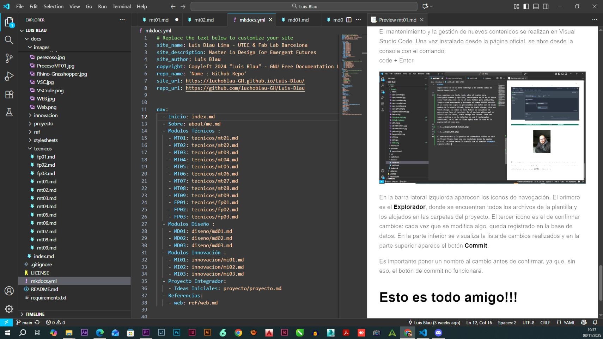

Otros avances relevantes que logré con el amigo ChatGPT son incorporar videos de YouTube embebidos, es decir, que se visualice el video en el área donde aparece la imagen que lo representa. 

Código:
```html
<div style="position:relative; padding-bottom:56.25%; height:0; overflow:hidden;">
  <iframe
    src="https://www.youtube.com/embed/eCaZfuYanok"
    title="Laboratorio de Fabricación Digital - UTEC Durazno"
    frameborder="0"
    allow="accelerometer; autoplay; clipboard-write; encrypted-media; gyroscope; picture-in-picture; web-share"
    allowfullscreen
    referrerpolicy="strict-origin-when-cross-origin"
    style="position:absolute; top:0; left:0; width:100%; height:100%;">
  </iframe>
</div>

```

En negrita se indica la parte de la etiqueta del vínculo que se debe pegar en el código del Visual Studio Code. *https : //www . youtube . com / watch?v = **eCaZfuYanok**&t = 125s* 

Otro logro es incorporar una ventana de visualización de documentos PDF.
Donde primero hay que editar el archivo con estilo de diálogo en un editor de texto y luego hay que alojarlo en una de las carpetas del repositorio. Luego el amigo ChatGPT, tras varios intentos y algunas horas de intercambio, logramos el siguiente código:


```html
<!-- Visor PDF (GitHub Pages + MkDocs) -->
<div style="max-width:100%; height:400px; border:0; margin:0; padding:0;">
  <object
    data="https://luchoblau-gh.github.io/Luis-Blau/files/amigo-chatgpt.pdf"
    type="application/pdf"
    width="100%"
    height="100%">
    <embed
      src="https://luchoblau-gh.github.io/Luis-Blau/files/amigo-chatgpt.pdf"
      type="application/pdf"
      width="100%"
      height="100%" />
    <p style="text-align:center">
      No se pudo incrustar el PDF.
      <a href="https://luchoblau-gh.github.io/Luis-Blau/files/amigo-chatgpt.pdf" target="_blank" rel="noopener">
        Abrir PDF completo
      </a>
    </p>
  </object>
</div>

<p style="text-align:center; margin-top:10px;">
  📄 <a href="https://luchoblau-gh.github.io/Luis-Blau/files/amigo-chatgpt.pdf" target="_blank" rel="noopener">
    Abrir PDF en pestaña nueva
  </a>
</p>

```
En negrita está la **RUTA**, que fue la dificultad mayor del código. De esta manera se pueden agregar documentos al repositorio y que sean visualizados directamente en una ventana dentro del sitio; era lo que yo buscaba para facilitarle la navegación al lector sin prolongar demasiado el contenido de la página.

Lo último de programacion de hoy, para que un código no se ejecute y se vea como texto se debe ponere tres acentos inveetidos y los caracteres html. 

Referencias:
 [Clase 08092025](https://drive.google.com/file/d/1JcN2wm2ZFkcQxv9aJR2IO1RcNqV-d9-8/view)
 