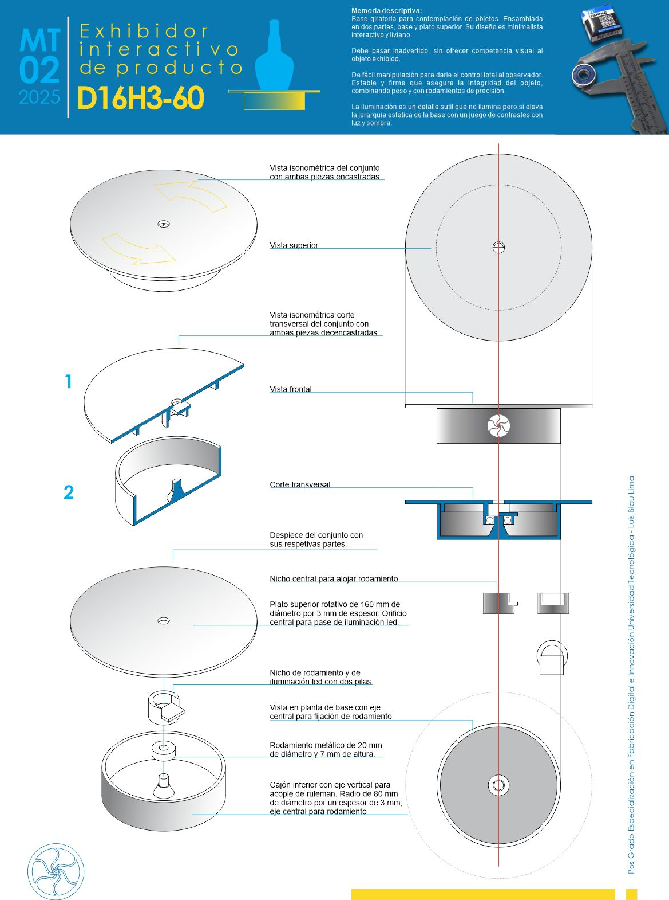

---
hide:
    - toc
---

# MT02

En este módulo nos introducen a las herramientas de manipulación de la forma, de representación proyectual y de materialización de los productos. Se abordan los tipos y formatos de archivos, la historia y diferencias entre mapas de bits y vectores, así como los principios de luz, matemática y fotografía digital. También se trabaja con la representación en dos y tres dimensiones, y con distintos programas de modelado 3D, tanto con licencia como de código abierto.

Las herramientas mencionadas en la primera clase del módulo constituyen la base para el primer desafío: la producción de un modelo cuyo diseño y funcionalidad es de libre definición. Este debe cumplir con una condición: estar compuesto por dos piezas encastrables entre sí. La entrega se presenta en una lámina A3.

La idea propuesta es reproducir un elemento que sea útil para varios productos, desarrollados tanto en los laboratorios como en el proyecto final: **un exhibidor rotativo**.

[**Video captura del modelo**](https://youtu.be/Vd-h5JyltwA)

<iframe width="560" height="315" 
    src="https://www.youtube.com/embed/https://youtu.be/Vd-h5JyltwA?si=X8wkR3lNRakpga3V" 
    frameborder="0" allowfullscreen>
</iframe>

El proceso de diseño se realizo usando autocad para el dibujo bidimencional y dridimencional. El objetivo de la lamina de presentación es describir el objeto, el montaje y la funcionalidad. 

**Lamina de presentacion del producto**

Tambien esperimente con tinkercad, muy inttuitivo se maneja unidades decimales en milimetros para generar los solidos. Tiene un simulador de movimiento muy interesante y didactico. estuvimos jugando un poco con esas herramientas:

[**Prueba Tinkercad 1**](https://youtu.be/wyWFIOsInSQ)

[**Prueba Tinkercad 2**](https://youtu.be/LMdFxJePiL0)

[**Prueba Tinkercad 3**](https://youtu.be/WP9G7YzJYEQ)

El proceso de diseño se realizó utilizando AutoCAD para el dibujo bidimensional y tridimensional. El objetivo de la lámina de presentación es describir el objeto, su montaje y su funcionalidad.

