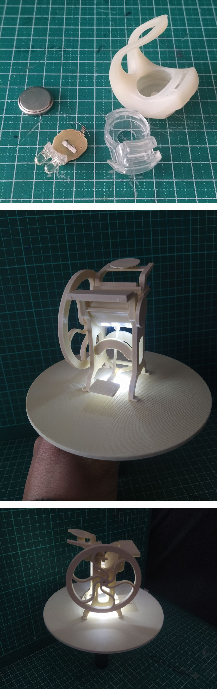

---
hide:
    - toc
---

# MT02

En este módulo nos introducen a las herramientas de manipulación de la forma, de representación proyectual y de materialización de los productos. Se abordan los tipos y formatos de archivos, la historia y diferencias entre mapas de bits y vectores, así como los principios de luz, matemática y fotografía digital. También se trabaja con la representación en dos y tres dimensiones, y con distintos programas de modelado 3D, tanto con licencia como de código abierto.

Las herramientas mencionadas en la primera clase del módulo constituyen la base para el primer desafío: la producción de un modelo cuyo diseño y funcionalidad es de libre definición. Este debe cumplir con una condición: estar compuesto por dos piezas encastrables entre sí. La entrega se presenta en una lámina A3.

Sin embargo para lograr el modelo use autocad para hacer el dibujo bidimensional. Usando comamdos básicos, línea y circulo desarrolle un boceto en planta. Luego proyecte el perfil para revolucionar el area. Para eso calculé la integral doble entre los dos extermos de la fomra, es broma!!!. Con el comando Bundari se logra el área y se revoluciona 360 para otener el modelo.

El comando revolución de autocad funciona con cualquier elemento, en este caso, el perfil, corte o sección del dibujo es suficiente para lograr ambas piezas del modelo.

El modelo queda pronto una vez aplicado el comando. Para el pivot del rodamiento que esta en la base trabaje independiente. Igual que el nicho del rodamiento que va en el lado inferior del plato o bandeja superior. El modelo sólido queda definido y ensamblado. Para expresar de modo mas claro use la vista isonometrica en estilo alambrico. Para pasar a modo bidimencional se aplica Aplanar geometría.

Una vez que el dibujo lineal tenga todas las piezas suficientes para explicar el objeto: plantas, inferior y superior, perfiles, vista frontal, despiece de ensamblado, isonometricas o renders. Se exporta como archivo *.eps para pasar a trabajar en la composicion de la lamina en Coreldraw.

En corel hice la composicion de la lamina con todas las piezas del modelo sin acotar. Por ser una geometria tan simple solo lo exprese en el nombre del objeto Diametro del plato 16 cm y de la base 8 y la altura es 3 cm. La valoracion de contrastes la logro con la herramienta pintar interactivo y luego se aplica gradente para el efecto cilindro.

Para el encabezado de la lamina fotografie el elemento de partida que es el ruleman de la rueda de un patin 4 en linea roler 4 en linea. Lo releve con un calibre, medida interior, exterior y espezor. Lo fotografie y en Potoshop edite el fondo
 
La idea propuesta es reproducir un elemento que sea útil para varios productos, desarrollados tanto en los laboratorios como en el proyecto final: **un exhibidor rotativo**.

[**Video captura del modelo**](https://youtu.be/Vd-h5JyltwA)

<iframe
  width="560"
  height="315"
  src="https://www.youtube.com/embed/Vd-h5JyltwA?si=X8wkR3lNRakpga3V"
  title="YouTube video player"
  frameborder="0"
  allow="accelerometer; autoplay; clipboard-write; encrypted-media; gyroscope; picture-in-picture; web-share"
  allowfullscreen
  referrerpolicy="strict-origin-when-cross-origin">
</iframe>

El proceso de diseño se realizo usando autocad para el dibujo bidimencional y dridimencional. El objetivo de la lamina de presentación es describir el objeto, el montaje y la funcionalidad. 

**Lamina de presentacion del producto**

# Tinkercad

Tambien esperimente con tinkercad, muy inttuitivo se maneja unidades decimales en milimetros para generar los solidos. Tiene un simulador de movimiento muy interesante y didactico. estuvimos jugando un poco con esas herramientas:

**Prueba Tinkercad 1**

  <iframe
    src="https://www.youtube.com/embed/wyWFIOsInSQ"
    title="YouTube video player"
    frameborder="0"
    allow="accelerometer; autoplay; clipboard-write; encrypted-media; gyroscope; picture-in-picture; web-share"
    allowfullscreen
    referrerpolicy="strict-origin-when-cross-origin"
    style="position:absolute; top:-7.5%; left:-7.5%; width:115%; height:115%;">
  </iframe>

**Prueba Tinkercad 2**

  <iframe
    src="https://www.youtube.com/embed/LMdFxJePiL0"
    title="YouTube video player"
    frameborder="0"
    allow="accelerometer; autoplay; clipboard-write; encrypted-media; gyroscope; picture-in-picture; web-share"
    allowfullscreen
    referrerpolicy="strict-origin-when-cross-origin"
    style="position:absolute; top:-7.5%; left:-7.5%; width:115%; height:115%;">
  </iframe>

**Prueba Tinkercad 3**

  <iframe
    src="https://www.youtube.com/embed/WP9G7YzJYEQ"
    title="YouTube video player"
    frameborder="0"
    allow="accelerometer; autoplay; clipboard-write; encrypted-media; gyroscope; picture-in-picture; web-share"
    allowfullscreen
    referrerpolicy="strict-origin-when-cross-origin"
    style="position:absolute; top:-7.5%; left:-7.5%; width:115%; height:115%;">
  </iframe>

El proceso de diseño se realizó utilizando AutoCAD para el dibujo bidimensional y tridimensional. El objetivo de la lámina de presentación es describir el objeto, su montaje y su funcionalidad.

# Fusion 3D

No tenia ninguan interaccion con este programa, como cualquier herramienta nueva cuesta un poco adaptarse y las dificulatades siempre viene heredadas de las costumbres de manejo de otros programas. 

El primer problema es que la rudea del scroll es invertido y tuve que ir a preferencias menu general y tildar la casilla de invertir Zoom. Recien ahi senti una compatibilidad emocional.

La clase de Valerio esta Excelente paso a paso y diversos productos permiten ir conocinedo cada comando. La construcción bidimencional se hacen en modo boceto tamabaien llamados Skech. 

cada elemento, linea, punto, circulos, rectungulos tiene atributos y un metodo de interaccion que funciona mediante restricciones. Una vez aplicada generan interacciones y quedan vinculados uno con otros.

Luego de lograr el primer ejercicio pude realizar el objeto usando compandos nuevos con Combinar, rotar objetos, mover y eliminar. No manejo muy bien la logia de alinear y ahy aluna dificultad en mover los objetos de forma independientes una vez quedan agrupados.

Como le pasa a la mayoria tardo muchisimo mas para hacer el mismo modelo. Conceptuamente lo mas novedos es el modo de simunlar conexiones entre piezas y movimientos como bisagras o engranajes.

# Rhinocero

La clase de Julian esta buenisima, el problema fue que me instale una version en español y el explico todo en una version en ingles. Uffff, gracias al amigo ChatGpt que me dijo que usara en la linea de comando el **guion bajo antes del nombre en ingles**. Gol!!! Pero pase un buen rato con eso.

Tiempo y dedicación, no hablo nada de Grasshoper me pregunto si ¿lo hará? En principio logre hacer el producto en todas las aplicaciones recomendadas, como priemer acercamiento es un buen avance. 

El desafio ahora es ver si logro imprimir, exportar el archivo en el lenguaje (.stl) de la impresora  que uso y analizar los problemas que surjan. Esto es algo que la consigna no piede pero, me adelanto motivado por la curiosidad de ver si es funcional.

Antes de imprimir las piezas completas, mande solamente la parte central del encastre para ahorrar material. Despues de tres intentos recien logre que la "olgura" permitiera un encastre justo con el rodamiento. En la primera imagen estan las piezas de prueba, se puede apreciar como el pivot central pieza (macho) y el cilindro de la pieza superior (hembra) reducen la dimencion de mayor a menor en la secuencia de izquierda a derecha.

Una vez resuelto el tema de la olgura hice la impresion de las dos piezas. El logo imprimir a parte y con otro color de filamento. El encastre quedo perfecto. La rigides del conjunto es buena y el giro es limpio y sin roces entre las partes. El anillo interior del plato superior, pensado para automatizar con un pequeño motor tiene una distancia correcta no tiene rozamiento con la otra pieza.

El exibidor funciona correctamente, pero, el prototipo no tiene un color adecuado, debe ser de color negro, o, del color opuesto al objeto que se va a exponer.

La iluminación funciona como efeto, no pretende iluminar el objeto sino mas bien crear un gesto de destaque. La idea es resolverlo con una luz de bicicleta. Medi la plaqueta y deje un espacio en el cilindro central para colocar los leds. obviamente necesitare sugerencias de los colegas de diseño industrial, para resolver la iluminacion y la automatizacion. 

  <iframe
    src="https://www.youtube.com/embed/aiKK3NbaXgs"
    title="YouTube video player"
    frameborder="0"
    allow="accelerometer; autoplay; clipboard-write; encrypted-media; gyroscope; picture-in-picture; web-share"
    allowfullscreen
    referrerpolicy="strict-origin-when-cross-origin"
    style="position:absolute; top:-7.5%; left:-7.5%; width:115%; height:115%;">
  </iframe>

# Eso es todo por ahora amigo!!!

