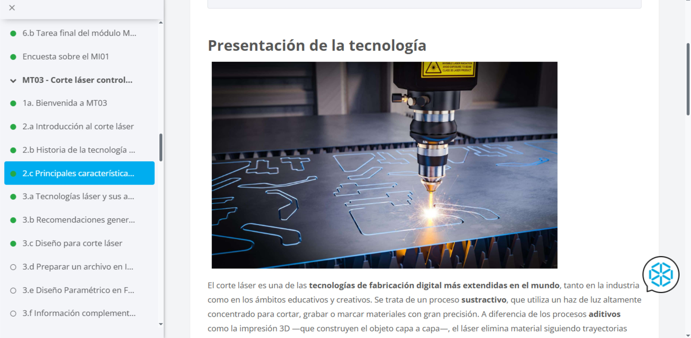
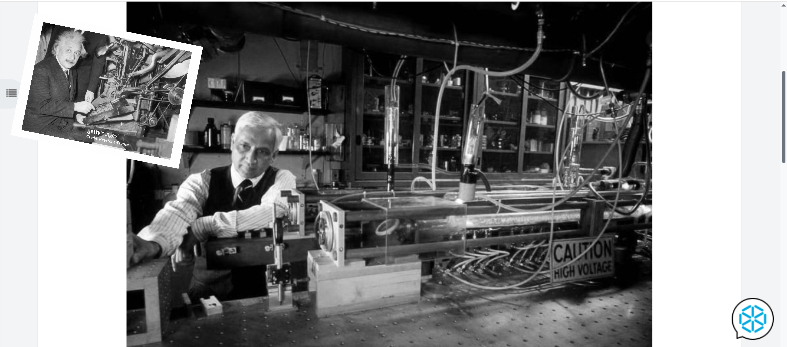
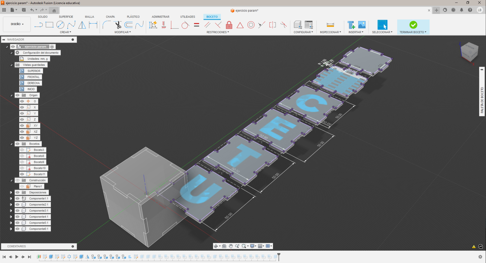
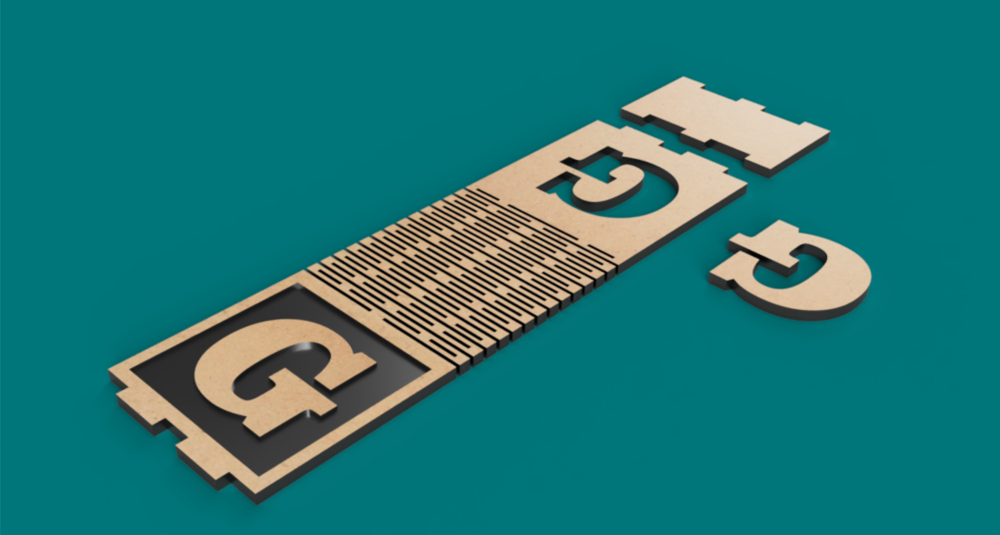
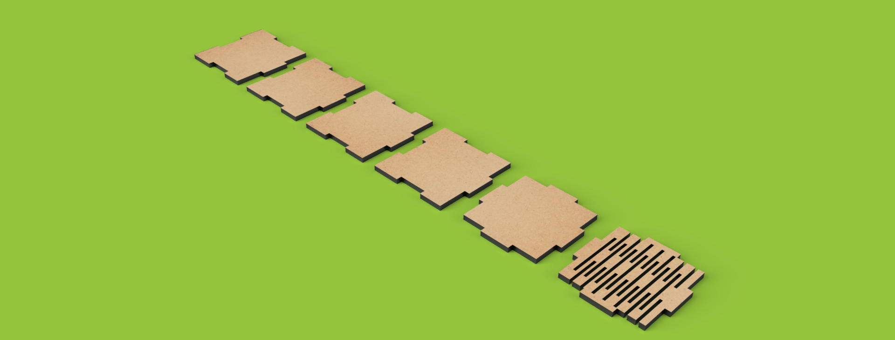
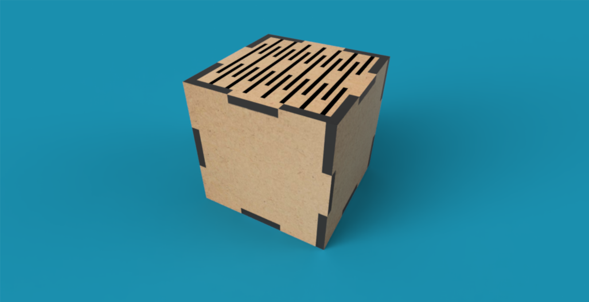
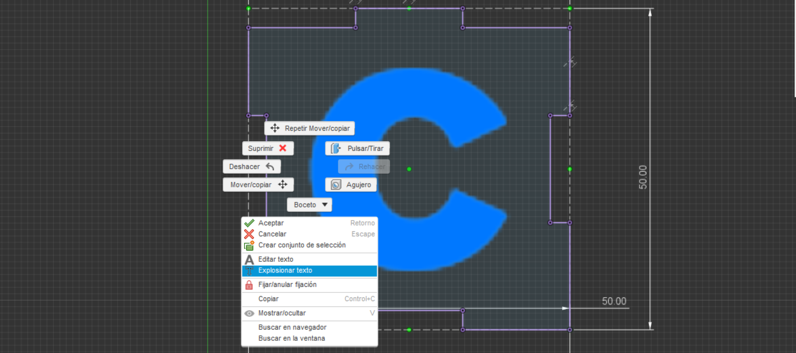
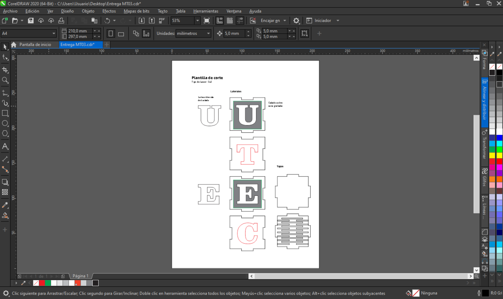

---
hide:
    - toc
---

# MT03

Bueno, vamos con la tecnología de *corte láser*.
Este módulo me permitió conocer los distintos tipos de corte laser que se usan en los procesos de fabricación.

Desde el Diseño Asistido por Computadora (CAD) y la Manufactura Asistida por Computadora (CAM), se abren dos caminos que terminan encontrándose en distintas tecnologías de materialización.

Agradezco una vez más a Albert Einstein, iniciador de la base científica que dio origen al fenómeno de la emisión estimulada, fundamento del surgimiento del láser.

Láser significa “amplificación de luz por emisión estimulada de radiación” (Light Amplification by Stimulated Emission of Radiation).

Sus estudios fueron retomados más adelante, y en 1959 Gordon Gould desarrolló los primeros dispositivos prácticos.
La cronología de este avance tiene varias etapas clave, desde las teorías de 1917 hasta los desarrollos tecnológicos de 1980.

Lo más significativo es que estos modelos de fabricación son hoy una de las prácticas más utilizadas en la industria. Existen tres tipos principales de láser, y es fundamental conocer las bases que los diferencian.

**Los láseres de CO₂** se usan para cortar materiales como madera, acrílico, cuero o textiles.

**Los láseres de fibra óptica** se aplican sobre todo al grabado y marcado de superficies metálicas.

**Y los láseres de diodo o de estado sólido** son más compactos, eficientes y de bajo consumo energético.

Entre las principales ventajas del corte láser destaco la precisión y la calidad del corte, que permiten obtener resultados limpios y exactos. También la diversidad de materiales que admite, junto con un amplio rango de espesores. Otra característica importante es que no ejerce presión directa sobre el material, lo que evita deformaciones. Además, ofrece compatibilidad con otros sistemas de fabricación, y una gran flexibilidad para el diseño, optimizando al máximo el uso de la materia prima.

Los archivos generados en programas como Fusion 360 tienen una lógica diferente cuando se diseñan para corte láser.
La principal característica es que el archivo debe ser bidimensional, ya que las máquinas de corte láser solo interpretan dos ejes y siguen recorridos previamente diseñados.

En este tipo de trabajo, el dibujo se convierte en un trazado vectorial que la máquina interpreta como movimiento y potencia, transformando la línea en un corte preciso y controlado.

El color tiene un valor diferencial y muy relevante para lograr tres resultados básicos. Con los trazos azules o negros, el láser cortará completamente la pieza. Con los trazos rojos, el láser calará o marcará sin atravesar el material, siguiendo una línea de contorno. Y con los trazos verdes, grabará lo inscripto dentro de su contorno, como si “pintara” una región.

El desafío fue entender la metodología de extracción de los datos bidimensionales del modelo 3D parametrizado.
Hicimos un modelo que será fabricado en MDF de 3 mm de espesor: un cubo de seis caras con encastres de acople en sus cuatro lados.

¿Parametrizar? ¡Costó, pero al final cayó la ficha!

En Fusion 360, parametrizar significa asignarle una palabra, una unidad numérica: radio, lado, espesor, cara, altura, holgura, entre muchas otras. Estos parámetros interactúan con las cotas y las restricciones, permitiendo simplificar los procesos de diseño y modificar el modelo de forma automatizada y controlada.

En el ejercicio, primero planteé una franja con una zona flexible, cuya forma se generaba doblando la pieza y pegando una base. El diseño jugaba con la tipografía como valor estético, usando la letra G de Clarendon, por su hermosa combinación de curvas y rectas. Aunque no logré parametrizar nada en el primer intento, sí pude experimentar con renders y texturas que representaban bastante bien el resultado final de la pieza.

El juego con la tipografía es rígido, pero permite extruir y calar las formas. Lo interesante es que, para poder aplicar el comando de extrusión, hay que “explotar” el texto: el programa convierte así el bloque tipográfico en un dibujo vectorial editable. Lamentablemente, el archivo de este ejercicio se dañó y no pude volver a abrirlo, aunque el proceso fue una buena oportunidad para comprender mejor cómo Fusion 360 interpreta los objetos de texto.

En la clase extra de Fusion con Joaquín recién pude entender el funcionamiento conceptual de la parametrización. Inicié un nuevo diseño, esta vez logré parametrizar correctamente y generar el archivo listo para el corte. Fue un avance importante, porque todo empezó a tener mas sentido en la práctica.

Las dificultades que tuve con respecto al parámetro de espesor fueron varias. Al modificarlo a 2 mm, las caras de la caja quedaban separadas aproximadamente un milímetro. La segunda dificultad fue que, si bien en el primer intento logré explotar el texto para poder extruir y renderizar, en el segundo ejercicio no los hace y no se porque. Además, me queda la duda sobre cómo proyectar tipografia al modelo para obtener el gráfico de fabricación. Ese paso me interesa especialmente, porque es donde el diseño digital se convierte en un archivo útil para producir.

Por último, armé el archivo para el corte como pide la consigna, en vista del encuentro de laboratorio previsto para la primera semana de noviembre en Durazno. Preparé el archivo en CorelDRAW, separando las tres capas correspondientes a corte, grabado y marcado, cada una con sus colores específicos para que la máquina las interprete correctamente.

Bueno por haora esto es todo vuelvo con novedades despues del laboratorio... 
# Hasta pronto!!

