---
hide:
    - toc
---

# MT04

*Introducción a electrónica y programación*

---
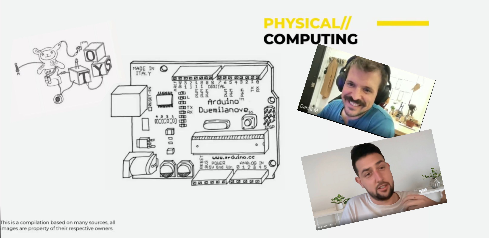

Una experiencia muy diferente y motivante iniciamos en este módulo. Poder hacer que los elementos que diseñamos tengan la capacidad de moverse o emitan señales de luces es un desafío que genera mucha curiosidad. Articular con este tipo de atributos implica adquirir conocimientos que nos dejan en un escalón más arriba de lo que nuestra formación de grado nos ha dado.

Iniciamos con conceptos básicos de flujos de electrones y los fundamentos básicos de electricidad, circuitos y componentes electrónicos. Las principales leyes, como la ley de Ohm, la lógica de la información digital, ceros u unos y la introducción al mundo de las placas Arduino.

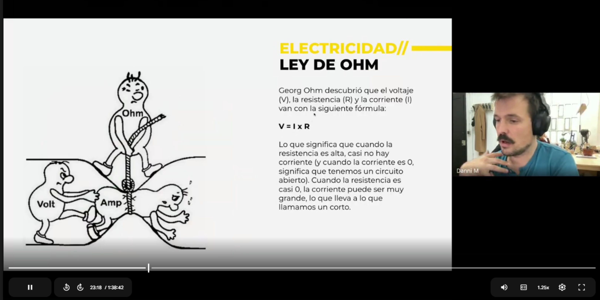

La plataforma de Arduino surgió como consecuencia de expandir el acceso al desarrollo de la electrónica con bajos costos para mejorar el acceso. Bajo el concepto de open source se desarrollaron infinidad de plataformas usadas en robótica, domótica y automatismos aplicados a muchas disciplinas.

Para amplificar más el poder de control electrónico, se suma la programación y se completan las características principales de Arduino, componentes electrónicos que funcionan con comandos programables que dan como resultados acciones físicas.

Estas dos variables de esa ecuación sumamente compleja están sintetizadas en simuladores como Tinkercad y Wokwi con una interfaz donde los componentes tienen un alto grado de iconocidad respecto a los elementos reales, facilitando el acceso y la identificación de cada elemento.

Para no perder la costumbre ni el entrenamiento, Mathías nos pidió instalar una aplicación de programación de la página de Arduino. La cosa se puso muy interesante cuando de a poco voy comprendiendo la lógica de los algoritmos que explicó Daniel. Siempre hay un **setup** y un **loop** y dentro de estas etiquetas de programación se define la acción y el tiempo que dura esa acción.

# LATU

  <iframe
   src="https://www.youtube.com/embed/quU-r4Q4RaU?si=7VSdD02oUI47csy7" 
   title="YouTube video player" 
   frameborder="0" allow="accelerometer; autoplay; clipboard-write; encrypted-media; gyroscope; picture-in-picture; web-share" 
   allowfullscreen
   referrerpolicy="strict-origin-when-cross-origin" style="position:absolute; top:0; left:0; width:100%; height:100%;">
  </iframe>

---

La experimentación física de **conectar** es tremendamente esclarecedora. A pesar de una carencia significativa en programación, la interacción de circuitos con componentes electrónicos y la programación nos colocó en una dimensión que antes estaba distante. Este conocimiento ya es un valor agregado a las capacidades adquiridas, además de ponernos en relación a un grupo de profesionales del diseño con perfiles diversos y altamente complementarios. 

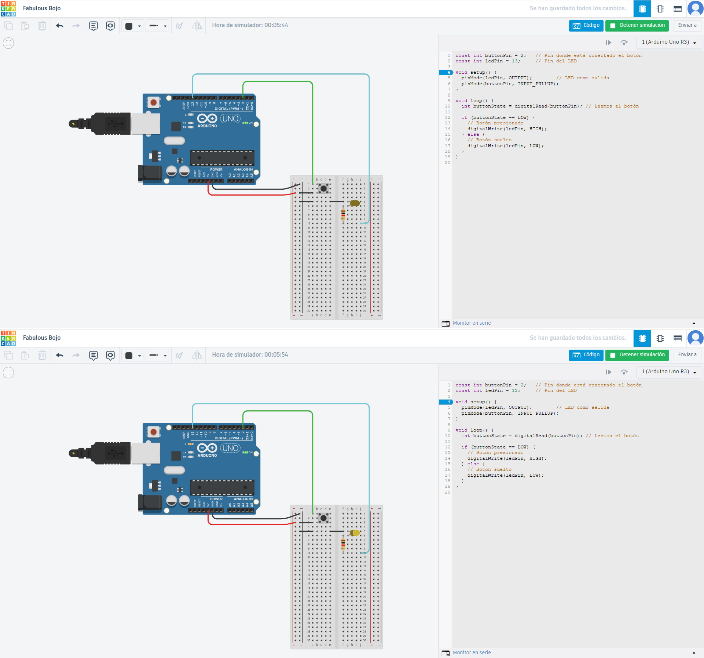

Los simuladores me permiten practicar sin riesgos de quemar ningun componente si hago mal una conexión. En la misma interfaz escribo el codigo y lo chequeo para que no tenga errores. Es indispensable tener claro algunas reglas del lenguaje de programacion:
- Las mayusculas se respetan siempre.
- Los espacios casi no se unsan.
- Cuidar los signos de puntuacion como los punto y coma.
- Revisar las llaves, los parentesis, los corchetes, parentesis angulares y barras.
- Hay que respetar estrictamente las palabras en ingles. 
Logré simular el ejercicio uno copiando el codigo en tinkercad pero tuve que hacer varis pruebas para que prendiera la luz y me exploto la placa un par de veces.
¿cual es la polaridad correcta de un interruptor?

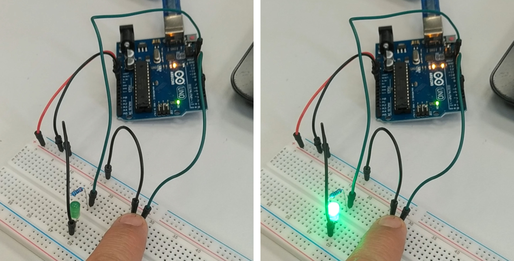

En la calse de hoy 20 de nov, evacuamos varias dudas entre ellas pregunte sobre el diagrama o esquema de los circuitos eso te ayuda a saber como se vinculan los distinto elementos, en ese sentido Mathias aclaro que el tinkercad da el esquema automaticamente ne una de sus botones. Volvi y fui a leer el esquema y efectivamente permite comprender el flujo de energia a traves de los distintos componentes conectados. Algo que no es tan claro de visibilisar mentalmente en la placa de pruebas o **protoboard**

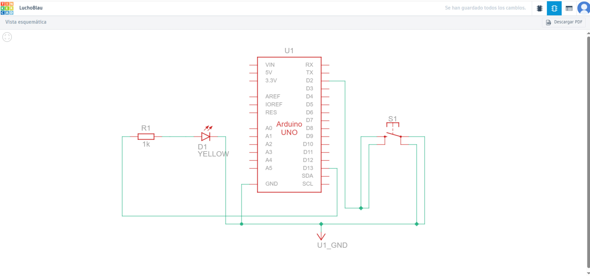

El ejerciicio uno es el cálsico muy sensillo pero tiene una variable trampa, el Led debe quedar encendido solo si el boton queda presionado. En la logica que vinmos con Daniel es Cero=apagado=LOW / uno=encendido=HIGH. para repasar lo que vimos con Mathias y las partes del codigo del ejercicio uno.

*const int buttonPin = 2;  // Pin donde está conectado el botón*
*const int ledPin = 13;    // Pin del LED*

el **const int** hace que esos valaores no cambien cuando se ejecuta el codigo. Nos dice que el boton esta conectado al pin digital 2 y el LED esta en el pin 13

*void setup() {*
  *pinMode(ledPin, OUTPUT);        // LED como salida*
  *pinMode(buttonPin, INPUT_PULLUP);*
*}*

Todo lo que esta en el **setup** se ejecuta una sola vez al inicio. en el pinMode(ledPin, OUTPUT); le indicamos al Arduino que el pin 13 va a encender o apagar el LED.
En el pinMode(buttonPin, INPUT_PULLUP); el PULL-UP activa la resistencia interna del Arduino, y el boton se comporta como suelto=high y presionado sera LOW y cierra el circuito en GND esto es la trampita, porque si soltamos el boton el led se apaga.

*void loop() {*
  *int buttonState = digitalRead(buttonPin); // Leemos el botón*
*}*
Todo lo que esta en **loop** se ejecuta continuamente de manera infinita, *digitalRead*obtiene el estado del boton HIGH o LOW

  *if (buttonState == LOW) {*
    *// Botón presionado*
    *digitalWrite(ledPin, HIGH);*  
  *} else {*
    *// Botón suelto*
    *digitalWrite(ledPin, LOW);*   
  *}*
condicion principal **if** significa: si el boton esta presionado el LED se enciendo. **Else** significa: si el boton esta suelto el LED se apaga.

**Resumen:**

`buttonPin` y `ledPin` Definen los pines del botón y LED.

`pinMode(..., OUTPUT)` El LED funciona como salida.

`pinMode(..., INPUT_PULLUP)` Botón con resistencia pull-up interna.

`digitalRead()` Lee el estado del botón.

`if (buttonState == LOW)` Detecta botón presionado.

`digitalWrite()` Enciende o apaga el LED.

Esta base lo vimos en la clase del LATU en 4 ejercicios mas los que replique en el simulador y con el KIT que nos dieron.

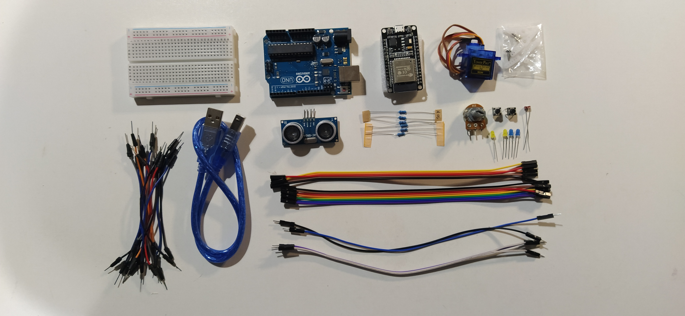

---

# Ejercicio 2

Programar el Arduino para que lea el valor de un potenciómetro y controle el brillo de un LED. Cuando el potenciómetro esté en valores bajos, el LED debe estar tenue; cuando el potenciómetro esté en valores altos, el LED debe brillar más fuerte. El cambio debe ser progresivo: a mayor giro del potenciómetro → mayor brillo.

---

# Ejercicio 3

Programar el Arduino para que use el sensor de distancia SRF05 y encienda un LED cuando un objeto esté a menos de 20 cm. Si el objeto está más lejos, el LED debe permanecer apagado. Además, el programa debe mostrar en el Monitor Serie la distancia medida en centímetros. 

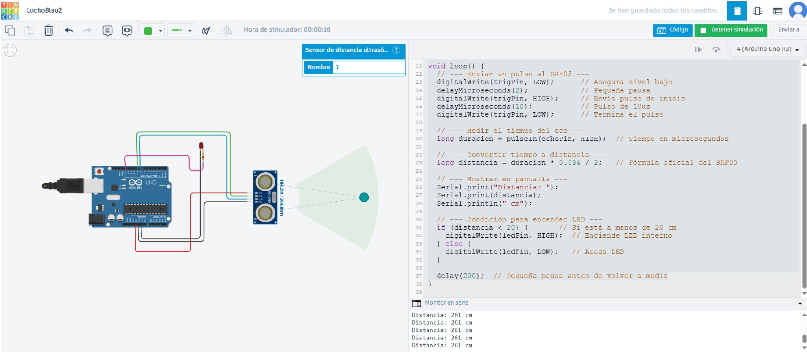

---

# Ejercicio 4

Programar el Arduino para que lea un potenciómetro y controle el ángulo de un servo SG90 en tiempo real. Mientras el servo esté moviéndose (cambiando de ángulo), debe encenderse un LED rojo. Cuando el servo esté quieto (el ángulo no cambió respecto a la lectura anterior), debe encenderse un LED verde.

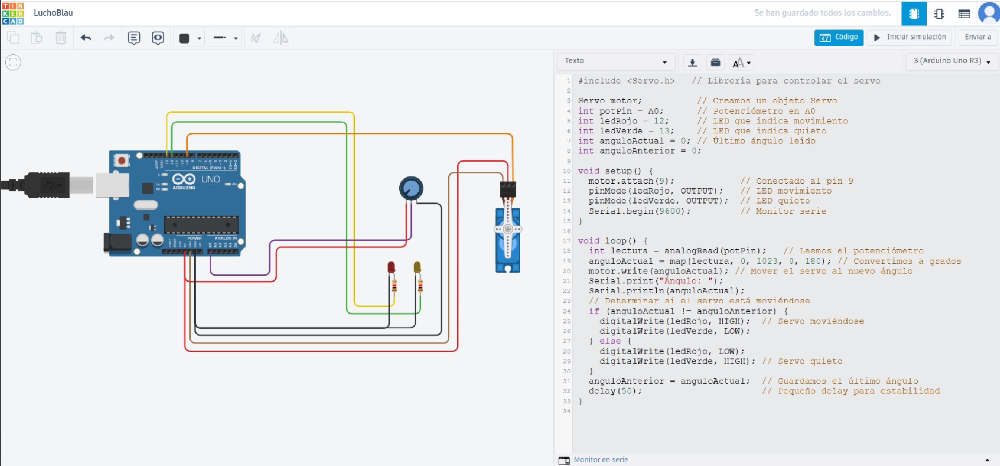

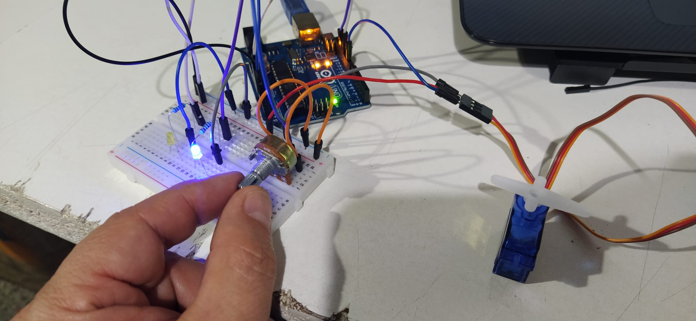

---

# Ejercicio 5

Programar el Arduino para que lea una fotoresistencia conectada a un pin analógico. Si la luz ambiente es alta, debe encenderse un LED. Si la luz es baja, debe encenderse otro LED diferente. Solo uno de los dos LEDs debe estar encendido a la vez. Además, el valor leído debe mostrarse en el Monitor Serie.

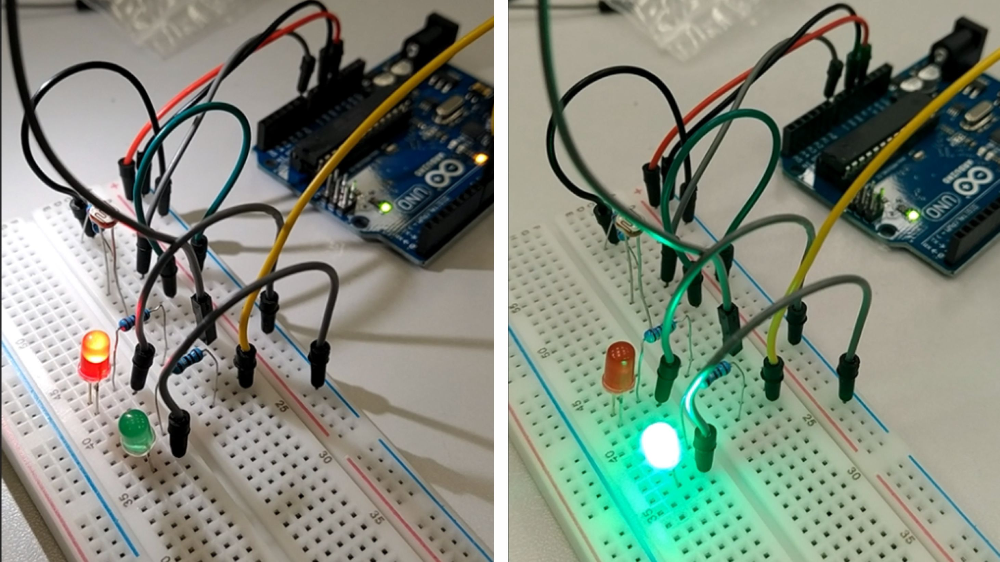

---

Como conclución y refelxión de este modulo podria decir que aunque la lógica de la programación, lleva un proceso de dedicación muchisimo mas extensa para tener un dominio aplicable de forma independiente. Sin embargo la practica posibilitó incorporar los fundamentes principales de la conexión entre la programación y resultados tangibles con componentes electrónicos. Con la ayuda de la IA creo que es posible lograr automatismos que respondan a objetivos diferentes, incluso aplicables al proyecto final.

---
---
Para proteger la placa y los componentes que nos dieron en la calse le fabrique en Fusion360 una cajita para el arduino y un contenedor para todo los demás elementos.

Caja configurada con cajetines a medida para cada componente. aplilables y lavables. ;)

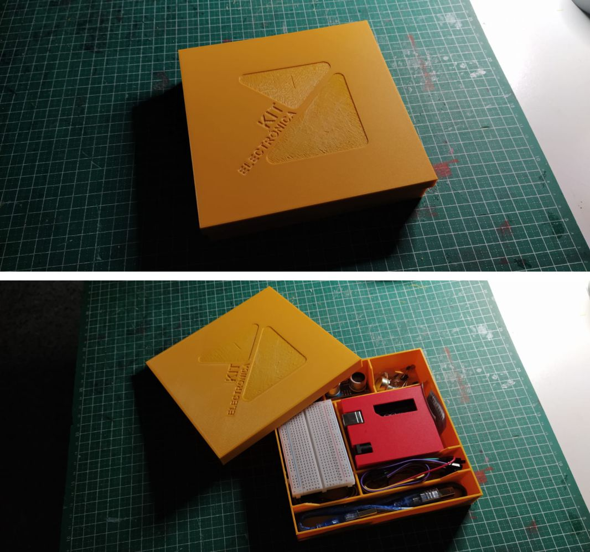

---

Referencias

Enlace a la Consigna
https://docs.google.com/presentation/d/1Ly0JR6jeLuPuMEq7Lt6N3M1PTVMk8FXvjujsZb0qju8/edit?slide=id.g390f6dd2a1d_0_169#slide=id.g390f6dd2a1d_0_169

https://www.instructables.com/Halloween-Badges/

https://www.hackster.io/

https://www.adafruit.com/

https://www.arduino.cc/

https://www.tinkercad.com/

https://www.electronica.uy/