# MT05

*Impresión y escaneo 3d*

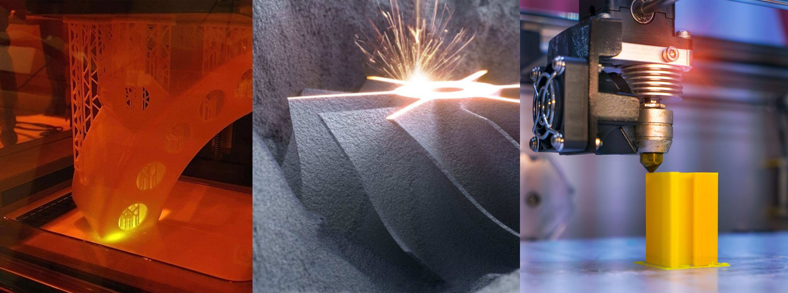

En este módulo navegamos por la historia de la impresión 3D. Desde la década del 80, los procesos de lograr objetos físicos a partir de datos fueron una búsqueda que arrancó en 1981. Los pioneros en este camino fueron el japonés Hideo Kodama, que buscaba solidificar resina fotosensible usando un rayo de luz. Esto se enmarcó en los sistemas de fabricación aditiva

Los franceses Alain Le Méhauté, Olivier de Witte y Jean-Claude André en 1984 también presentan patentes con el mismo método. Ese año el estadounidense Chuck Hull desarrolla la estereolitografía. Esto marca una revolución tecnológica que llegará con tres métodos de fabricación aditiva, es decir, que acumulan material capa a capa como recorriendo el cuerpo como si fuera una tomografía.

1 SLA - (Stereo Lithography Apparatus), solidifica resina líquida con un láser.
2 SLS - (Sintetizado Selectivo por Láser), solidifica un polvo con un láser.
3 FDM - (Modelado por Deposición Fundida), similar a la manga pastelera.

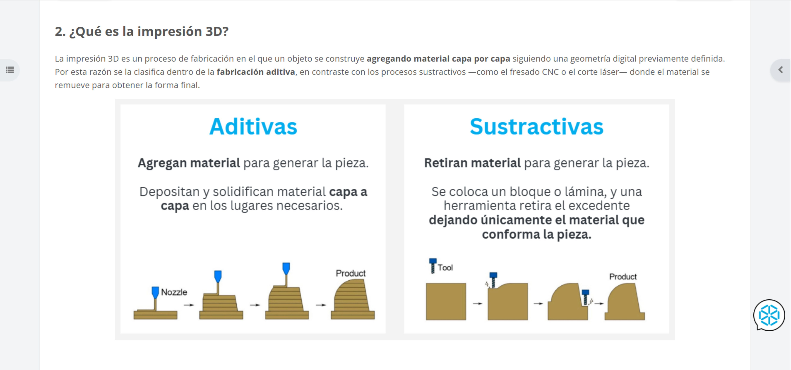

A medida que las patentes caducaban y los costos bajaban, el desarrollo se desplazó de la industria a lo doméstico. Esta expansión generó grandes competencias comerciales y un contraste entre el código abierto y el secreto comercial. La película Printing the legend es un testigo de esas tensiones entre el trabajo colaborativo no remunerado y los costos de mano de obra especializada.

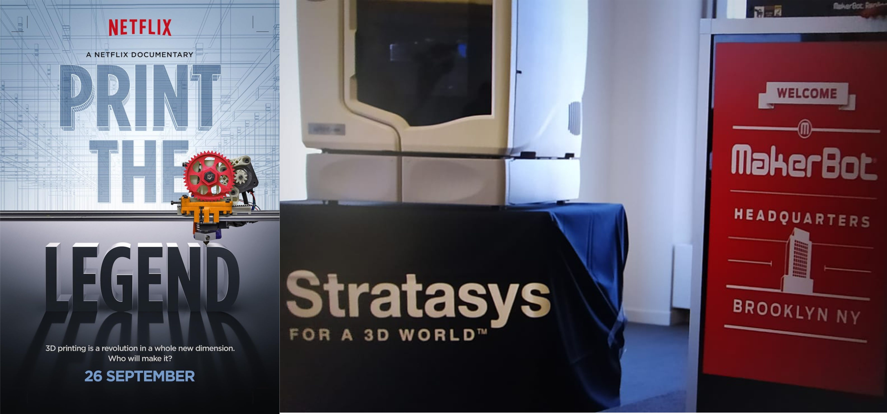

Actualmente, las impresoras 3D con fusión de filamentos son accesibles y han proliferado en el mercado como modelo de producción, generando una nueva oportunidad laboral relacionada con el diseño y el modelado digital. Lo que en su momento se generaba para representar la realidad con fotorealismo hoy se puede convertir en un objeto físico, un producto comerciable.

Para generar el modelo digital usamos dos métodos: el dibujo técnico vectorial en CAD o el escaneo fotográfico. En ambos casos, para que se pueda imprimir, hay que establecer una comunicación con la impresora. Entre el modelado 3D y la impresión física están los programas laminadores. Son las encargadas de traducir la geometría vectorial a una sucesión de capas que la impresora entiende y ejecuta con distintos rangos de fidelidad.

En los laminadores, las configuraciones y las estrategias de ubicación del modelo en la cama de impresión serán fundamentales en la eficiencia de la impresión. El ahorro de tiempo, insumo y energía son determinantes para una buena gestión de los recursos. En la secuencia de las imágenes siguientes, analice la mejor ubicación del modelo y se aprecia diferencia significativa en el gasto de tiempo.

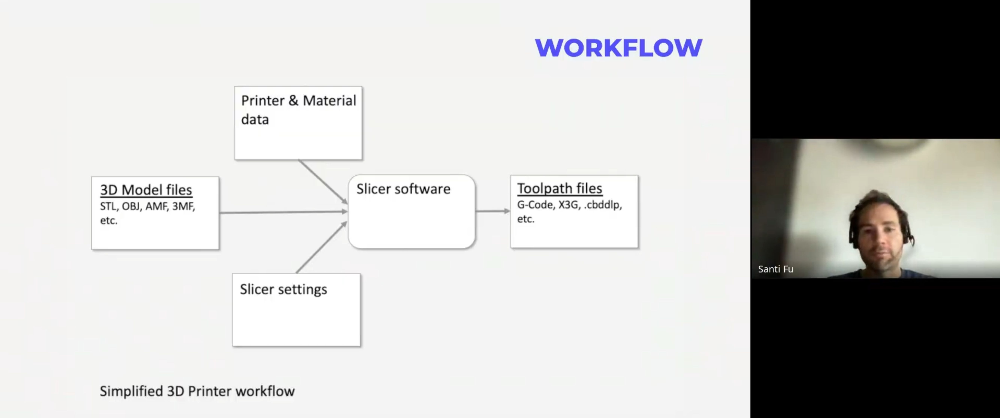

Modelo dado como consigna para establecer la mejor estrategia de impresión, considerando tiempo, consumo de material y forma del diseño. Tanto el comportamiento de la impresora como el diseño son variables que se modificarán para lograr una optimización de recursos. 

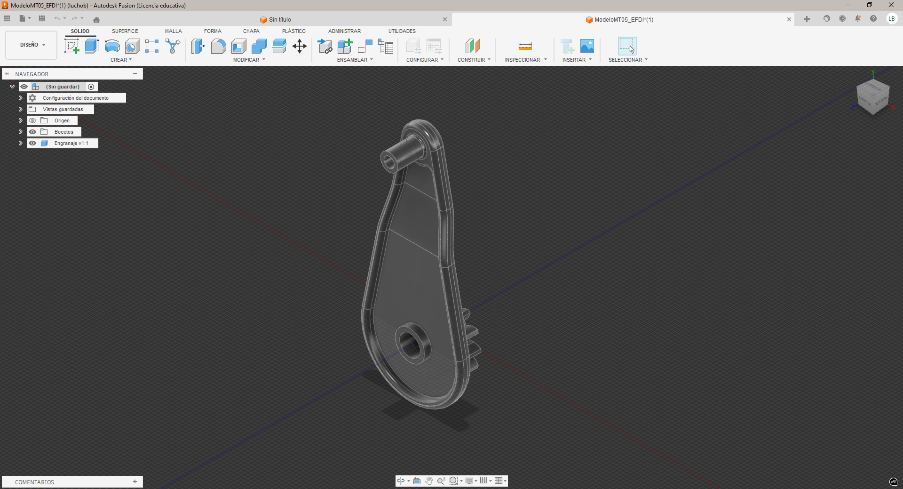

En mi caso use primero el laminador original de mi impresora 3D, una *Creality Ender 3 V3 KE 0,4 nozzle*. En el recuadro de borde amarillo están las cuatro variables que calcula el programa: Tiempo, longitud de filamento insumido, costo de filamento y el peso de la pieza.

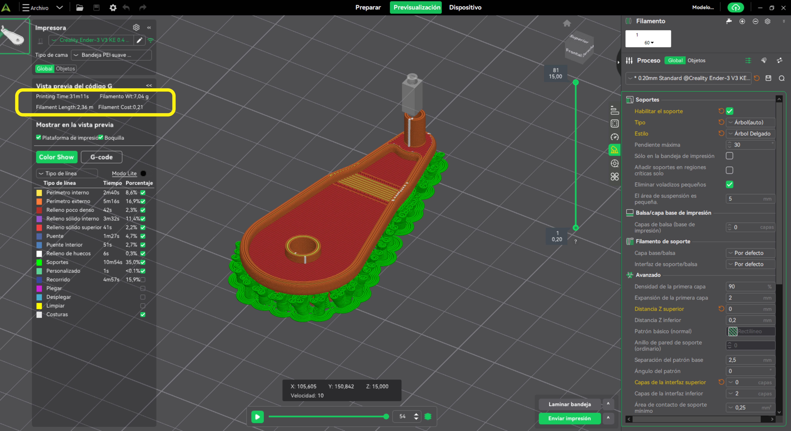

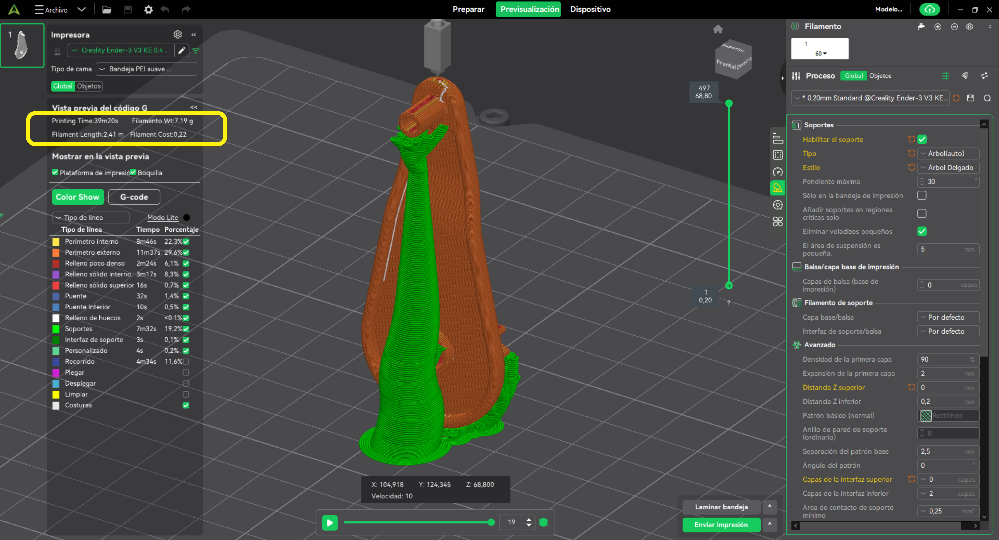

Una vez impreso el prototipo, evalúo por observación la calidad de terminación superficial, la resistencia de la pieza, la cantidad de desperdicios en soportes, el tiempo que lleva limpiar la pieza. Esa es la información que se necesita para establecer una correcta configuración del laminador. Variables como el espesor por capa, alisado de superficies, porcentaje de relleno, estilo de soporte y velocidad son modificables para mejorar el resultado de la pieza.

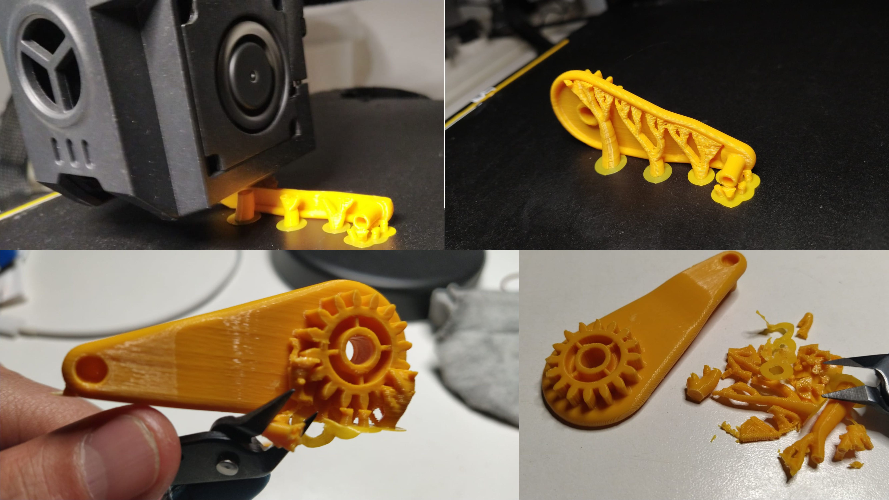

La impresión insumió 19 minutos mas unos 5 de limpiezas y retiro de soportes, limado de cicatrices. respete el tamaño original y no modifique el diseño.

---

En los **laminadores**, las configuraciones y las estrategias de ubicación del modelo en la cama de impresión serán fundamentales en la eficiencia de la impresión. El ahorro de tiempo, insumo y energía son determinantes para una buena gestión de los recursos. En la secuencia de las imágenes siguientes, experimente con otros laminadores como *IdeaMeker, UltiMaker Cura y OrcaSlicer* para ver interfaces y analisar los datos que arroja y comparar resultados.

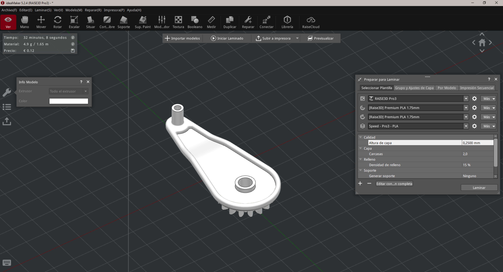
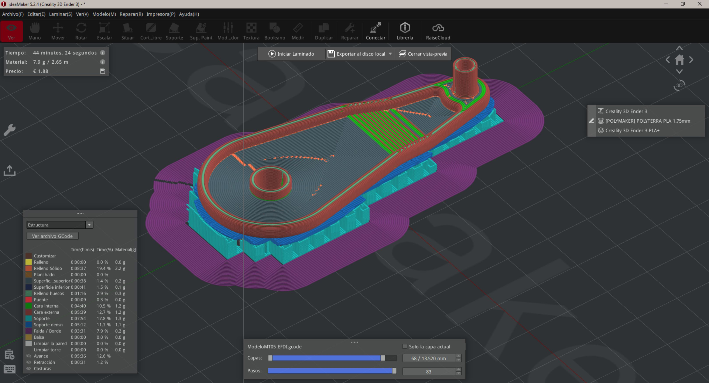

---

**Modelado con escaneo**

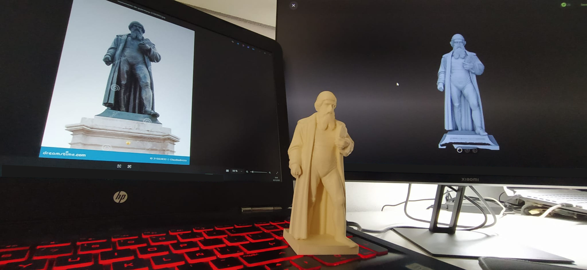

Una oportunidad postergada hace bastante tiempo. Cuando como estudiante me llamó la atención cómo un grupo de docentes del Vidialab (laboratorio video digital) fotografiaban a la estatua de la Vitoria de Samotracia para imprimirla en 3D (2015 o 16), comentamos como una novedad innovadora, pero quedó ahí, nunca experimentamos.

Hoy los programas han evolucionado mucho en términos de generación de modelos a partir de fotos. La fotometría y la IA permiten generar un modelo a partir de una sola imagen. Es verdaderamente increíble que de una foto puedas tener un objeto en la mano.

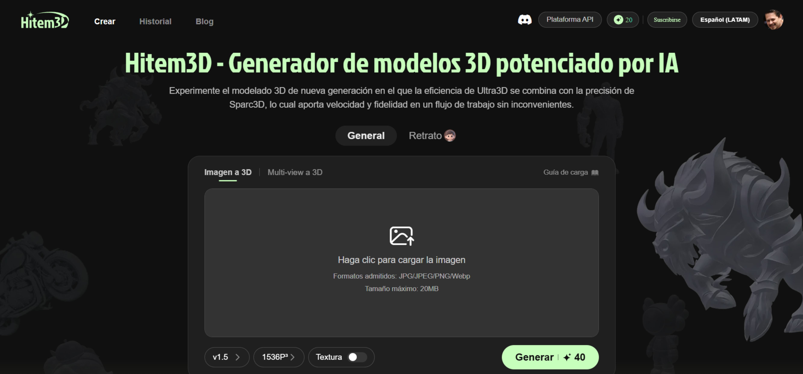

---

Otro método de escaneo sugerido en aula para obtener modelos tridimensionales es la fotogrametría. Consiste en hacer una secuencia de fotografías digitales alrededor del objeto e importarlas a un programa que las lee y convierte la información del sensor de la cámara en una nube de puntos. El programa sugerido fue el Meshroom, un programa de código abierto, portable, de descarga gratuita y sin requerimiento de cuenta. 

Consideraciones a tener presente: el archivo ZIP pesa 10 gb y demoró 4 horas en bajar. Usa Visual Studio Code para leer algunos de sus archivos; lo que me generó es que tuve que volver a vincular la carpeta de la bitácora digital del EFDI.

La primera prueba la hice con mi esposa como modelo, en un entorno con luz uniforme sin sombras contrastantes. Hice un círculo con 15 fotografías de 4000x1850 px. Una vez que se abre el programa, hay que ir al menú superior y elegir nuevo proyecto; bajar hasta fotogrametría, para que se cargue la configuración correspondiente. Se cargan las imágenes desde la carpeta asignada y se cliquea en la flecha superior Computar. El proceso es largo y llevó cerca de 7 horas en tirarme que hay un error.

Algo que no me gustó del programa es que no tiene ningún indicador de procesamiento; es muy estresante la sensación de que el programa está colgado. La única manera de ver si están en marcha es abrir el cuadro de diálogo del administrador de tareas y verificar que el CPU está activo.

El error que me tiró, según ChatGPT, se debió a que la tarjeta gráfica tenía drivers desactualizados. GPU - CPU: Sugería actualizar la tarjeta y reiniciar. Bien actualizada la tarjeta gráfica. El otro factor es que 15 imágenes es muy poca información para el programa. La cantidad recomendada es entre 40 y 80 fotografías. Usar la fotogrametría (photogrammetry) en el New Pipeline. 

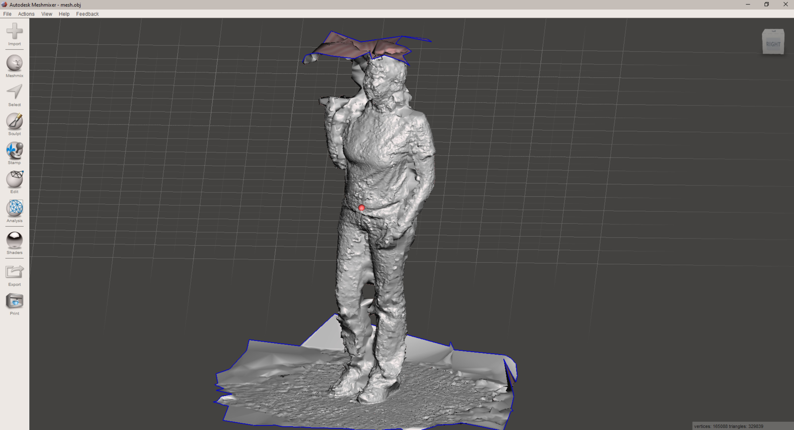

Volví a hacer las fotos, ahora con tres recorridos: zona alta, media y baja, 78 fotos en total. En condiciones de luz natural bajo una malla sol y sombra, con presencia de sol al oeste a las 18 h, las cargué al Meshroom y en 2 horas hizo el proceso completo. Pero, cuando lo abrí en el Meshmixer, la malla estaba muy mal, peor que la anterior. Conclusión: La luz y los contrastes fuertes en las fotografías fueron las causas del mal resultado. 

---

**Referencias**

https://sketchfab.com/blogs/community/tutorial-meshroom-for-beginners

generador de modelos (permite dos modelos grátis)
https://www.hitem3d.ai/create

