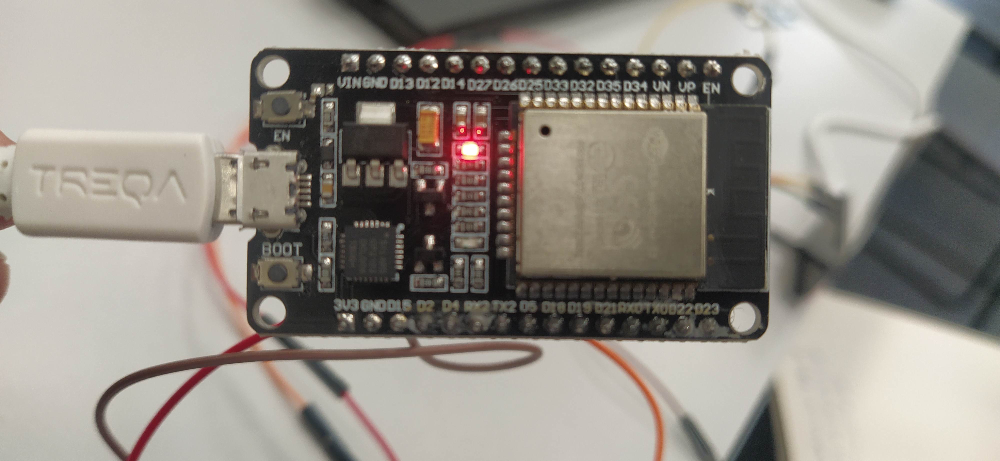
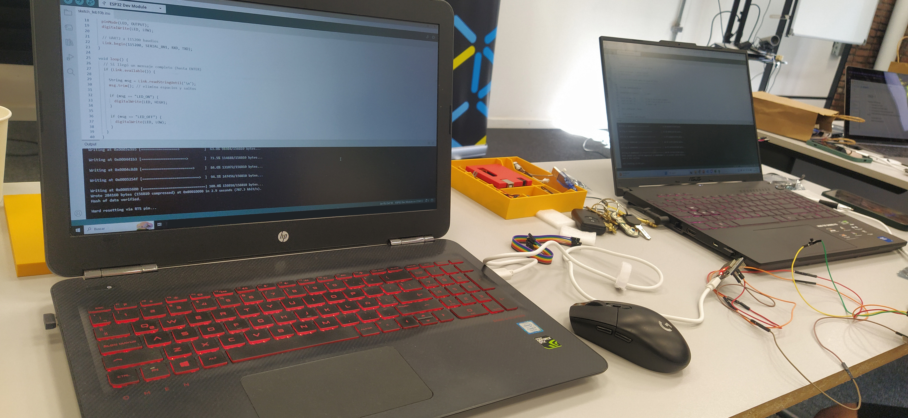
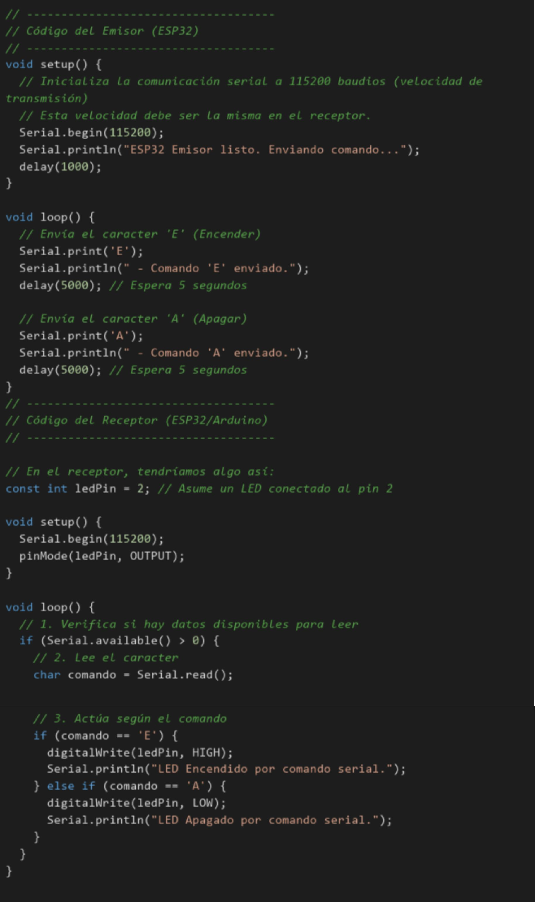
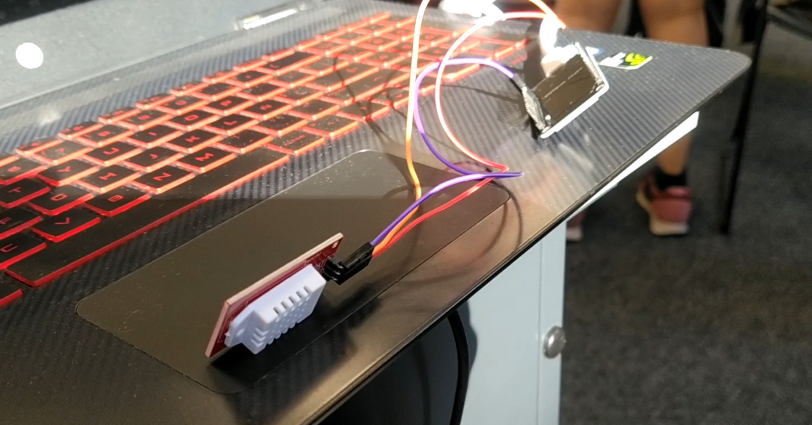

# MT06

*Sensores y actuadores*

En este módulo vimos cómo la electrónica se comunica, se ordena y actúa según la programación que le designemos. Un cerebro que emite órdenes y otros receptores las reciben y accionan dispositivos que mueven, emiten luz, sonido o visualizan información en una web. Un paso más que el módulo de Introducción a la electrónica; ahora diferentes dispositivos se interconectan entre sí para trabajar en redes y dar respuesta según lo que se necesite y a eso se le llama NETworking.

Para lograr que se comuniquen y que se entiendan, son necesarias reglas como, por ejemplo, la velocidad a la que envían los bits, llamada tasa de baudios o baud rate. 
En la placa de ESP32 que usamos, se conectan los pines de transmisión TX (boca) de un dispositivo a los pines de recepción RX (oreja) de otro; además, necesitan una conexión a tierra (GND).

Para empezar, se abre la aplicación de Arduino y se carga el módulo ESP32. Se revisa la biblioteca y, si no aparece en la lista, hay que descargar e instalar el módulo desde el servidor de Arduino. Cargar los enlaces dados en el cuadro de dialgo de preferencias. Luego de ese ajuste es posible iniciar la consigna propuesta; son dos ejercicios.

---

## Ejercicio 1

*"Implementar una comunicación Serial UART entre dos
ESP32:
• ESP32 A (Emisor): cuando el usuario aprieta un botón,
envía un mensaje por UART.
• ESP32 B (Receptor): recibe el mensaje por UART y
prende/apaga un LED según el comando recibido."*

## Ejercicio 2

*Programar un ESP32 para que:
Se conecte a una red WiFi.
Haga una petición HTTP GET a una página web simple.
Muestre en el Serial Monitor:
Si se conectó correctamente
La IP asignada
El código HTTP de respuesta
Los primeros caracteres del contenido recibido*

Logramos que el modulo trasmitiera en la web los datos del sensor de humedad en tiempo real.

<iframe
src="https://www.youtube.com/embed/ISglY_0f4ww?si=dxf0sRlNvfhsre7K" 
title="YouTube video player" 
frameborder="0" 
allow="accelerometer; autoplay; clipboard-write; encrypted-media; gyroscope; picture-in-picture; web-share" 
allowfullscreen
referrerpolicy="strict-origin-when-cross-origin" 
style="position:absolute; top:0; left:0; width:100%; height:100%;">
 </iframe>

