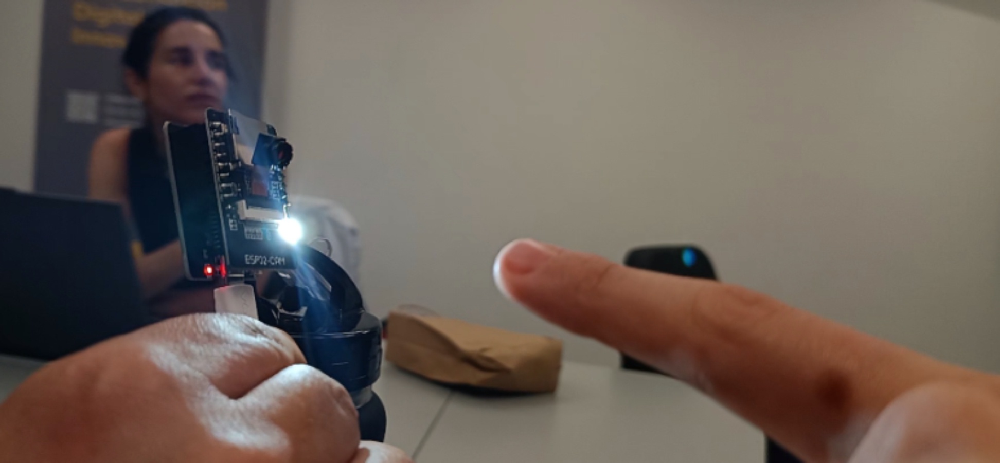
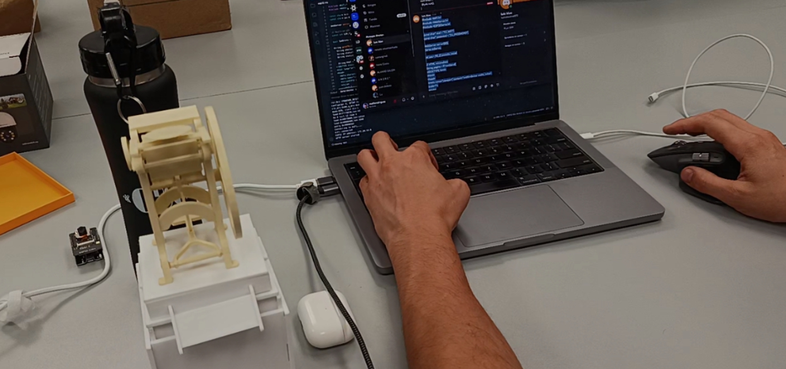
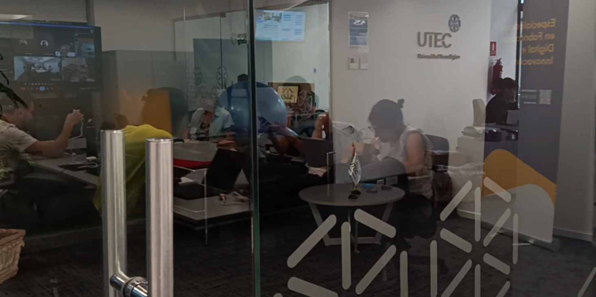
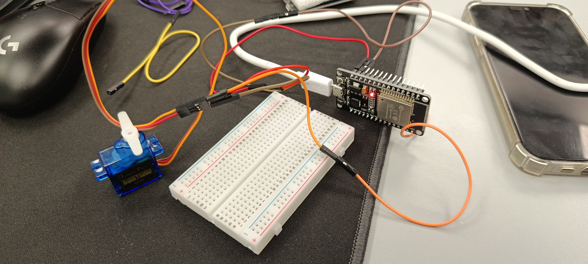
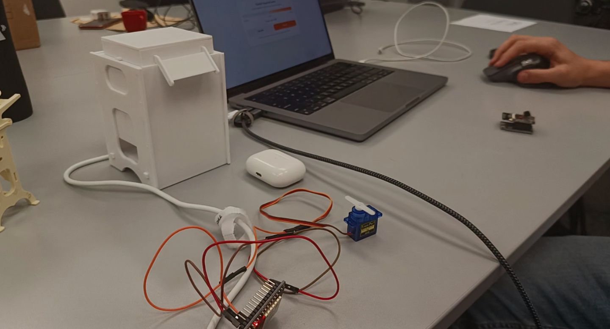

# MT07

*Interfaces y aplicaciones*

Este módulo nos guía en el camino de los protocolos de diseño y programación para generar interfaces entre los usuarios y los objetos. El objetivo principal de esta instancia es construir un puente que permita ver estados y ejecutar acciones. La interfaz visual es la clave del éxito de una interacción eficiente con el usuario. Provocar movimientos, sonidos, colores con luces mediante elementos físicos y programación es el desafío que tenemos que cumplir.

Algo fundamental que se recomienda en el curso es: ¿Qué variable o estado quiero mostrar? ¿Qué acción real puede ejecutar el usuario? ¿Cómo voy a confirmar lo que pasó? Si responden bien esas tres cosas, ya tienen una base muy sólida. 

La interacción puede ocurrir a través de una página web, un panel en Node-RED, una app en Blynk o incluso una consola muy básica. Basado en estas referencias, hicimos el laboratorio práctico con ESP32 en el LATU.

---
El priemer ejercicio fue hacer que desde un boton en una plataforma web ensendiera la luz integrada del modulo ESP32
La propuesta fue que Usando inteligencia artificial para intentamos programar la acción desde Blynk. todo el proceso lo teniamos que hacer udando chatgpt o gemini de forma independiente. Algo paso con los puertos de mi laptop que no puede completar la consigna. Me quede con testimoniar el trabajo de mis compañeras que si lo lograron.

En el segundo ejercicio, intenté controlar desde una interfaz generada por la IA un servo que girara hacia un lado y hacia el otro.

[Acceso al chatGPT](https://chatgpt.com/share/69bd72e4-0bdc-8000-bcfb-bb638cd111b5)

Este sí lo logré y es la base para las tres interacciones que pretendo lograr. Girar el disco exhibidor, subir y bajar la altura de la base y encender la luz del disco.

---

## Referencias:

[Tarjeta perforada](https://discord.com/channels/1407443589599989920/1407443593005764702/1480585210356568177)

[Interaccion entre objetos](https://www.youtube.com/watch?v=hNeCHI4NAzw)

[Interfaz tangible de paisajes](https://tIngible.media.mit.edu/project/sandscape/)

[Internet de las cosas](https://appinventor.mit.edu/explore/ai2/IoT_unit)

[Creador de aplicaciones ](https://appinventor.mit.edu/)

[Aplicaciones WEB](https://streamlit.io/)

[Herramienta para aprender a programar](https://p5js.org/)

[Tutoriao de Arduino - ESP32](https://awot.net/en/guide/tutorial.html)

[Como usar una pantalla electornica en tu proyecto](https://www.digikey.com/en/maker/tutorials/2022/how-to-use-an-e-ink-display-in-your-arduino-project)

[Arduino con sensor de proximidad, luz, RGB y gestos APDS9960](https://randomnerdtutorials.com/arduino-apds9960-gesture-sensor/)

[Codificador rotatorio Arduino](https://arduinogetstarted.com/tutorials/arduino-rotary-encoder)

[Perilla interactiva](https://hackaday.com/2022/03/13/haptic-smart-knob-does-several-jobs/)

[Creador de aplicaiones](https://lovable.dev/)

[Creador de aplicaciones](https://www.blynk.io/)

[Tutorioa acelerometro y giroscopio](https://www.blynk.io/)

[Biblioteca de Filtros Kalman](https://docs.arduino.cc/libraries/kalman-filter-library/)

[Proveedor de componentes electronicos](https://www.electronica.uy/)