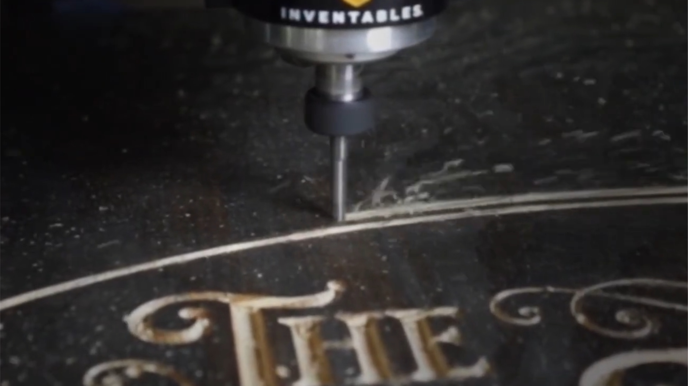
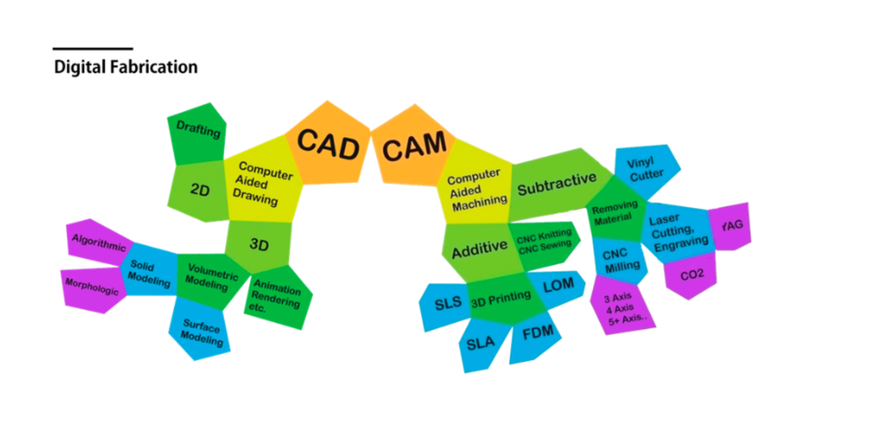
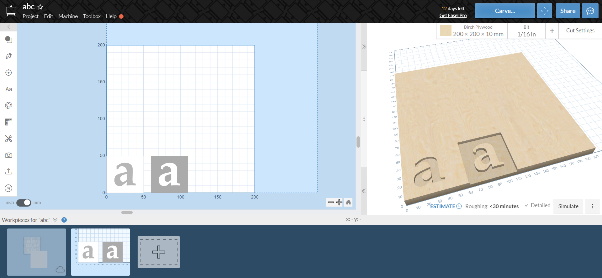
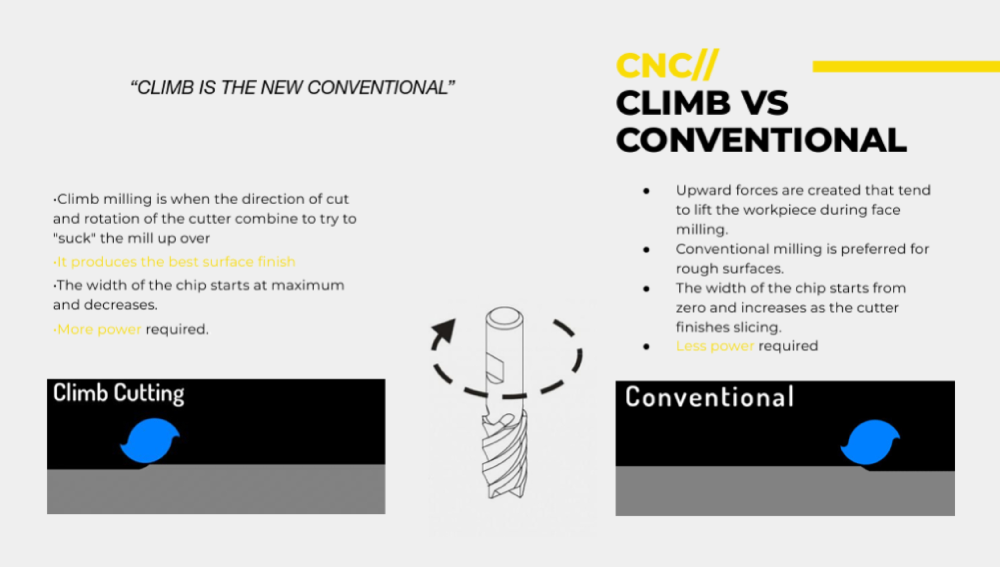
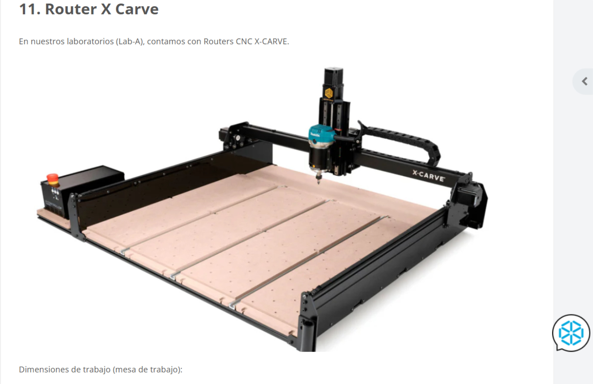
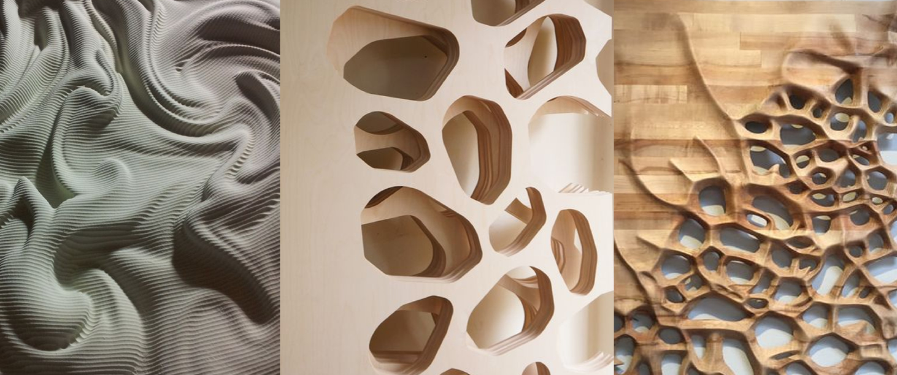

# MT08

*Contron númerico computarizado CNC*

Otra tecnología de fabricación sustractiva que permite un rango amplio de resultados exclusivos o combinados con otros métodos y herramientas. Con las mismas bases que relaciona herramientas de diseño, dibujo digital CAD y procesos de materialización CAM. Ideal para trabajar madera, acrílicos y bioplásticos.

Esta tecnología fue desarrollada por el ingeniero Jhon T. Parson con métodos mecánicos entre las décadas del 40 y el 50 en EEUU. En la década del 70 surge el control numérico computarizado (CNC). La evolución es continua y ampliamente usada en la industria y aprovechada por el diseño en sus distintas disciplinas para lograr productos con alto valor agregado en distintos materiales.

Es un sistema que permite controlar distintos motores de alta velocidad con mucha precisión en los tres ejes de traslación. La aplicación con la que trabajamos en el laboratorio es Easel. Una interfaz con dos zonas de visibilidad: una bidimensional para diseñar y la otra tridimensional, donde se representa el resultado final con visualización realista de la pieza. Se aprecia el espesor de la fresa, el material de la placa de madera que se usa. MDF, melamínico, tabla compensada, aglomerados, etc. Tiene una biblioteca variada en la opción de acceso gratuito y en la opción de suscripción paga tiene otras opciones.

Para determinar la ubicación en el eje Z, se usa una hoja de papel como referencia. Cuando la punta de la fresa aprieta el papel contra la placa de sacrificio, la distancia es la adecuada. La aplicación simula el recorrido de la fresa y cómo baja capa a capa según la profundidad configurada. Eso es fundamental para establecer los tiempos de fabricación de las piezas. En mi caso, para fabricar un tipo de MDF de 50 x 50 mm y 3 mm de alto relieve, tardo 10 minutos. Es decir, extrajo todo el material que rodea el contorno de la letra. Luego, para fabricar el bajorelieve, tardó 5 mm; extrajo el material del interior de los contornos de la letra.

Las variables principales para iniciar cualquier trabajo son:
 - Toolpath, la ruta por donde se desplazará la fresa.
 - Feed Rate, velocidad de avance de la freza
 - Spindle speed, velocidad de rotación del motor de la fresa.
 - Sentido de giro del recorrido, horario o antihorario. Este último es muy importante porque, según el tipo de fresa, la placa será esculpida, quitando material hacia la propia placa o disparándola hacia el aire. Esto afecta la calidad de los bordes de la pieza.

 

El router con el que trabajamos en el Lab tiene una cama de trabajo de 750x750x114 mm. Pero existen muchos modelos los mas comunes son los de 3 ejes como el de durazno. 

 

El de 4 ejes que agrega la rotación del husillo hasta 180°.
De 5 ejes incorporan brazos articulados en el husillo. Permite formas de alta complejidad al mismo tiempo que requiere de operadores con capacitaciones profundas en programación. 

 

### Referencias:

[Programa EASEL para comando de CNC](https://easel.com/)

[Modelado y mecanizado 3D para fresadoras CNC](https://carbide3d.com/carbidecreate/pro/)

[Simulación de código abierto y mecanizado asistido por ordenador](https://camotics.org/)

[Laminador Kirimoto](https://grid.space/kiri/)

[Suite de diseño de PCB multiplataforma y de código abierto](https://www.kicad.org/)

[FabAcademy - Tutoriales](https://pub.fabcloud.io/tutorials/electronic_production/mods/)

[Fab Academy](https://fabacademy.org/2020/labs/kamplintfort/students/kais-alila/assignments/week10/)

[X-Carve CNC Machine Kits](https://www.inventables.com/products/x-carve-1?srsltid=AfmBOor3yNgIeon-ZGiJfPWZfAEsEu29VkrGMSuf_JFgEA4q0Ax-fWx_)

[Router de 3 ejes](https://www.youtube.com/watch?v=lcWn4VEjaio)

[Router de 4 ejes](https://www.youtube.com/watch?v=QC90mruG-bY)

[Router de 5 ejes](https://www.youtube.com/watch?v=3VzSk1iOE8Q)