# MT09

## *Moldes*
Nos embarcamos en el fascinante mundo de la reproducción con moldes y sus distintos tipos. Un extenso abanico de modos de producción, que se potenció con la impresión 3D y la fabricación digital sin perder lo artecanal.

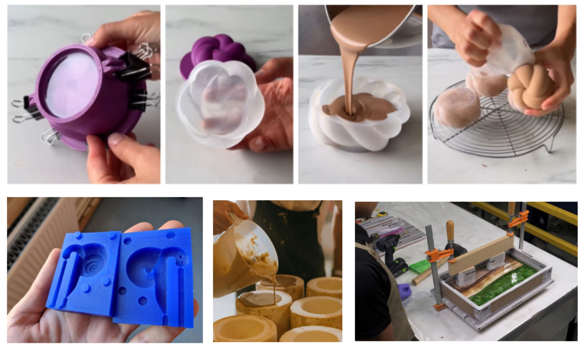

Un módulo donde la tecnología de fabricación digital se encuentra con prácticas artesanales, formulas  de técnicas, dosificaciones de siliconas, coladas de gliserina, recetas gastronómicas, alimentos con formas y posproducción decorativa.

Como desafío para aplicar lo expuesto en las clases, se planteó el diseño de un modelo y la reproducción con molde flexible. Arranqué el diseño del objeto impreso en 3D con la estrategia de reproducir el mismo objeto en múltiples materiales: yeso, jabón, velas, bombones, helados y galletitas o escones. Una vez que decidí la forma del objeto maestro. Inicié el proceso de obtener los moldes y moldes maestros.
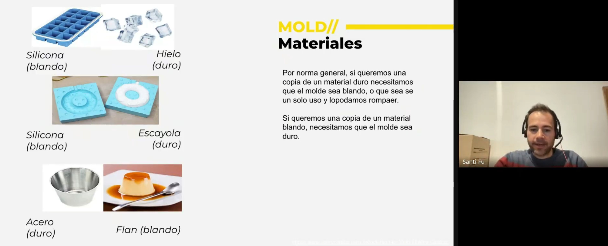

Del mismo modelo diseñe tres sistemas de piezas para experimentación, uno rígido para colada directa con dos matrices y 4 taseles cónicos, impresos directamente en 3D. El de la consigna con un contenedor en dos partes, dos tapas, inferior y superior con abertura para vertido y obtención del molde maestro. Y el tercero es otro ejemplo para obtener un tipo de molde flexible con un mayor apoyo de base. A imprimir!!!

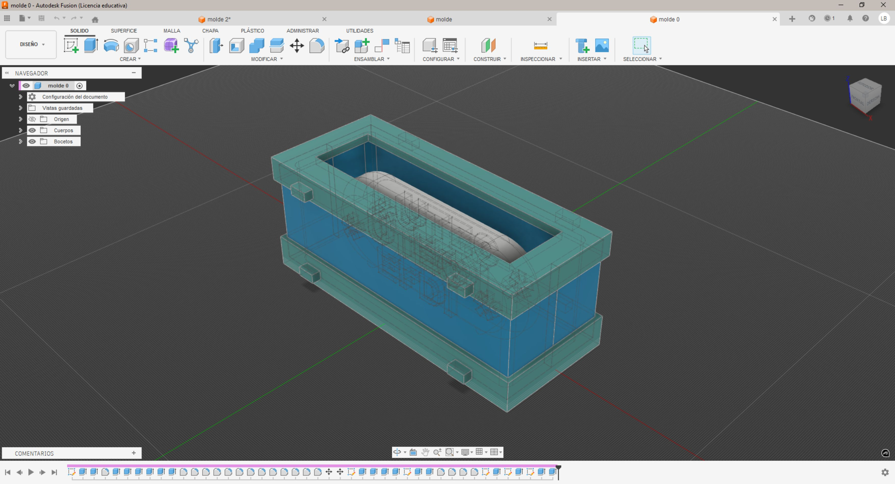

La pieza maestra a reproducir se inscribe en un volumen que tiene 120x45x20 mm; tardó 1 h 30 min en imprimir. 

Intentando pasar a la práctia el proceso de moldes de una y dos caras, aunque me confunde y nos es sencillo de visualizar moldes contra moldes y piezas finales.

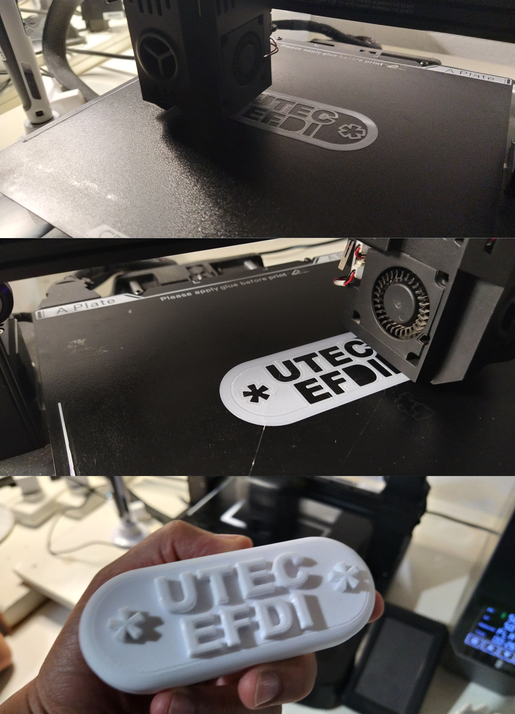

Las demás piezas demoraron entre 2 y 4 horas en imprimirse; en total, invertí casi 7 horas de impresión con 250 g de filamento. En la configuración, use capas de 0.15 mm con una velocidad baja de impresión para minimizar el agarre contra las paredes del molde.

Con la ayuda de Santi y Myriam, iniciamos el proceso de prueba, yeso y una receta casera para lograr el molde maestro flexible. El volumen de ambos moldes requiere unos 150 ml para llenarse. 

Proceso de colada de yeso: Pasé aceite de bebé en las dos piezas del molde. Prepare la mezcla de yeso y agua en proporción 2 por 1 hasta completar los 200 ml. Revolví lento para evitar burbujas y dejé reposar por aproximadamente 5 minutos. Cerré las dos partes del molde encajando los taseles; los aseguré con prensas. Nivelé el molde y empecé el vertido lentamente, vibrando el molde con golpes suaves. Todo el proceso consumió unos 50 minutos, incluyendo el preparado de la mesa de trabajo.

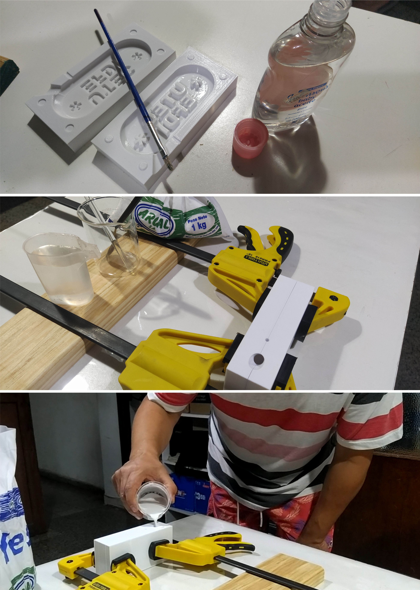

Proceso de fabricación de molde flexible con agar-agar y almidón de maíz: Use una balanza para medir la dosificación; lo recomendado según ChatGPT y tutoriales de la web es 6 g parte de agar por 20 g de almidón de maíz en 250 ml de agua. La mezcla la hice a fuego lento para activar el agar y disolver la almidón de maíz. Una vez que llega a una consistencia cremosa, se retira del fuego. (No llega a hervir.) Se deja enfriar y se vierte sobre el molde. La pieza maestra la fijé al fondo con dos gotitas de UHU. Tuve el inconveniente de que la cantidad que preparé no fue suficiente para cubrir todo el molde, así que preparé un poco más y la mezcla no quedó igual a la anterior. Para activar el agar, lo lleve a la heladera. Este proceso llevó 30 minutos.

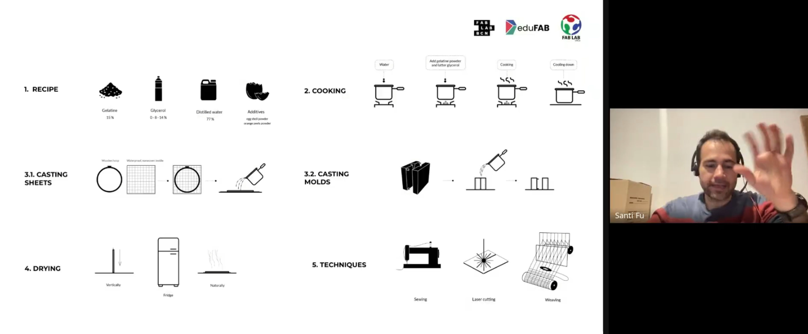

Llevar a la parctica el esquema de pictogramas no es nada facil, pero estoy lejos de rendirme :D

---

## *Resultados*

Luego de 12 horas decidí desmoldar y, para mi sorpresa, ninguno de los dos moldes quedó como esperaba; los intentos fallaron con gran éxito. Varias conclusiones en este primer intento, y la más importante es que la ansiedad y los resultados rápidos son una característica que juega en contra de estos procesos. Lleva tiempo y requiere paciencia.
Tiempos de fraguado para el yeso: mínimo 24 horas, ideal 48 h y lo saqué en 12 h, gran error. En el molde flexible, varios procedimientos equivocados: la mezcla en agua del agar-agar y la alimidón de maíz se hace en frío. Luego de deshechos los grumos, se lleva a fuego lento para activar el agar-agar. Se deja enfriar y se vierte sobre el molde. No se lleva a la heladera; se solidifica a temperatura ambiente en 5 o 6 horas. Para desmoldar, es recomendable 24 h. En mi caso la mezcla quedo como una pasta, lo intentaré otra vez desde cero.

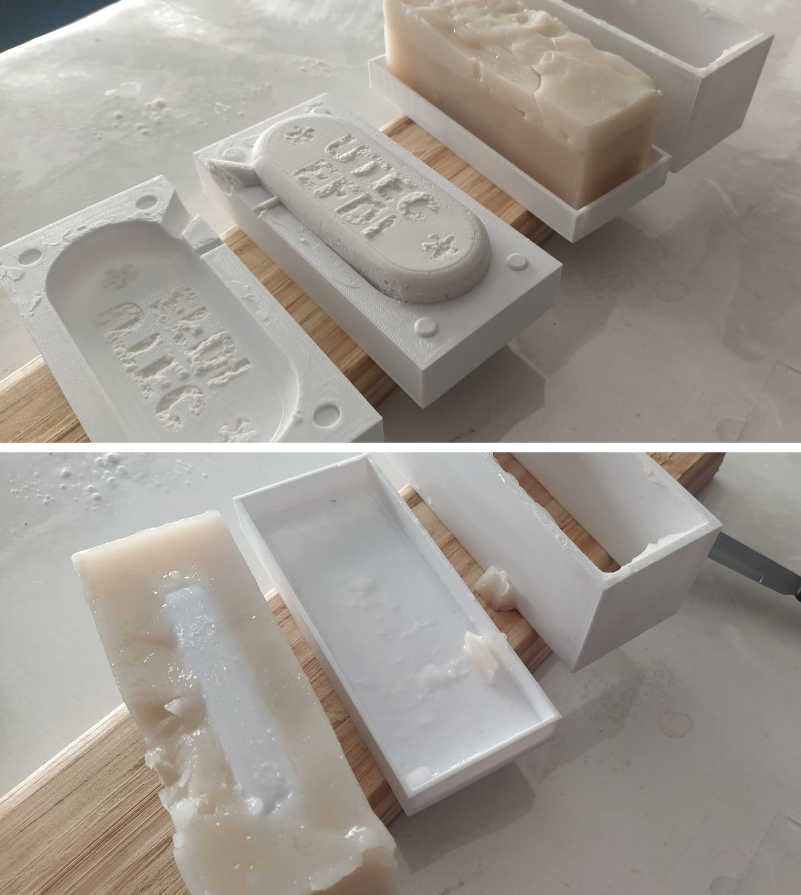

Intento 2

El tiempo estimado que invertí hasta ahora es de aproximadamente 26 h distribuidas en 3 días. Ahora voy con caucho de silicona comprado; espero lograr reproducir una pieza.

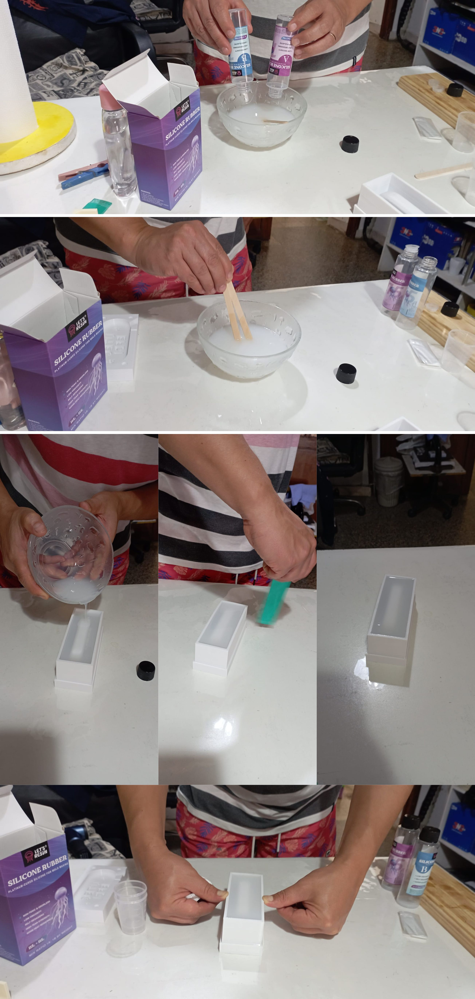

Este producto que conseguí en la casa del artesano, cuyo costo es bastante alto (899 $ el kit de 250 ml), me permite tener el molde flexible de silicona. El producto tiene un grado de dureza A15; es bastante elástico, cosa que viene bien por la complejidad de la pieza. El tiempo para trabajarlo después de mezclados los dos componentes es de 40 minutos. El curado es de 4 h mínimo para poder desmoldar. La durabilidad es de mucho tiempo según la manipulación. También tiene grado comestible, pero no horneable. 

Logré un molde de silicona, con algunas fragilidades porque el modelo maestro se movió y el piso del molde de silicona quedó muy delgado. 

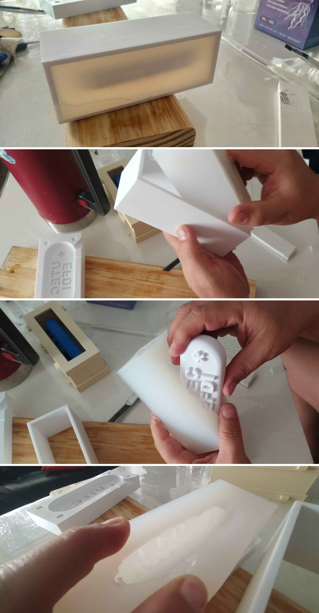

---

El primer producto que intenté en el nuevo molde fue una vela. Usé 150 g de parafina granulada, dos pavilos de 5 cm, una gotita de esencia de vainilla y una gotita de colorante rojo. Fundí a fuego lento y lo vertí en el molde lentamente. En 4 horas retiré el primer producto de la técnica, completando el proceso. Noté que algunas de las letras del objeto vela quedaron con huecos; revisé el modelo, son cavidades originadas seguramente por burbujas atrapadas en la silicona en el proceso de premolde. A su vez, todas las líneas de las capas de la impresión retienen pequeñas burbujitas que le dan una terminación rayada a la superficie del objeto. Me pregunto si no es una consecuencia de haber usado aceite de bebé como desmoldante.

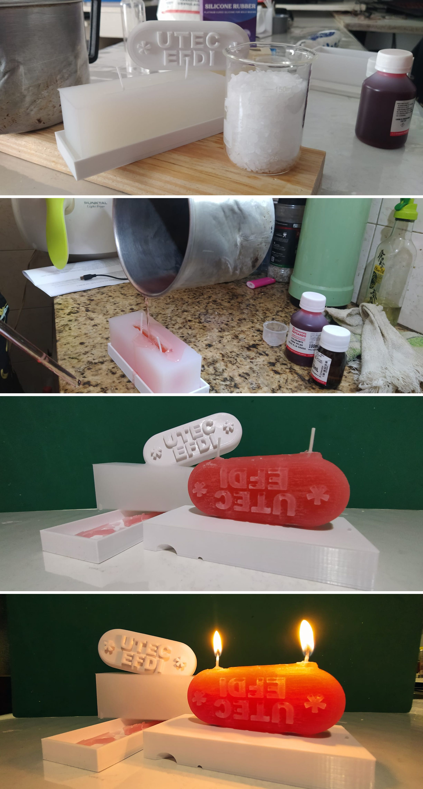

Como conclusión, lo primero es mejorar el modelo, disminuir la profundidad de las tipografías, generar ángulos para mejorar el desmolde, biselar aristas como sugirieron los docentes, diseñar una mejor estrategia de juntas de partes del molde.

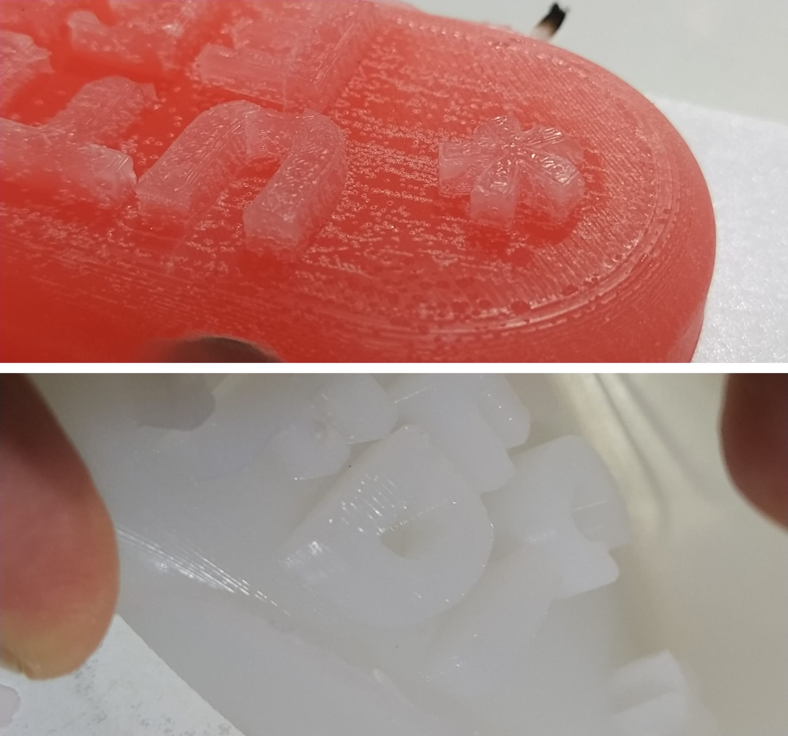

Rediseño e impresión del premolde, contramolde, o molde rigido.

---

Experimento con jabón. En casa, mi esposa guarda todos los pedacitos de jabón que, por pequeños, se dejan de usar. Así que reciclamos todo eso, lo rallamos, lo ablandamos hasta punto de puré en baño maría y lo prensamos en un molde rígido. La dosificación de jabón y agua es una relación de 10 a 20% del peso del jabón. Fallo, No pude desmoldar. La pasta requiere un molde de rigidez 50A de una sola cara.

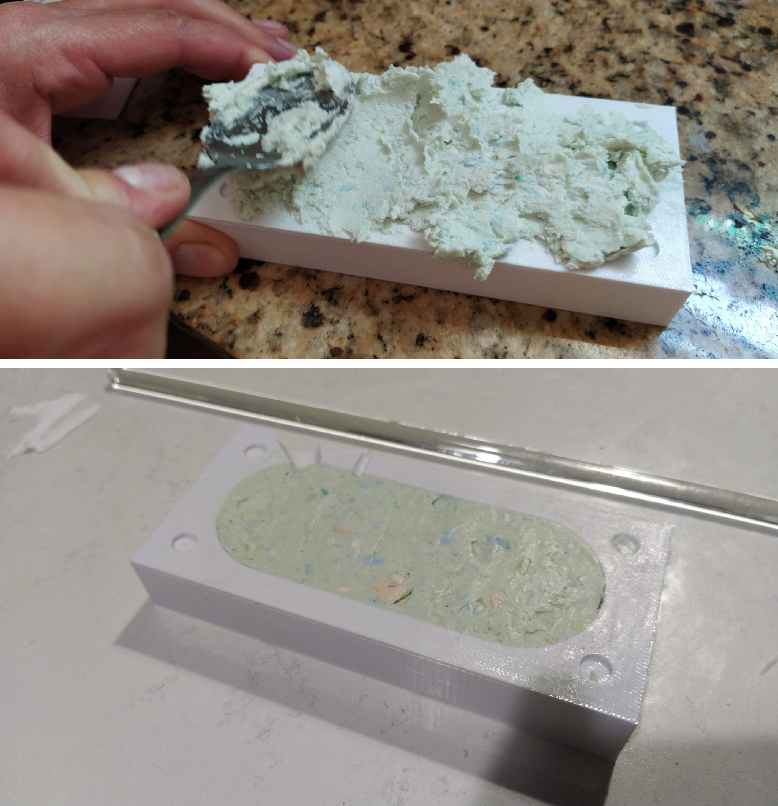

---

Experimento con gelatina, alimidón de maíz y agua. Nuevo intento de molde flexible con un biomaterial usando gelatina en vez de agar-agar. Probé en 200 ml de agua, 20 g de alimidón de maízy 28 g de gelatina. Mezclé todo en frío por 5 minutos. Lo llevé a fuego lento hasta que empezó a espezar. Hice un vertido de sellado y a los 3 minutos vertí lentamente hasta llenar el premolde. Nuevamente falló y no logré retirar el molde sin romperlo. Tuve que fundir y agregarle 16 g de fécula de alimidón para logar mas rigidez. 

---

Experimento con resina de poliéster y endurecedor con peróxido de metil cetil cetona (MEKP), recomendado en droguería como la materia prima que usan los artesanos. Con este material hay que trabajar con precaución y con equipos de seguridad personal, guantes, túnica, antiparras y, en lo posible, con mascarillas antigases; en mi caso, ventilé mucho el local. La dosificación recomendada por el vendedor es el 3 % de la cantidad de resina en general. Usé 220 g de resina y 4 g de MEK según sugerencia de ChatGPT. El tiempo de trabajo luego de mezclado es de hasta 8 minutos y se gelatiniza. Levanta bastante temperatura; aunque no recomiendan el uso sobre PLA, creo que en pequeñas cantidades la temperatura no lo llega a afectar. Eso es otro experimento. :)

No pude decorar el producto con la técnica del laminado, similar a la impresión por capas, se usa en el colado de recina para agregarle elementos decorativos. Implica preparar la mezcla en distintos tiempos, eso prolonga los palzos de produccion de una pieza. Aproximadamente 30 minutos por cada vertido.

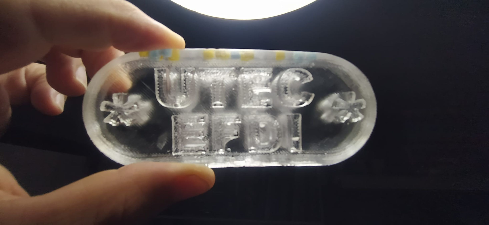

esto no termina acá, Seguimos...

---

## *Referencias*

